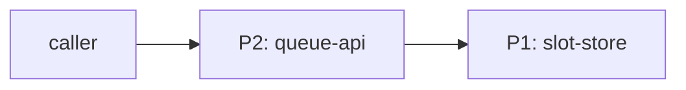
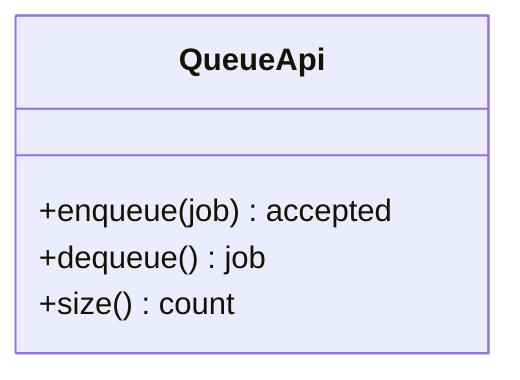

# STANDARD — The Drawing Standard

Standard revision C, 2026-07-10. Changes to this document go through the same
PR review as designs. The section titles and table headers defined here are
load-bearing: `tools/validate.py` matches them byte-for-byte.

## Principle

Mechanical production drawings work because they specify **constraints** and
**assembly**, not just shape. A machinist can hold a finished part against the
drawing and accept or reject it with a micrometer — no conversation with the
designer required. A drawing here serves the same function for software: a
specification precise enough that a competent hobbyist can manufacture the
program from it, in any language, and verify the result against stated
tolerances.

Six conventions are ported. Nothing else.

| Convention | Mechanical original | Ported form |
|------------|--------------------|-------------|
| Title block | ID, revision, drafter, approval in the sheet corner | Front matter — Section 1 |
| Assembly vs detail | Separate sheets per zoom level | Section 2 vs Section 4 |
| Bill of materials | Numbered parts list on the assembly sheet | BOM table — Section 3 |
| Tolerances | Every dimension is nominal ± allowed variance, never bare | Tolerance column — Section 5 |
| Routing sheet | Op 10, Op 20 … with an inspection per op | Process plan — Section 6 |
| Part register | Global part numbers; assembly BOMs cite child part numbers; one part, one drawing, one number | Ref column — Section 3; external-part note — Section 4; Composition rules |

Spatial conventions — projections, section views, hatching, GD&T — are **not**
ported. Software has no geometry; porting them would be cargo-culting.

## General requirements

- One design per directory: `designs/<slug>/LLD.md`. The slug is the
  kebab-case form of the title.
- GitHub-flavored Markdown plus Mermaid. Every drawing renders completely on
  github.com with no build step.
- Mermaid diagram types permitted: `flowchart`, `sequenceDiagram`,
  `classDiagram`, `stateDiagram-v2`. No experimental or beta diagram types.
- Pseudocode only, in fenced `text` blocks. No runnable implementations —
  designs are language-agnostic.
- Pipe characters must not appear inside table cells.
- Register: drafting room. Declarative sentences, present tense, no marketing
  prose. If a sentence survives deletion, delete it.
- No deferral markers anywhere. A cell you cannot fill is a design decision
  you have not made; make it or withdraw the drawing.

## The seven sections

Every LLD contains exactly these seven sections, in this order. Section 1 is
the front matter block. Sections 2–7 are `##` headings with these exact
titles; no other `##` headings are permitted.

| # | Section | Form |
|---|---------|------|
| 1 | TITLE BLOCK | front matter block at line 1 |
| 2 | ASSEMBLY DRAWING | `## ASSEMBLY DRAWING` |
| 3 | BILL OF MATERIALS | `## BILL OF MATERIALS` |
| 4 | DETAIL DRAWINGS | `## DETAIL DRAWINGS` |
| 5 | CONTRACTS & TOLERANCES | `## CONTRACTS & TOLERANCES` |
| 6 | PROCESS PLAN | `## PROCESS PLAN` |
| 7 | REVISION HISTORY | `## REVISION HISTORY` |

An `# <id> — <title>` heading directly after the front matter, followed by a
one-sentence statement of what the artifact is, is required by review (not
machine-checked).

### Section 1 — TITLE BLOCK

Flat `key: value` front matter, opening `---` on line 1, closing `---` on its
own line. Machine-parseable by splitting each line on the first colon — no
YAML nesting, no lists, no quoting. GitHub renders it as a table at the top
of the page, exactly where a title block belongs. All nine keys, in this
canonical order:

```
---
id: DO-001
title: Token Bucket Rate Limiter
revision: A
status: released
author: F. William
reviewed_by: F. William
date: 2026-07-06
part_count: 5
supersedes: none
---
```

| Key | Rule |
|-----|------|
| id | `DO-NNN`, three digits, zero-padded. Assigned as next free number in the repo. Never reused, never recycled. |
| title | Noun phrase naming the artifact, 60 characters or fewer. |
| revision | Capital letters: A, B, C … Z, AA. Bumped on every content change after first release. |
| status | One of `draft`, `released`, `superseded`. |
| author | Drafter of the current revision. |
| reviewed_by | Reviewer of the current revision, or `none`. `none` is permitted only while status is `draft`. |
| date | Date of the current revision, `YYYY-MM-DD`. |
| part_count | Positive integer. Must equal the number of data rows in the BOM. |
| supersedes | `DO-NNN` of the design this one replaces, or `none`. The superseded design's status changes to `superseded` in the same PR. |

### Section 2 — ASSEMBLY DRAWING

Zoom level 1: the parts and their connections, in the spirit of a C4
container diagram. Exactly one Mermaid `flowchart`. Every node that is a part
carries its part number in the label (`P1: bucket-store`). External actors
(callers, clocks, files, humans) appear unnumbered. Twelve nodes is the
practical ceiling; a design that needs more should be split into two designs.
One short paragraph beneath the diagram states the data flow. No internals —
internals belong in Section 4.

### Section 3 — BILL OF MATERIALS

One table, exact header:

```
| Part | Name | Kind | Responsibility | Deps | Ref |
```

| Column | Rule |
|--------|------|
| Part | `P1`, `P2` … sequential from P1, no gaps. Find numbers, local to this drawing. Once released, a find number is never reassigned to a different part. |
| Name | kebab-case part name, matching the assembly drawing label. |
| Kind | One of `module`, `class`, `function`, `store`, `assembly`, `claim`. |
| Responsibility | One sentence or less. |
| Deps | Comma-separated find numbers this part depends on within this drawing, or `none`. |
| Ref | `local` when the part is fully specified by this drawing, or the `DO-NNN` of the registered part that fills this slot. A ref may not cite the drawing's own id. |

`Part` is the find number — a local label for balloons and wiring on this
sheet. `Ref` is the part number — the global identity in the register. A
drawing whose refs are all `local` is a leaf drawing; a drawing with at least
one `DO-NNN` ref is an assembly of registered parts.

### Section 4 — DETAIL DRAWINGS

Zoom level 2. Every BOM part gets exactly one `###` heading:

```
### P2 — refill-calculator
```

Under each heading, one of:

- A detail drawing: at least one Mermaid diagram (`classDiagram`,
  `sequenceDiagram`, `stateDiagram-v2`, or `flowchart`) plus terse prose.
  Pseudocode in fenced `text` blocks where arithmetic or ordering matters.
- A commodity note, for parts too ordinary to draw:
  `Commodity part — no drawing needed: <one-line justification>.`
- An external-part note, for parts whose BOM ref is a `DO-NNN`:
  `External part — see DO-NNN: <one line on the interface consumed>.`
  The child's internals are never restated here; its own drawing owns them.

No detail heading may reference a part number absent from the BOM.

### Section 5 — CONTRACTS & TOLERANCES

The jewel. One table per interface, each with this exact header:

```
| Operation | Input domain | Nominal behavior | Tolerance | Inspection op | Failure mode outside tolerance |
```

| Column | Rule |
|--------|------|
| Operation | Operation signature in pseudocode. |
| Input domain | The accepted inputs, stated as constraints. Everything outside the domain is rejected, and the rejection is itself nominal behavior. |
| Nominal behavior | What the operation does, one or two sentences. |
| Tolerance | The allowed variance around nominal: a latency bound, an error budget, a precision, an ordering or durability guarantee. `exact` is permitted. An empty or dash cell is a conformance error — a bare nominal is not a dimension. |
| Inspection op | At least one `Op NN` reference naming the Process Plan op that verifies this tolerance. Empty or dash is a conformance error; a tolerance no op checks is an unverified claim. The referenced op must exist in the Process Plan. One op may verify several tolerances; a tolerance may cite several ops. |
| Failure mode outside tolerance | What the caller observes when tolerance is exceeded, and what the part does about it. |

A tolerance must be checkable by a test or a measurement. "Fast" and
"usually" are not tolerances. Every tolerance names the inspection op that
checks it, and that op must appear in the Process Plan — the tolerance→op
link is a structured column so the coverage is machine-checked, not left to
prose. A tolerance whose op does not genuinely exercise it — the op resolves
but tests something else — passes the validator and is caught only in human
review; the honest form is to strengthen the op, add one, or mark the cite
`Op NN (partial)` with a note.

### Section 6 — PROCESS PLAN

The routing sheet: the order in which a manufacturer builds and verifies the
artifact from an empty directory. One table, exact header:

```
| Op | Task | Tooling | Inspection |
```

| Column | Rule |
|--------|------|
| Op | 10, 20, 30 … — increments of ten, so a revision can insert Op 15 without renumbering. |
| Task | What is built or configured in this step. |
| Tooling | What the step is performed with (language stdlib, test runner, editor — generic, never brand-specific). |
| Inspection | How the manufacturer verifies the op succeeded before proceeding. Every op has one. |

Ops are ordered so that every op's inspection can run using only the parts
built in previous ops.

### Section 7 — REVISION HISTORY

One table, exact header, rows in ascending revision order (append-only):

```
| Rev | Date | Author | Change summary |
```

The top row is revision A. The latest row always matches `revision`, `date`,
and `author` in the title block.

## Composition

The register is a register of parts, not documents: `DO-NNN` names a part,
and its drawing shares the number — one part, one drawing, one number. An
assembly is a part whose BOM cites other registered parts through the Ref
column. Derivation and evidence:
[research/composable-unit/FINDINGS.md](research/composable-unit/FINDINGS.md).

- **Graph, not tree.** Ref edges form the design graph. It must be acyclic;
  a part may be cited by any number of parents (shared parts are the normal
  case, not an exception). Where-used — which drawings cite part X — is
  derived from Ref columns, never authored by hand.
- **Sheet size forces decomposition.** The 12-node assembly ceiling is the
  sheet-size rule. A local part that outgrows its sheet is detailed out:
  register it under the next free DO-NNN, move its details to its own
  drawing, and flip the parent's BOM ref from `local` to that number.
- **Interchangeability.** A revision of a child that leaves its contracts
  unchanged requires no change to any parent. A change to a child's
  contracts requires a revision of every drawing that cites it — where-used
  says which. Reviewers hold this rule; it is what keeps revision ripple
  bounded.
- **Assembly contracts.** An assembly's contract tables tolerance the
  assembled whole — end-to-end budgets derived from chains of child
  tolerances — and never restate a child's internals. Assembly process-plan
  ops may treat each referenced child as accepted per its own drawing, the
  way a routing sheet treats a purchased finished component.
- **Register-wide checks.** Ref existence and acyclicity are properties of
  the register, not of one sheet, so E408/E409 are meaningful when the whole
  library is validated (`python tools/validate.py designs/` — the CI run).
  Validating a lone assembly directory reports its external refs as
  dangling; pass the referenced design directories too, or validate the
  library.

## Derived drawings

A drawing is one of two genres. A **prescriptive** drawing designs an
artifact that does not yet exist; everything above describes it, unchanged.
A **derived** drawing reconstructs the design of code that already exists.
The genres differ in the direction of truth: a prescriptive drawing is
right by decision — the artifact is manufactured to match it. A derived
drawing is right by evidence — it must match the artifact, and every claim
in it is either backed or labeled. The validator checks that claims are
**evidence-bearing, falsifiable, and revision-pinned**. It never checks
that they are true; truth lives on the substance side of the
form-vs-substance boundary, with the human reviewer and the verification
plan.

### Genre marker and subject identity

A drawing is derived if and only if its title block carries the four source
keys, appended after `supersedes` in this canonical order:

```
source: <URL or path of the source repository>
source_rev: <full 40- or 64-character lowercase commit hash>
subject: <path or build-target label of the drawn part within source>
derived_by: <tool or model and version, or the human drafter>
```

If any of the four is present, all four are required. `id` remains the
**record identity** — the register's accession number for this drawing.
`source` + `source_rev` + `subject` are the **subject identity** — the
codebase's own name for the thing drawn. The two are never conflated: the
DO number names the drawing record; the subject coordinates name the code.
`source_rev` must be a full commit hash. A branch name, tag, or abbreviated
hash is a conformance error: a floating reference makes every claim in the
drawing unfalsifiable at review time.

### Basis and Evidence columns

Every contract table in a derived drawing carries two additional columns,
between `Inspection op` and `Failure mode outside tolerance`:

```
| Operation | Input domain | Nominal behavior | Tolerance | Inspection op | Basis | Evidence | Failure mode outside tolerance |
```

| Column | Rule |
|--------|------|
| Basis | The claim's epistemic basis, one of `observed` (read directly from code at source_rev), `documented` (stated in the repo's docs, commits, or issues), `inferred` (reasoned from evidence; the reasoning is stated in the row or detail prose), `unknown` (searched and undetermined). |
| Evidence | One or more citations separated by `;`. Each citation is `code <path[:lines]>`, `commit <hash>`, `doc <path[#anchor]>`, `issue <ref>`, or — only when Basis is `unknown` — `searched <what was searched>`. Paths are relative to the source repository root at source_rev. |

Basis and Evidence must cohere in form: `observed` requires at least one
`code` citation; `documented` requires at least one `doc`, `commit`, or
`issue` citation; `inferred` requires at least one non-`searched` citation;
`searched` entries are permitted only under `unknown`. There is no numeric
confidence column, deliberately: an uncalibrated percentage is invented
certainty, and this standard's confidence representation is the basis
label, the citations, and the named falsifier — nothing else.

### Unknowns are legal; invented tolerances are not

The prescriptive rule "a cell you cannot fill is a design decision you have
not made" inverts for derived drawings: a tolerance you cannot determine
from evidence is not a decision to make — it is an unknown to record.
Forcing a value would force fabrication. A tolerance cell in a derived
drawing may therefore be the word `undetermined`, if and only if the row's
Basis is `unknown`. The row still names an inspection op: the op that would
settle the unknown. Even ignorance must be falsifiable.

### The process plan is a verification plan

In a derived drawing the artifact already exists, so inspection reverses
direction: mechanical inspection measures the part against the drawing; a
derived drawing's ops measure the **drawing against the code**. The section
keeps its title and header. Ops are checks — the subject exists at the
cited path, a claimed invariant survives a targeted probe, a claimed edge
appears in the build graph, the pinned self-tests pass — and every
tolerance's cited op (E604–E606, unchanged) is the claim's falsifier.

### Per-part source anchors

Every detail entry in a derived drawing states where its part lives, as a
line beginning `Source: ` followed by the path (with optional line range)
within the source repository — unless the entry is a commodity or
external-part note. A drawn part with no source anchor is an existence
claim with no evidence.

### Staleness

A derived drawing speaks only of `source` at `source_rev`. It makes no
claim about any other revision. A reader at a newer revision re-runs the
verification plan before trusting a single row; a re-derivation at a new
commit updates `source_rev` and bumps the drawing revision like any other
content change. Inferred or speculative prose outside the contract tables
is marked as such in place (`Inferred:`, `Speculation:`) — this is
review-checked, not machine-checked.

### What the machine does not check

The validator confirms a citation's presence and format, never its
resolution: a fabricated `code` path in a well-formed cell passes. It
confirms a basis label exists, never that it is honest: `observed` on a
guessed row passes. It confirms the falsifier op exists in the plan, never
that the op would really falsify. Resolution, honesty, and teeth are
substance — human review and actually running the verification plan. This
is the same boundary DO-006 proved for prescriptive drawings, restated for
derived ones.

## Conformance

`python tools/validate.py designs/` checks every `designs/**/LLD.md` and
exits 0 clean or 1 with `file:line: code message` errors. Machine-checked:

| Code | Check |
|------|-------|
| E101–E107 | Front matter present at line 1, closed, flat `key: value`, no unknown or duplicate keys, all nine canonical keys, no empty values |
| E108–E115 | id format and repo-wide uniqueness, status enum, revision format, date format, part_count is a positive integer, supersedes format, released implies reviewed |
| E116–E117 | Derived title-block keys all-or-none (source, source_rev, subject, derived_by); source_rev is a full 40- or 64-char lowercase hash |
| E201–E203 | Sections 2–7 present, exact titles, in order, no extra `##` sections |
| E301 | At least one `mermaid` fence in ASSEMBLY DRAWING |
| E401–E404 | BOM table present, part numbers well-formed and unique, part_count matches BOM row count |
| E405–E407 | Ref cell is `local` or `DO-NNN`; BOM table has a Ref column; no ref cites the drawing's own id |
| E408–E409 | Every `DO-NNN` ref resolves to a drawing in the validated set; ref edges contain no cycle |
| E501–E503 | Every BOM part has a detail heading; every detail heading has a diagram or a commodity or external-part note; no detail heading for an unknown part |
| E504 | Every detail entry in a derived drawing has a `Source: ` anchor, a commodity note, or an external-part note |
| E601–E603 | Contract tables present, every table has a Tolerance column, every tolerance cell non-empty and not a dash |
| E604–E606 | Every contract table has an Inspection-op column; every tolerance cites at least one `Op NN`; every cited op exists in the Process Plan |
| E607–E611 | Derived contract tables carry Basis and Evidence columns; Basis in its enum; Evidence cells match the citation grammar; Basis and Evidence cohere; `undetermined` tolerance if and only if Basis `unknown` |

Everything else — tolerances that are real, responsibilities that are one
sentence, prose in the right register — is caught by human review
(checklist in [CONTRIBUTING.md](CONTRIBUTING.md)).

## Worked example

A complete minimal drawing. Two parts, one of them a commodity. This is the
source exactly as committed; see [designs/](designs/) for rendered examples.

````markdown
---
id: DO-000
title: FIFO Job Queue
revision: A
status: released
author: F. William
reviewed_by: F. William
date: 2026-07-06
part_count: 2
supersedes: none
---

# DO-000 — FIFO Job Queue

A bounded first-in-first-out queue for opaque jobs, for single-process use.

## ASSEMBLY DRAWING



The caller submits and withdraws jobs through queue-api, which owns all
access to slot-store.

## BILL OF MATERIALS

| Part | Name | Kind | Responsibility | Deps | Ref |
|------|------|------|----------------|------|-----|
| P1 | slot-store | store | Holds queued jobs in arrival order. | none | local |
| P2 | queue-api | module | Enforces capacity and FIFO order over P1. | P1 | local |

## DETAIL DRAWINGS

### P1 — slot-store

Commodity part — no drawing needed: any ordered in-memory sequence with
append and remove-first suffices.

### P2 — queue-api



Rejects enqueue at capacity rather than evicting; the queue never drops an
accepted job.

## CONTRACTS & TOLERANCES

| Operation | Input domain | Nominal behavior | Tolerance | Inspection op | Failure mode outside tolerance |
|-----------|--------------|------------------|-----------|---------------|--------------------------------|
| enqueue(job) | any job value; queue size < capacity | Appends job, returns accepted. | FIFO order exact; O(1) amortized | Op 20, Op 30 | At capacity: returns rejected, queue unchanged. |
| dequeue() | queue non-empty | Removes and returns oldest job. | FIFO order exact; O(1) amortized | Op 20, Op 30 | On empty: returns empty error, no blocking. |
| size() | none | Returns current job count. | exact | Op 30 | Not applicable — total function. |

## PROCESS PLAN

| Op | Task | Tooling | Inspection |
|----|------|---------|------------|
| 10 | Implement P1 slot-store. | language stdlib | Append three values; removal yields them in order. |
| 20 | Implement P2 queue-api over P1 with fixed capacity. | language stdlib | enqueue then dequeue returns the same job. |
| 30 | Verify boundary behavior. | unit test runner | Full queue rejects enqueue; empty queue errors on dequeue; size() returns the live count across enqueue and dequeue. |

## REVISION HISTORY

| Rev | Date | Author | Change summary |
|-----|------|--------|----------------|
| A | 2026-07-06 | F. William | Initial release. |
````

## Standard revision history

| Rev | Date | Author | Change summary |
|-----|------|--------|----------------|
| A | 2026-07-06 | F. William | Initial standard: seven sections, conformance codes, worked example. |
| B | 2026-07-10 | Claude | Part register ported: BOM Ref column (find number vs part number), external-part note, Composition rules, Kind gains assembly and claim, conformance codes E405–E409. Derivation in research/composable-unit/FINDINGS.md. |
| C | 2026-07-10 | Claude | Derived-drawing genre: source keys pin record vs subject identity, Basis and Evidence columns, undetermined-iff-unknown rule, process plan as verification plan, Source anchors, staleness rule, codes E116–E117, E504, E607–E611. The validator checks claims are evidence-bearing, falsifiable, and revision-pinned — never that they are true. |
