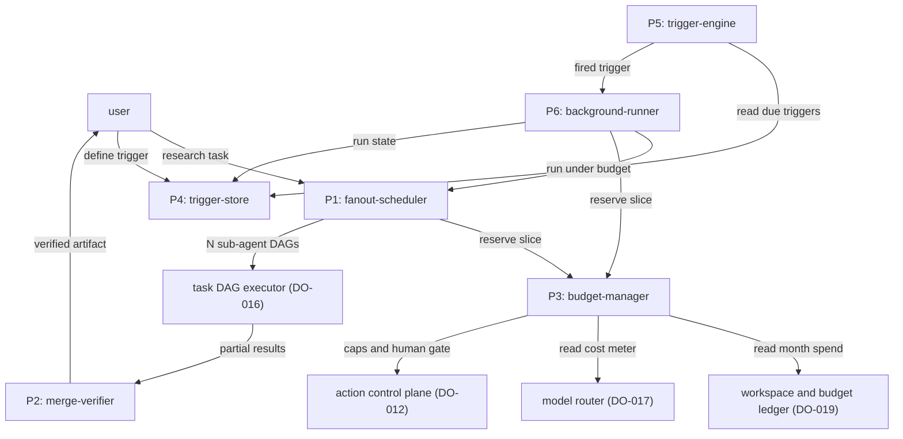
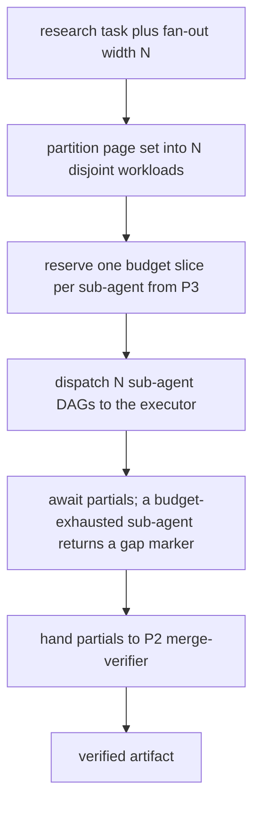
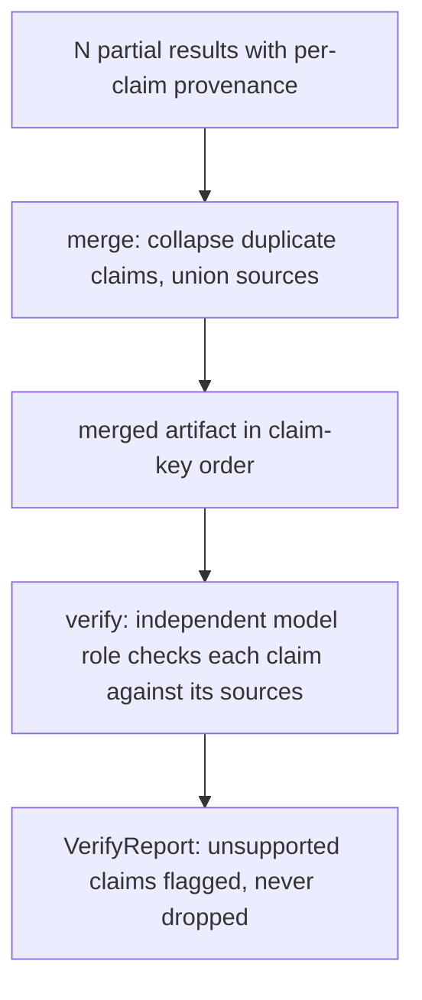
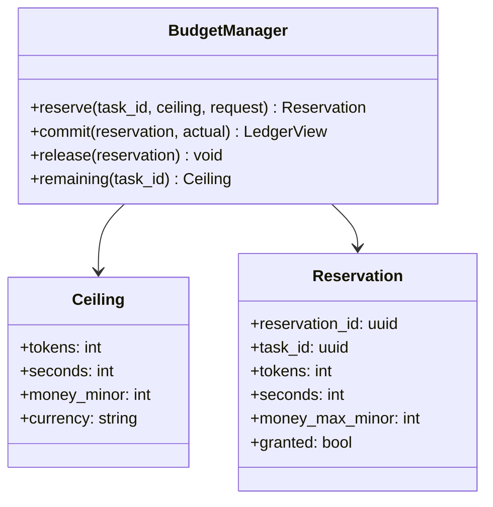
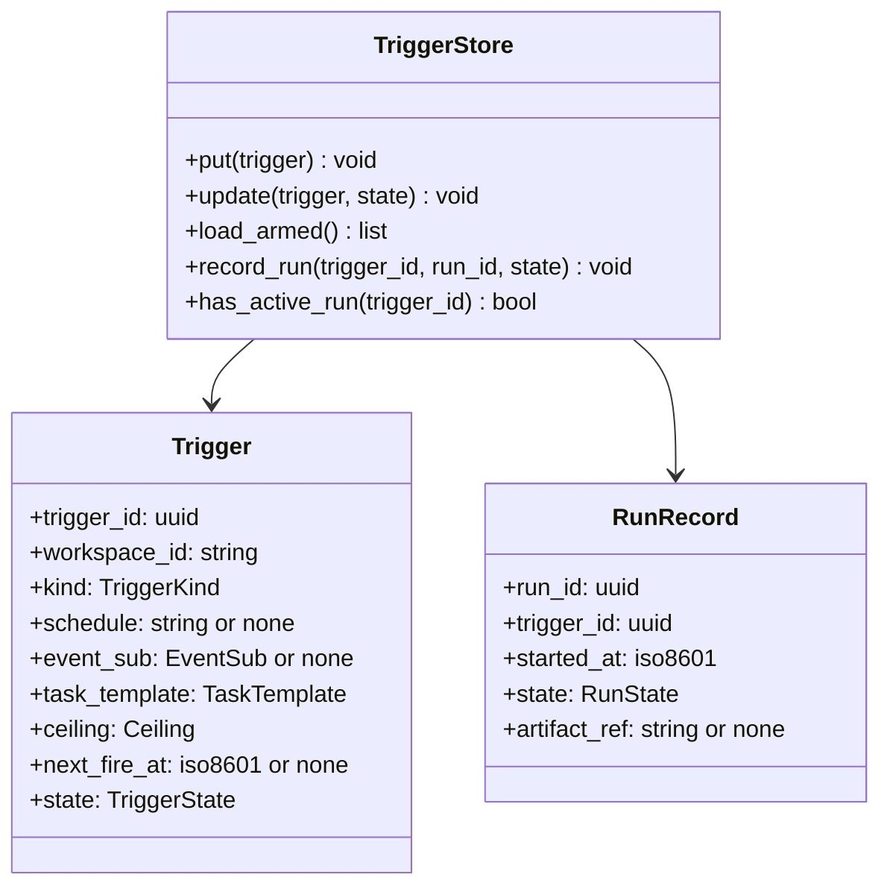
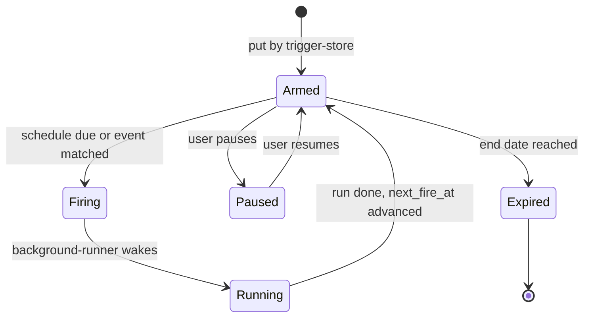
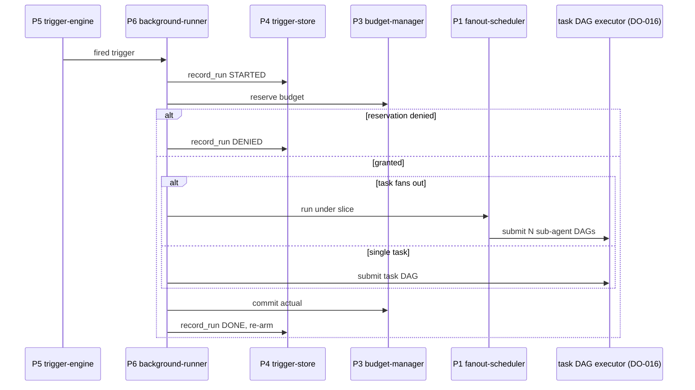

# DO-020 — Agent Orchestration Layer

The L5 layer that fans out agents under enforced per-task budgets and runs scheduled and event-driven background tasks over the task DAG executor, so the machine works while the user does not.

## ASSEMBLY DRAWING



A research task enters the fanout-scheduler, which reserves a budget slice from the budget-manager, partitions the page set into N disjoint sub-agent DAGs, and submits them to the task DAG executor; the executor's partial results return to the merge-verifier, which merges and verifies them into one artifact for the user. The budget-manager reads month-to-date spend from the ledger and the token-to-money rate from the model router, and coordinates monetary caps and the human gate with the action control plane. A user-defined trigger persists in the trigger-store; the trigger-engine reads due triggers, fires on a schedule or a matched event, and hands each firing to the background-runner, which reserves a budget, runs the task through the fanout-scheduler or the executor, and records run state back to the trigger-store.

## BILL OF MATERIALS

| Part | Name | Kind | Responsibility | Deps | Ref |
|------|------|------|----------------|------|-----|
| P1 | fanout-scheduler | module | Partitions a research task into N disjoint sub-agent DAGs, dispatches them for parallel execution, and drives the merge and verify step. | P2, P3 | local |
| P2 | merge-verifier | module | Collapses N partial results into one artifact by claim key and runs an independent verify pass over the merged claims. | none | local |
| P3 | budget-manager | class | Enforces per-task token, time, and money ceilings, reading the ledger and cost meter and deferring every transact authorization to the action control plane. | none | local |
| P4 | trigger-store | store | Persists trigger definitions, schedules, and run records durably across restarts. | none | local |
| P5 | trigger-engine | module | Evaluates schedules and subscribed events and fires a trigger when its condition is due. | P4 | local |
| P6 | background-runner | module | Wakes on a fired trigger, runs its task under a reserved budget, and records the outcome. | P1, P3, P4, P5 | local |

## DETAIL DRAWINGS

### P1 — fanout-scheduler



The scheduler partitions the task's page set into N disjoint workloads by stable page id, so every page is researched exactly once and no two sub-agents duplicate work. Each sub-agent runs its own DAG through the executor under its own reserved slice; a sub-agent that exhausts its slice returns a recorded gap marker rather than a silent omission. The scheduler owns no action path: sub-agents reach pages only through the executor.

```text
partition(task, N):
 1. pages := task.page_set
 2. IF N < 1: ERROR invalid_width
 3. IF count(pages) < N: N := count(pages)
 4. buckets := N empty lists
 5. LOOP over pages in stable id order, index i:
      buckets[i mod N].append(page)
 6. RETURN buckets    one disjoint workload per sub-agent
```

```text
fan_out(task, buckets):
 1. slice := budget_manager.reserve(task.id, task.ceiling, per_agent_request(buckets))
 2. IF slice is denied: RETURN halt(ceiling_reached)
 3. handles := []
 4. LOOP over buckets as b with its sub-slice s:
      dag := build_subagent_dag(task, b)
      handles.append(executor.submit(dag, budget_hook: s))
 5. partials := await_all(handles)     a sub-agent that exhausts s returns a gap marker
 6. RETURN merge_verifier.run(partials)
```

### P2 — merge-verifier



The merge is deterministic: identical partials in any order collapse to one artifact whose claims are sorted by claim key, with each claim carrying the union of its supporting sources. The verify pass draws a role from the model router that is distinct from every producing role in the fan-out, checks each merged claim against its cited sources, and flags every unsupported claim in place; verification annotates the artifact and removes nothing, so an unsupported claim is visible, not deleted.

```text
merge(partials):
 1. claims := {}
 2. LOOP over partials as p:
      LOOP over p.claims as c:
        key := claim_key(c)
        IF key in claims: claims[key].sources := union(claims[key].sources, c.sources)
        ELSE: claims[key] := c
 3. RETURN artifact(sort claims by key)
```

```text
verify(artifact):
 1. role := router.verify_role()     distinct from every producing role
 2. flagged := []
 3. LOOP over artifact.claims as c:
      IF NOT supported_by(c, c.sources, role): flagged.append(c)
 4. RETURN VerifyReport(artifact, flagged)
```

### P3 — budget-manager



A reservation is granted only when the sum of live reservations plus the request stays within every ceiling axis: token count, wall-clock seconds, and money in minor units. Money is checked twice, against the per-task ceiling and against the ledger's month-to-date spend read live at reservation time, so a task never reserves spend the ledger already shows over its workspace cap. `commit` debits the measured actual and `release` returns the unused remainder, so committed plus released equals reserved for every reservation.

The money ceiling bounds only the maximum a task may attempt; it authorizes no spend. Every monetary action a sub-agent takes is submitted by the executor to the action control plane, which applies its own per-workspace caps and its human gate. The budget-manager emits no approval and holds no capability token, so a lower ceiling can only shrink what a task may request and never raises a cap or replaces the gate.

```text
reserve(task_id, ceiling, request):
 1. live := sum_live_reservations(task_id)
 2. IF live.tokens + request.tokens > ceiling.tokens: RETURN deny(TOKEN_CEILING)
 3. IF live.seconds + request.seconds > ceiling.seconds: RETURN deny(TIME_CEILING)
 4. spent := ledger.month_spent(task.workspace)
 5. projected := live.money + request.money_max
 6. IF projected > ceiling.money_minor: RETURN deny(MONEY_CEILING)
 7. IF spent + projected > policy_cap(task.workspace): RETURN deny(MONEY_CEILING)
 8. res := record_reservation(task_id, request)
 9. RETURN grant(res)    a grant bounds spend; it authorizes no transact
```

### P4 — trigger-store



Enums, closed: `TriggerKind` = scheduled, event. `TriggerState` = armed, firing, running, paused, expired. `RunState` = started, denied, done, failed. A `put` or `update` returns only after the record is durable on disk, so an acknowledged trigger survives a process restart. `load_armed` returns every trigger in state armed with its `next_fire_at`; on restart the store recomputes `next_fire_at` from the schedule and the current time before returning. Run records are append-only per trigger and ordered by firing, so the run history is a faithful log.

### P5 — trigger-engine



The engine ticks on the injected clock. A scheduled trigger fires once its `next_fire_at` is at or before now; the engine advances `next_fire_at` to the next scheduled instant strictly after now in the same step, so a downtime that spans several scheduled instants coalesces to exactly one fire rather than a burst. An event trigger fires once per matching subscribed event and never on a non-match. A trigger in state paused or expired never fires. A firing transitions the trigger to state firing and enqueues it for the background-runner.

```text
tick(now):
 1. fired := []
 2. LOOP over trigger_store.load_armed() as t:
      IF t.kind is scheduled AND now >= t.next_fire_at:
        t.next_fire_at := next_after(t.schedule, now)    coalesces missed instants
        fired.append(t)
      ELSE IF t.kind is event AND event_matched(t, now):
        fired.append(t)
 3. LOOP over fired as t:
      trigger_store.update(t, state: FIRING)
      background_runner.enqueue(t)
 4. RETURN count(fired)
```

### P6 — background-runner



The runner processes one firing per trigger at a time: a `has_active_run` guard refuses a second concurrent run of the same trigger. It reserves a budget before the first executor step, so a firing whose reservation is denied dispatches nothing and records a denied run. On recovery from a crash, a run left in state started with no terminal record is resumed from the executor checkpoint or restarted under a fresh run_id exactly once, and the active-run guard keyed by run_id keeps a resumed run from doubling.

```text
run(t):
 1. IF trigger_store.has_active_run(t.id): RETURN skip(already_running)
 2. run_id := new_run_id()
 3. trigger_store.record_run(t.id, run_id, state: STARTED)
 4. slice := budget_manager.reserve(t.id, t.ceiling, t.request)
 5. IF slice is denied:
      trigger_store.record_run(t.id, run_id, state: DENIED)
      RETURN halt(ceiling_reached)
 6. IF t.task fans out: result := fanout_scheduler.run(t.task, slice)
    ELSE: result := executor.submit(t.task_dag, budget_hook: slice)
 7. budget_manager.commit(slice, result.actual)
 8. trigger_store.record_run(t.id, run_id, state: DONE, artifact: result)
 9. trigger_store.update(t, state: ARMED, next_fire_at advanced)
10. RETURN result
```

## CONTRACTS & TOLERANCES

P1 — fanout-scheduler:

| Operation | Input domain | Nominal behavior | Tolerance | Inspection op | Failure mode outside tolerance |
|-----------|--------------|------------------|-----------|---------------|--------------------------------|
| partition(task, N) | a research task with a page set; fan-out width N at or above 1 | Splits the page set into N disjoint workloads covering every page exactly once. | Every page assigned once, no overlap and no omission; N clamped to page count when smaller; exact | Op 40 | An overlap or omission is a duplicated or missing sub-result; inspection rejects the build. |
| fan_out(task, buckets) | partitioned workloads; a task ceiling | Reserves a slice per sub-agent, dispatches N sub-agent DAGs, and drives merge and verify. | Each sub-agent dispatched with a nonzero slice; sum of slices at or below the task ceiling; exact | Op 40, Op 70 | A slice sum above the ceiling overspends the budget; the reservation denies and the task halts. |
| collect(handles) | dispatched sub-agent handles | Awaits all partials, then invokes the merge-verifier. | A failed or budget-exhausted sub-agent yields a recorded gap marker, never a silent drop; exact | Op 40, Op 70 | A dropped sub-result corrupts the merge; inspection asserts a marker for every incomplete bucket. |
| fan_out dispatch overhead | reference corpus of fan-out tasks | Adds bounded scheduling latency per sub-agent excluding executor and model time. | p99 at or below 50 ms per sub-agent on the Op 100 corpus | Op 100 | Over-budget dispatch stalls fan-out; the op rejects the build until within budget. |

P2 — merge-verifier:

| Operation | Input domain | Nominal behavior | Tolerance | Inspection op | Failure mode outside tolerance |
|-----------|--------------|------------------|-----------|---------------|--------------------------------|
| merge(partials) | a list of partial results with per-claim provenance | Collapses duplicate claims by claim key and unions their sources into one artifact. | Deterministic: identical partials in any order yield a byte-identical artifact; duplicates collapse to one with unioned provenance; exact | Op 30 | A nondeterministic or lossy merge misreports coverage; inspection rejects it. |
| verify(artifact) | a merged artifact with cited sources | Runs an independent model role that checks each claim against its sources and flags the unsupported ones. | Verify role distinct from every producing role; every unsupported claim flagged with its failing source; claims removed equal zero; exact | Op 30 | A dropped or unchecked claim hides an unverified fact; inspection asserts flag-not-delete on a seeded unsupported claim. |

P3 — budget-manager:

| Operation | Input domain | Nominal behavior | Tolerance | Inspection op | Failure mode outside tolerance |
|-----------|--------------|------------------|-----------|---------------|--------------------------------|
| reserve(task_id, ceiling, request) | a per-task ceiling on tokens, seconds, and money; a sub-request | Grants a reservation when cumulative reserved plus request stays within every ceiling axis; else denies with the breached axis. | Sum of live reservations never exceeds any ceiling axis; concurrent reserves never collectively exceed a ceiling; exact | Op 20 | A reservation past a ceiling overspends; a stress harness of concurrent reserves asserts the invariant holds. |
| commit(reservation, actual), release(reservation) | a granted reservation and its measured actual | Debits the actual to the ledger view and returns the unused remainder. | Committed plus released equals reserved, exact to the minor unit and the token | Op 20 | Arithmetic drift leaks or overcounts budget; inspection sums reservations against commits and releases. |
| money-ceiling rule | any monetary sub-action under a ceiling | Bounds the maximum a task may request; issues no authorization and holds no capability token. | Budget-manager emits zero transact authorizations; every monetary action still routes to the action control plane human gate regardless of headroom; exact | Op 20, Op 80 | A ceiling that authorized spend would bypass the gate; the Op 80 battery asserts the gate fires on every transact. |
| month-spend read | a monetary request | Reads the ledger's month-to-date spend live at reservation time before granting. | A reservation is refused when month spend plus projection exceeds the workspace cap; the read is never cached past the reservation; exact | Op 20, Op 80 | A stale read admits spend past the cap; inspection mutates the ledger between reservations and asserts refusal. |
| reserve latency | reference corpus of reservations | Returns a grant or denial within the latency budget. | p99 at or below 5 ms on the Op 100 corpus | Op 100 | Over-budget reservation stalls every dispatch; the op rejects the build. |

P4 — trigger-store:

| Operation | Input domain | Nominal behavior | Tolerance | Inspection op | Failure mode outside tolerance |
|-----------|--------------|------------------|-----------|---------------|--------------------------------|
| put(trigger), update(trigger, state) | a valid trigger record | Persists the record and its state to stable storage. | Durable before return; an acknowledged trigger survives process restart; exact | Op 10, Op 90 | A lost trigger silently stops firing; inspection writes, kills the process, and asserts the record survives. |
| load_armed() | an existing store | Returns every armed trigger with next_fire_at recomputed from schedule and current time. | Every armed trigger reloads; next_fire_at recomputed on restart; exact | Op 10, Op 90 | A missed armed trigger never fires again; inspection compares the reload against the written set. |
| record_run(trigger_id, run_id, state) | a firing of a stored trigger | Appends a run record ordered by firing. | Run records append-only; order equals firing order; exact | Op 10, Op 90 | A rewritten or reordered history misattributes outcomes; inspection asserts append-only order. |

P5 — trigger-engine:

| Operation | Input domain | Nominal behavior | Tolerance | Inspection op | Failure mode outside tolerance |
|-----------|--------------|------------------|-----------|---------------|--------------------------------|
| tick(now) | the injected clock; armed triggers | Fires each scheduled trigger due at or before now and each event trigger whose subscription matches. | A due scheduled trigger fires at or after next_fire_at and before the following tick; no armed scheduled fire is skipped; exact | Op 50 | A skipped fire drops a briefing; inspection advances a fake clock across due instants and counts fires. |
| catch-up on downtime | a downtime spanning several scheduled instants | Fires once and advances next_fire_at strictly past now. | Missed scheduled instants during downtime coalesce to exactly one fire; exact | Op 50, Op 90 | A burst of catch-up fires floods the runner; inspection simulates downtime and asserts a single fire. |
| event match | a subscribed event | Fires once per matching event; ignores non-matching events. | One fire per matching event; zero fires on non-match; a paused or expired trigger never fires; exact | Op 50 | A spurious or missing event fire runs the wrong task; inspection replays matching and non-matching events. |

P6 — background-runner:

| Operation | Input domain | Nominal behavior | Tolerance | Inspection op | Failure mode outside tolerance |
|-----------|--------------|------------------|-----------|---------------|--------------------------------|
| run(trigger) | a fired trigger | Reserves a budget, runs the task, records the outcome, and re-arms the trigger. | Exactly one run per firing; zero concurrent runs of the same trigger; exact | Op 60, Op 90 | A double run duplicates work and spend; the active-run guard is exercised with overlapping firings. |
| budget-before-run | a fired trigger with a ceiling | Reserves the budget before the first executor step. | A run whose reservation is denied dispatches zero executor steps; exact | Op 60, Op 80 | A run that dispatches before reserving can overspend; inspection denies the reservation and asserts no dispatch. |
| crash-resume | a run interrupted mid-task | On recovery resumes from the executor checkpoint or restarts under a fresh run_id. | An interrupted run completes exactly once on recovery, never duplicated or lost; exact | Op 60, Op 90 | A lost run drops a briefing and a resumed-plus-restarted run doubles it; a fault-injection harness kills mid-run and asserts single completion. |
| wake-to-dispatch latency | reference corpus of firings | Wakes on a firing and reserves and dispatches within the latency budget. | p99 at or below 100 ms excluding executor time on the Op 100 corpus | Op 100 | Over-budget wake delays a scheduled briefing; the op rejects the build. |

External boundaries (unnumbered actors; DO-020 consumes these interfaces and never restates their internals):

| Operation | Input domain | Nominal behavior | Tolerance | Inspection op | Failure mode outside tolerance |
|-----------|--------------|------------------|-----------|---------------|--------------------------------|
| executor.submit(dag, budget_hook) — DO-016 | a sub-agent or task DAG; a reserved slice | Runs the DAG with checkpoints and reports consumed tokens and time to the budget hook per step. | A step whose reserved slice is exhausted halts and returns a gap marker; the runner touches pages only through the executor; exact | Op 40, Op 70 | An unmetered step overspends; the stub executor asserts every step reports to its slice. |
| ledger.month_spent(workspace) — DO-019 | an open workspace | Returns the month-to-date committed spend for the workspace. | Read exact to the minor unit; DO-020 reads the ledger and never writes it; exact | Op 20, Op 80 | A wrong or writable ledger view breaks the cap check; inspection asserts read-only access and a matching sum. |
| router.cost_meter(role), router.verify_role() — DO-017 | a model role | Returns the token-to-money rate for a role and a verify role distinct from producing roles. | Rate exact per role; verify role never equals a producing role in the same fan-out; exact | Op 30 | A same-model verify passes the work it produced; inspection asserts role distinctness on a fan-out fixture. |
| acp.submit(proposal) — DO-012 | any consequential action a background task takes | Applies policy, per-workspace spend caps, and the human gate to every action. | No orchestrated action reaches RenderSurface except through DO-016 and DO-012; every transact-tier action hits the human gate regardless of budget headroom; exact | Op 80 | A budget-headroom bypass would auto-transact; the Op 80 battery asserts the gate fires on every transact-tier action. |

## PROCESS PLAN

| Op | Task | Tooling | Inspection |
|----|------|---------|------------|
| 10 | Implement P4 trigger-store: durable records, load_armed, append-only run history. | language stdlib, key-value or file store, unit test runner | Write triggers, kill the process, reload; every armed trigger survives with next_fire_at recomputed; run records stay append-only and ordered. |
| 20 | Implement P3 budget-manager: token, time, and money ceilings, reserve, commit, release, over stub ledger and cost meter. | language stdlib, unit test runner | Reserve within ceiling grants and over ceiling denies with the breached axis; concurrent reserves never exceed a ceiling; committed plus released equals reserved; the money path emits no authorization. |
| 30 | Implement P2 merge-verifier over recorded partial-result fixtures. | language stdlib, fixture corpus, unit test runner | Identical partials in any order give a byte-identical artifact; duplicates collapse with unioned sources; a seeded unsupported claim is flagged and not dropped; the verify role differs from the producing role. |
| 40 | Implement P1 fanout-scheduler over a stub executor. | language stdlib, stub executor harness, unit test runner | Partition covers every page once with no overlap; N sub-agent DAGs dispatched, each with a nonzero slice summing within the ceiling; an incomplete bucket yields a gap marker; merge and verify are invoked. |
| 50 | Implement P5 trigger-engine: scheduled and event evaluation on a fake clock and stub event source. | language stdlib, fake clock, unit test runner | A scheduled trigger fires at its due instant; downtime across instants coalesces to one fire; an event fires once per match and never on non-match; paused and expired triggers never fire. |
| 60 | Implement P6 background-runner wiring P5, P4, P3, and P1 to the stub executor. | language stdlib, stub executor harness, unit test runner | A firing runs exactly once; the budget is reserved before any dispatch; a denied reservation dispatches nothing; run state is recorded and the trigger re-arms. |
| 70 | End-to-end fan-out research battery over a multi-page corpus. | integration harness, stub executor, unit test runner | An N-page research task partitions, dispatches, merges, and verifies into one artifact; a task that hits its ceiling halts at the ceiling with a partial artifact marking the gaps. |
| 80 | Transact-gate battery: a monetary action taken by a background task. | adversarial harness, stub action control plane, unit test runner | The money ceiling bounds the requested amount, yet every transact-tier action routes to the human gate; the budget-manager emits zero authorizations; an over-ceiling monetary task is denied before dispatch. |
| 90 | Durability and catch-up battery: kill mid-run and across restart with fault injection. | fault-injection harness, fake clock, unit test runner | The trigger-store survives; armed triggers reload; an interrupted run completes exactly once, never duplicated or lost; missed scheduled instants coalesce to one fire. |
| 100 | Latency and throughput measurement over reference corpora. | benchmark harness with high-resolution clock measurement | p99 measured at or below budget: reserve 5 ms, fan-out dispatch overhead 50 ms per sub-agent, wake-to-dispatch 100 ms. |

## REVISION HISTORY

| Rev | Date | Author | Change summary |
|-----|------|--------|----------------|
| A | 2026-07-18 | Claude Fable 5 | Initial draft. |
