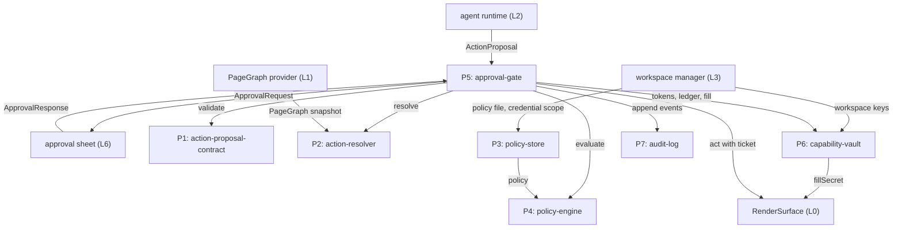
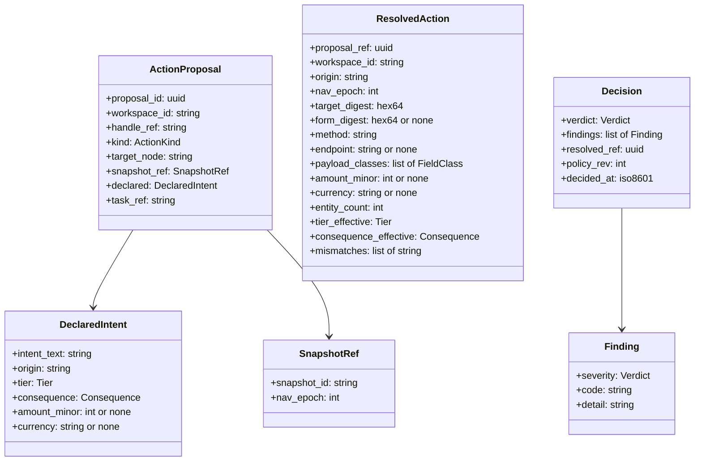
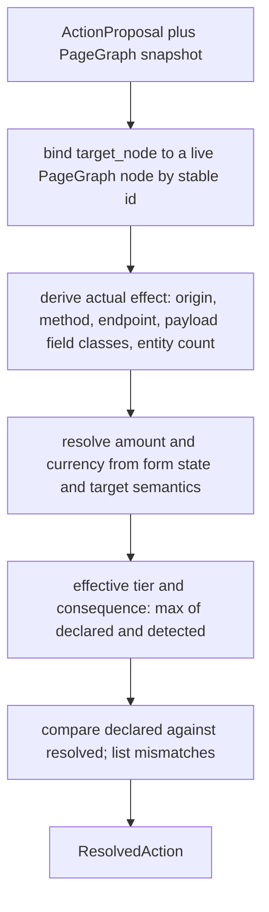
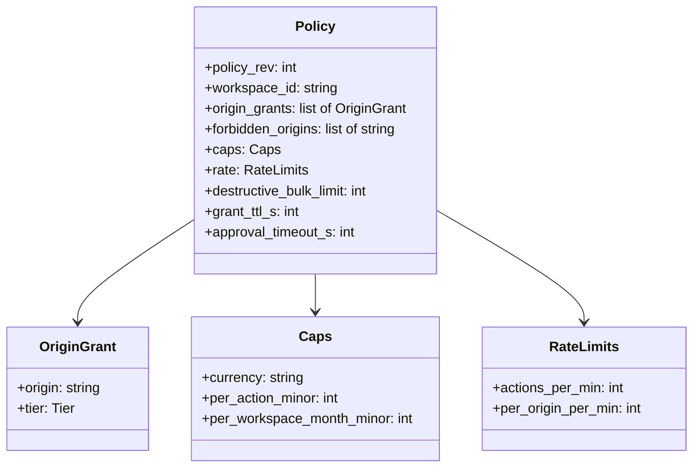
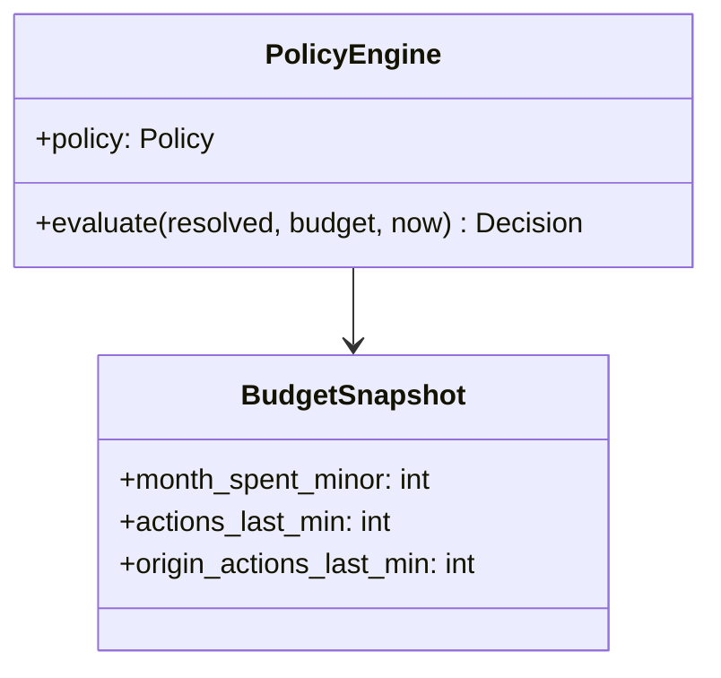
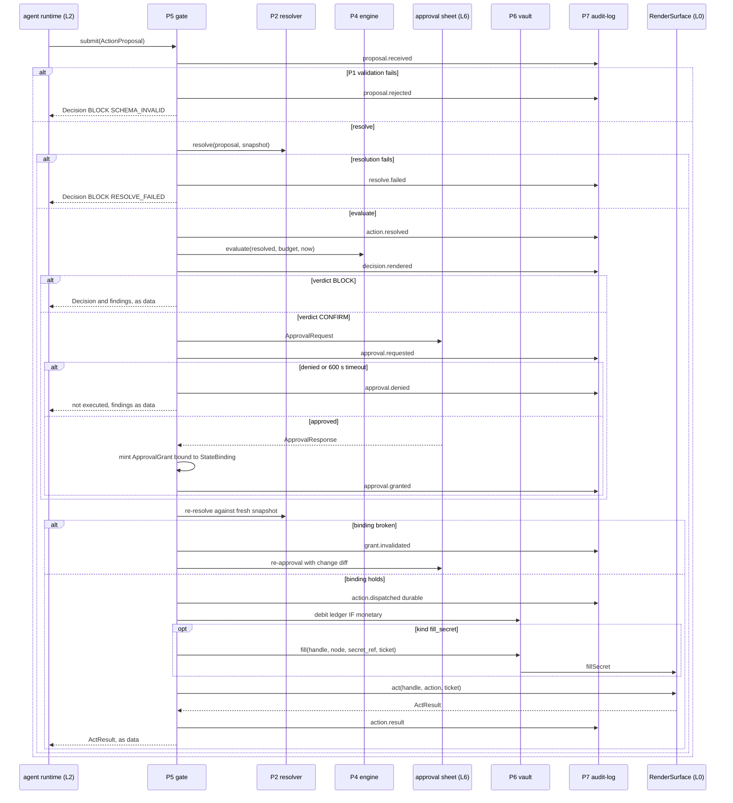
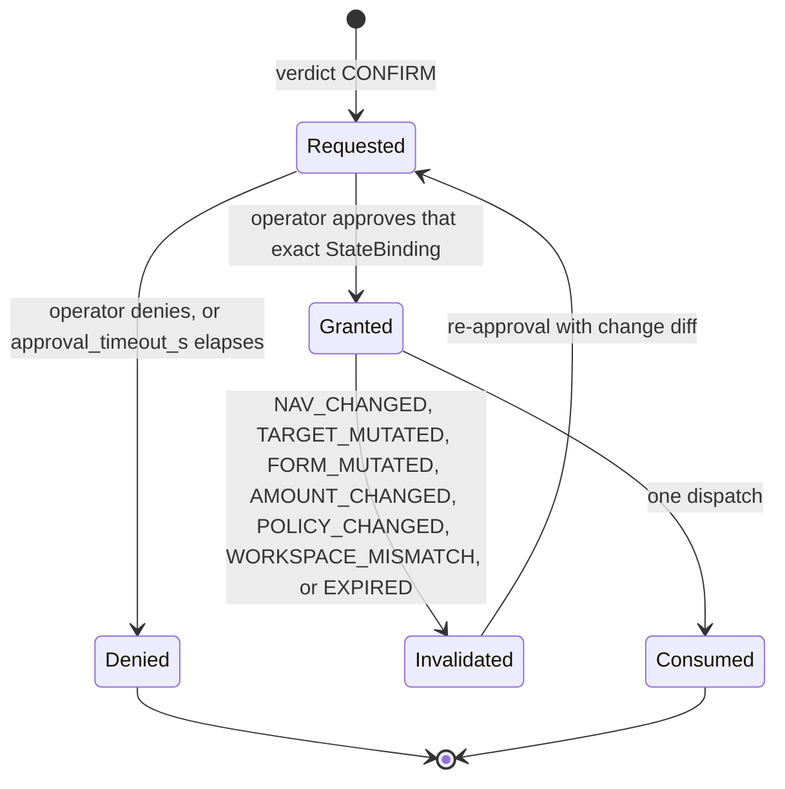
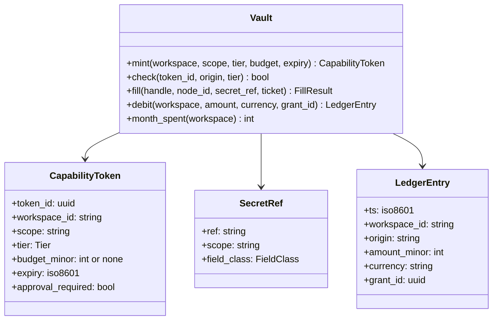
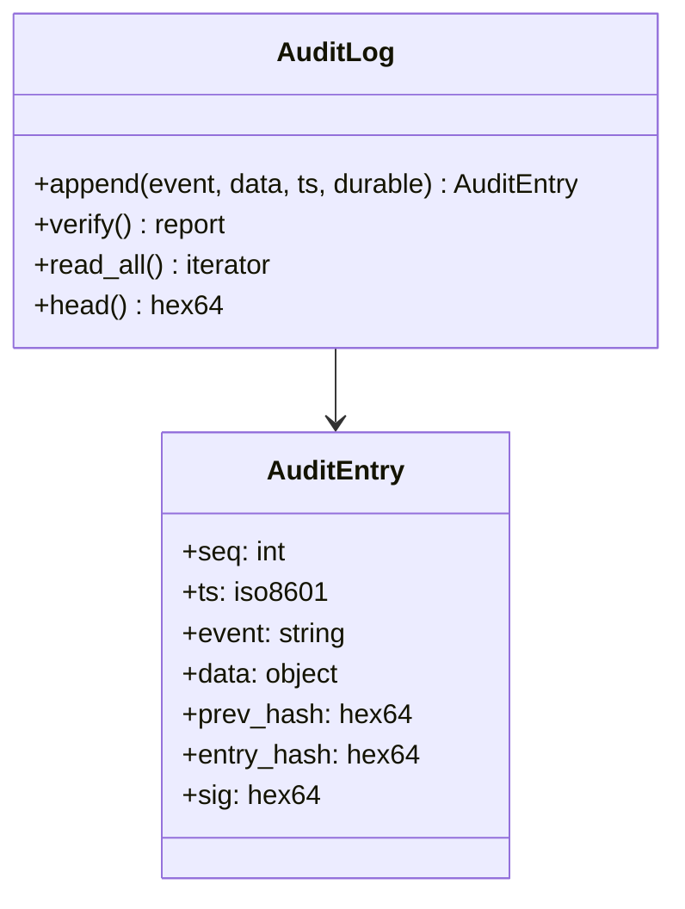

# DO-012 — Browser OS Action Control Plane

The deterministic authorization and evidence layer between the agent runtime (L2) and every consequential action executed through RenderSurface (L0): it decides, for each specific action in the current session state, whether that action may execute now, and records the decision so the log stands as evidence afterward.

## ASSEMBLY DRAWING



The agent runtime submits an ActionProposal to the approval-gate, the single entry point. The gate validates it against the proposal contract, has the resolver bind it to the current PageGraph, and passes the resolved action to the policy-engine, which reads the policy-store and returns a Decision. The gate enforces the verdict: blocked actions stop, confirm-tier actions round-trip through the approval sheet for a state-bound grant, and permitted actions are appended durably to the audit-log before the gate dispatches them to RenderSurface with a one-time execution ticket. The capability-vault fills credentials into the page directly and debits the spend ledger; secrets never cross the model boundary.

## BILL OF MATERIALS

| Part | Name | Kind | Responsibility | Deps | Ref |
|------|------|------|----------------|------|-----|
| P1 | action-proposal-contract | module | Defines and validates the typed contracts every other part exchanges, with canonical serialization and digests. | none | local |
| P2 | action-resolver | module | Resolves a proposal against the current PageGraph into what it actually does: origin, method, endpoint, payload semantics, amount, tier, consequence. | P1 | local |
| P3 | policy-store | store | Loads, validates, and serves the workspace policy file; refuses unsafe or malformed policies. | none | local |
| P4 | policy-engine | class | Pure function from resolved action, policy, and budget snapshot to a Decision of named findings with a fail-closed verdict. | P1, P3 | local |
| P5 | approval-gate | module | Sole execution path: orchestrates validate, resolve, evaluate, human approval, grant binding, ticket mint, dispatch, and logging. | P1, P2, P4, P6, P7 | local |
| P6 | capability-vault | store | Holds credentials, capability tokens, and the spend ledger; fills secrets into pages without exposing them. | P1 | local |
| P7 | audit-log | store | Append-only, hash-chained, signed evidence log of every control-plane event, per workspace. | P1 | local |

## DETAIL DRAWINGS

### P1 — action-proposal-contract

Origin: SKELETON of Rampart's structured-output contract — `rampart/tools.py::PROPOSE_COMMAND_TOOL` and `rampart/policy.py::ProposedCommand`, `Finding`, `Decision`. The shape survives: the model communicates only in typed proposals, a deterministic layer re-derives the truth, and every decision is a list of named findings. The fields are new to the browser domain.



Enums, closed: `Verdict` = ALLOW(0), CONFIRM(1), BLOCK(2), ordered by severity. `Tier` = read(0), interact(1), transact(2). `Consequence` = reversible(0), irreversible(1), monetary(2). `ActionKind` = click, type, select, submit, navigate, fill_secret. `FieldClass` = text, identifier, credential_ref, payment, address, free_form.

Canonical serialization is deterministic JSON — sorted keys, no whitespace, UTF-8 — identical to `rampart/audit.py::canonical`. `digest(x)` is SHA-256 of the canonical form, hex-encoded. Validation rejects unknown fields, missing required fields, and out-of-enum values; rejection is itself a Decision with finding `SCHEMA_INVALID`.

```text
validate_proposal(raw_bytes):
 1. IF raw_bytes does not parse as JSON: RETURN Decision(BLOCK, [SCHEMA_INVALID])
 2. IF any field is missing, unknown, or out of enum: RETURN Decision(BLOCK, [SCHEMA_INVALID])
 3. IF declared.tier is transact AND declared.amount_minor is none: mark amount undeclared
 4. RETURN ActionProposal
```

### P2 — action-resolver

Origin: NEW. No Rampart part resolves against a live document; the deterministic-extraction discipline is inherited from `rampart/targets.py::extract_targets` — never take the model's word for the target — but the mechanism is new. The resolver judges the actual effect, never the declaration: stated intent is evidence, and mismatch is itself a finding input.



Rules, each a decision on this sheet:

- Binding uses the stable node id from the referenced snapshot. A node absent from the snapshot, or a snapshot whose `nav_epoch` differs from the handle's current epoch, is a resolution failure — never a guess.
- Actual effect derives from the node's affordance metadata in the PageGraph: enclosing form action and method for submit-class nodes, link target for navigation, event semantics for click and type. `payload_classes` classifies every field the action would transmit; a field whose value came from `fillSecret` classifies as `credential_ref`.
- Amount resolution reads the enclosing form's price and currency fields and the target's accessible name. An amount that cannot be resolved to minor units plus ISO-4217 currency is returned as none — unresolved, never estimated.
- Detected consequence comes from an effect lexicon over resolved semantics: send, post, publish, delete, revoke, submit, and confirm map to irreversible; pay, buy, order, subscribe, and transfer map to monetary; all else reversible. Detected tier: read for pure navigation and extraction, interact for state-changing DOM actions, transact for monetary. Effective values are the maximum of declared and detected on each axis — the anti-under-declaration rule, mirroring `rampart/classify.py::Classification.effective_category`.
- `target_digest` is `digest` of the resolved node's subtree (tag, attributes, accessible name, geometry bucket). `form_digest` is `digest` of the enclosing form's field names and current values; none when no form encloses the target. `entity_count` is the number of distinct entities the action affects (list rows selected, messages addressed); 1 when singular.
- Resolution is deterministic: identical proposal plus identical snapshot yields a byte-identical ResolvedAction.

### P3 — policy-store

Origin: SKELETON of `rampart/roe.py::ROE` and `load_roe`. Kept: the policy file is the single source of authorization truth, read only by deterministic code; validation refuses to load a file that would authorize nothing or everything. New: origins replace CIDRs, tier grants replace category lists, spending caps replace rate ceilings as the load-bearing limit.



Semantics: any origin defaults to tier read. Tiers interact and transact exist only through an explicit OriginGrant. `forbidden_origins` wins over any grant. `policy_rev` increments on every accepted reload; the engine stamps it into each Decision, and grants bound to an older revision invalidate. Defaults when a field is absent: `actions_per_min` 30, `per_origin_per_min` 10, `destructive_bulk_limit` 25, `grant_ttl_s` 120, `approval_timeout_s` 600.

Load refusals, mirroring Rampart's empty-scope refusal: any OriginGrant of tier transact while `caps` is absent; unknown keys; empty `workspace_id`; caps or limits that are zero or negative; a currency not in ISO-4217. While no valid policy is loaded the engine holds no policy and every submission blocks with `NO_POLICY` — fail closed.

### P4 — policy-engine

Origin: SKELETON of `rampart/policy.py::PolicyEngine.evaluate` and `_check_declared_target`. Kept: pure and side-effect-free with an injected clock; independent named checks each appending a Finding; verdict is the maximum severity across findings; declared-versus-actual cross-check as a first-class check. New: the two-axis tier-and-consequence posture and the browser-domain check set.



The check set. Each check is independent, has a stable machine code, and appends at most one Finding whose severity is at or above the stated floor. Verdict floors are tolerances in CONTRACTS & TOLERANCES.

| Code | Trigger | Verdict floor |
|------|---------|---------------|
| NO_POLICY | No valid policy loaded for the workspace. | BLOCK |
| SCHEMA_INVALID | Proposal failed P1 validation. | BLOCK |
| RESOLVE_FAILED | P2 could not bind the proposal to the referenced snapshot. | BLOCK |
| SNAPSHOT_STALE | Snapshot nav_epoch differs from the handle's current epoch. | BLOCK |
| DECLARED_MISMATCH | Declared origin, tier, consequence, or amount disagrees with resolved values. | CONFIRM |
| ORIGIN_FORBIDDEN | Resolved origin is in forbidden_origins. | BLOCK |
| TIER_EXCEEDED | Effective tier above the origin's granted tier. | BLOCK |
| TOKEN_INVALID | Tier at or above interact with no live in-scope capability token. | BLOCK |
| IRREVERSIBLE | Effective consequence irreversible. | CONFIRM |
| MONETARY | Effective consequence monetary, unconditionally. | CONFIRM |
| AMOUNT_UNRESOLVED | Monetary action whose amount or currency resolved to none. | BLOCK |
| CAP_EXCEEDED | Amount above per_action cap, or month_spent plus amount above monthly cap, or currency differs from cap currency. | BLOCK |
| EXFIL_PATTERN | Payload carries a credential_ref field class to any origin other than that secret's scope. | BLOCK |
| DESTRUCTIVE_BULK | Destructive semantics with entity_count above destructive_bulk_limit. | BLOCK |
| RATE_EXCEEDED | Budget snapshot at or above actions_per_min or per_origin_per_min. | BLOCK |
| CROSS_WORKSPACE | Handle's workspace differs from the proposal's workspace. | BLOCK |
| OK | No other finding raised. | ALLOW |

```text
evaluate(resolved, budget, now):
 1. findings := []
 2. IF no valid policy: append (BLOCK, NO_POLICY)
 3. ELSE: LOOP over the check set in table order, skipping NO_POLICY and OK:
      IF a check triggers: append its Finding at or above its floor
 4. IF findings is empty: append (ALLOW, OK)
 5. verdict := max severity across findings
 6. RETURN Decision(verdict, findings, resolved.proposal_ref, policy.policy_rev, now)
```

Ambiguity escalates, never passes: an unclassifiable consequence evaluates as irreversible; an unclassifiable tier evaluates as interact. The engine never mutates budget counters; the gate owns state.

### P5 — approval-gate

Origin: NEW. The nearest Rampart shape is `rampart/session.py::Session.step` with its `confirm_fn`, but Rampart is stateless per command and its operator confirmation binds to nothing. Here an approval binds to the exact state it was granted against, survives nothing that changes that state, and the gate is the only path to RenderSurface. Every tolerance on this part holds against a fully injected, fully jailbroken agent runtime; no guarantee on this sheet depends on the model resisting instruction-bearing page content.



Session continuity. An ApprovalGrant binds to a StateBinding hash; the human approved that amount, on that page, in that state, and nothing else.

```text
StateBinding := canonical({
 1. workspace_id
 2. origin
 3. nav_epoch                 of the handle at approval
 4. target_digest             of the resolved node subtree
 5. form_digest               of the enclosing form values, or none
 6. action_digest             digest of the ResolvedAction minus mismatches
 7. amount_minor, currency    or none
 8. policy_rev
 9. token_id                  or none
})
ApprovalGrant := { grant_id, binding: digest(StateBinding), granted_at,
                   ttl_s: policy.grant_ttl_s, consumed: false, operator_ref }
```



Invalidation is checked by recomputing the StateBinding from a fresh snapshot immediately before dispatch. Any committed navigation (nav_epoch change), mutation of the target subtree or enclosing form values, re-resolved amount change, policy reload, workspace mismatch, elapsed TTL, or prior consumption refuses dispatch, appends `grant.invalidated` with the reason code, and re-enters CONFIRM with a diff of what changed. Grants are single-use; replay is `CONSUMED`.

```text
dispatch(decision, grant_or_none):
 1. IF decision.verdict is BLOCK: RETURN not_executed
 2. IF decision.verdict is CONFIRM AND grant is none: RETURN not_executed
 3. resolved2 := P2.resolve(proposal, fresh snapshot)
 4. IF grant present AND digest(StateBinding(resolved2)) differs from grant.binding,
    OR grant expired, consumed, or bound to another policy_rev:
      append grant.invalidated; RETURN re_enter_confirm(change diff)
 5. append action.dispatched to P7 and wait for durable flush
 6. IF resolved2 is monetary: P6.debit(workspace, amount_minor, currency, grant_id)
 7. ticket := mint ExecutionTicket { ticket_id, action_digest(resolved2),
              nav_epoch, expiry: now + 2000 ms, single_use, mac }
 8. result := RenderSurface.act(handle, action, ticket)
 9. mark grant consumed; append action.result
10. RETURN result as data
```

The ticket `mac` is an HMAC over the ticket body, keyed by a per-session key shared between the gate and RenderSurface at surface construction and unreadable by L2. The approval sheet contract (pixels are L6's): ApprovalRequest carries request_id, workspace_id, origin, kind, consequence_effective, amount_minor and currency when monetary, target accessible name labeled as page content, finding codes, and expires_at; ApprovalResponse carries request_id, approved, operator_note. Strings originating in the PageGraph are always labeled page content in the request; approval binds to the request_id only — there are no blanket approvals.

### P6 — capability-vault

Origin: NEW. Rampart holds no credentials — its executor runs commands that carry no secrets. The budget counters echo `rampart/policy.py::RateState` (caller-owned mutable state the engine only reads), but the vault, fill path, and ledger have no analog.



Secrets are stored encrypted at rest under a per-workspace key provisioned by L3, in a local file with owner-only permissions — the same posture as `rampart/audit.py::load_or_create_key`. A SecretRef is an opaque handle scoped to one origin; `fill` streams the secret value to `RenderSurface.fillSecret` and returns only a boolean FillResult. The secret value appears in no return value, no log field, no PageGraph, and no L2-visible channel; the audit event records the SecretRef only. `fill` requires a valid ExecutionTicket — a fill is a gated action like any other.

The spend ledger is append-only. `debit` is called by the gate at dispatch, before the ActResult returns — a failed payment still consumes budget until an operator-approved credit reverses it, so the cap can never be overspent by racing failures. `month_spent` sums entries in the current UTC calendar month and feeds the engine's BudgetSnapshot.

### P7 — audit-log

Origin: PORTED from `rampart/audit.py::AuditLog` near-as-is: append-only JSONL, per-entry SHA-256 hash chain from `GENESIS_PREV`, HMAC-SHA256 signature over the entry hash, caller-supplied ISO-8601 timestamps, `verify()` that walks the chain and names the exact line of any tampering, `canonical` serialization. What changes: one chain file and one signing key per workspace instead of per engagement; the event taxonomy below replaces Rampart's; `append` gains a durable flush mode the gate uses before dispatch; the HMAC-to-Ed25519 swap point noted in Rampart's docstring is retained as a future revision, not taken now.



Event taxonomy, closed set:

| Event | Emitted when | Payload fields |
|-------|--------------|----------------|
| policy.loaded | P3 accepts a policy file. | policy_rev, workspace_id |
| policy.rejected | P3 refuses a policy file. | reason, path |
| proposal.received | Gate accepts bytes from L2. | proposal_id, task_ref |
| proposal.rejected | P1 validation fails. | proposal_id, code |
| action.resolved | P2 returns a ResolvedAction. | proposal_id, origin, tier_effective, consequence_effective, amount_minor, mismatches |
| resolve.failed | P2 cannot bind the proposal. | proposal_id, reason |
| decision.rendered | P4 returns a Decision. | proposal_id, verdict, finding codes, policy_rev |
| approval.requested | Gate sends an ApprovalRequest. | request_id, proposal_id, expires_at |
| approval.granted | Operator approves; grant minted. | request_id, grant_id, binding, operator_ref |
| approval.denied | Operator denies or timeout elapses. | request_id, reason |
| grant.invalidated | StateBinding check fails at dispatch. | grant_id, reason code |
| action.dispatched | Durable pre-dispatch record. | proposal_id, grant_id or none, ticket_id, action_digest |
| action.result | ActResult returned by L0. | proposal_id, ticket_id, ok, detail |
| vault.fill | Vault fills a secret into a page. | secret_ref, origin, node_id, ok |
| budget.debit | Ledger debit at dispatch. | workspace_id, amount_minor, currency, grant_id |
| budget.credit | Operator-approved reversal. | workspace_id, amount_minor, currency, operator_ref |

## CONTRACTS & TOLERANCES

P1 — action-proposal-contract:

| Operation | Input domain | Nominal behavior | Tolerance | Inspection op | Failure mode outside tolerance |
|-----------|--------------|------------------|-----------|---------------|--------------------------------|
| validate_proposal(raw_bytes) | any byte sequence from L2 | Parses and schema-checks into an ActionProposal; rejects unknown fields, missing fields, out-of-enum values. | Acceptance and rejection deterministic; exact | Op 10 | Malformed input yields Decision BLOCK with SCHEMA_INVALID; nothing downstream runs. |
| canonical(obj), digest(obj) | any contract-typed value | Deterministic JSON serialization and its SHA-256 hex digest. | Byte-identical output for equal values regardless of field order; exact | Op 10 | Divergent digests break grant bindings and chain verification; the op rejects the build. |

P2 — action-resolver:

| Operation | Input domain | Nominal behavior | Tolerance | Inspection op | Failure mode outside tolerance |
|-----------|--------------|------------------|-----------|---------------|--------------------------------|
| resolve(proposal, snapshot) | valid ActionProposal; PageGraph snapshot with nav_epoch, workspace_id, per-node stable digests | Binds the target node and derives actual origin, method, endpoint, payload classes, amount, entity count, effective tier and consequence, and declared-versus-resolved mismatches. | Deterministic: identical inputs yield a byte-identical ResolvedAction; exact | Op 40 | Nondeterminism is rejected at inspection; at runtime a failed bind returns RESOLVE_FAILED and the action blocks. |
| resolve(proposal, snapshot) — amount rule | submit-class actions on payment forms | Resolves amount to minor units plus ISO-4217 currency from form state and target semantics. | Amount is resolved or none — never estimated; exact | Op 40, Op 90 | An unresolved amount on a monetary action blocks via AMOUNT_UNRESOLVED; no payment executes on a guessed figure. |
| resolve(proposal, snapshot) — classification rule | any resolvable proposal | Effective tier and consequence are the maximum of declared and detected on each axis. | Effective value never below either input; exact | Op 40, Op 50 | Under-declaration cannot lower posture; inspection rejects any vector where declared under-labels win. |
| resolve latency | PageGraph up to 20000 nodes | Returns within the latency budget. | p99 at or below 100 ms on the Op 100 corpus | Op 100 | Over-budget resolution stalls the gate; the op rejects the build until within budget. |

P3 — policy-store:

| Operation | Input domain | Nominal behavior | Tolerance | Inspection op | Failure mode outside tolerance |
|-----------|--------------|------------------|-----------|---------------|--------------------------------|
| load(path) | policy file bytes | Validates against the P3 schema; on acceptance increments policy_rev and serves the policy; on refusal keeps the prior policy if any. | Refusal set exact: transact grant without caps, unknown keys, empty workspace_id, non-positive limits, unknown currency | Op 30 | A refused file leaves the store unchanged and emits policy.rejected; with no valid policy every submission blocks with NO_POLICY. |
| current() | none | Returns the live policy and policy_rev. | policy_rev strictly monotonic across accepted loads; exact | Op 30 | A non-monotonic rev would let stale grants survive a reload; inspection rejects it. |

P4 — policy-engine:

| Operation | Input domain | Nominal behavior | Tolerance | Inspection op | Failure mode outside tolerance |
|-----------|--------------|------------------|-----------|---------------|--------------------------------|
| evaluate(resolved, budget, now) | valid ResolvedAction, BudgetSnapshot, injected clock | Runs every check in the P4 table, appends named Findings, returns Decision with verdict, findings, policy_rev. | Pure and deterministic: identical inputs yield identical Decision; verdict equals max severity across findings; exact | Op 50 | Any hidden state or verdict below a finding's severity is rejected at inspection. |
| evaluate — verdict floors | any input triggering a check | Each triggered check appends a Finding at or above its floor from the P4 table. | MONETARY and IRREVERSIBLE at or above CONFIRM; EXFIL_PATTERN, CAP_EXCEEDED, CROSS_WORKSPACE, DESTRUCTIVE_BULK, TIER_EXCEEDED at BLOCK; exact per table | Op 50, Op 90 | A floor violation is a forged pass; the Op 90 battery falsifies each floor independently. |
| evaluate — fail closed | ambiguous or unclassifiable inputs | Unclassifiable consequence evaluates as irreversible; unclassifiable tier as interact; empty finding list is impossible. | Escalation on ambiguity exact; no input yields ALLOW without an OK finding | Op 50 | Ambiguity passing silently is rejected; the vector set includes unclassifiable fixtures. |
| evaluate latency | reference corpus of 1000 resolved actions | Returns within the latency budget. | p99 at or below 20 ms on the Op 100 corpus | Op 100 | Over-budget evaluation is rejected at inspection. |

P5 — approval-gate. The four injection guarantees hold against a fully injected, fully jailbroken L2; each row names the op that could falsify it:

| Operation | Input domain | Nominal behavior | Tolerance | Inspection op | Failure mode outside tolerance |
|-----------|--------------|------------------|-----------|---------------|--------------------------------|
| submit(proposal) | any bytes from L2, hostile included | Orchestrates validate, resolve, evaluate, gate, execute, log; the only path to RenderSurface.act. | Exactly one dispatch per approved decision; zero dispatches for BLOCK or ungranted CONFIRM; exact | Op 70 | Any second dispatch or gate bypass observed at the stub surface rejects the build. |
| submit — credential guarantee | adversarial proposal streams | No sequence of proposals reads a secret. | Secret bytes crossing to L2 equal zero across the Op 90 battery; exact | Op 90 | A single leaked byte fails the battery; the vault and masking contracts are the mechanism. |
| submit — spend guarantee | adversarial monetary proposal streams | Cumulative dispatched monetary total per workspace stays within policy caps. | Dispatched total at or below per_workspace_month cap and each action at or below per_action cap; exact | Op 90 | Any dispatch past a cap fails the battery; CAP_EXCEEDED plus ledger debit-at-dispatch is the mechanism. |
| submit — irreversibility guarantee | adversarial irreversible or monetary proposals | No irreversible or monetary action dispatches without a valid state-bound ApprovalGrant. | Ungranted dispatches equal zero across the Op 90 battery; exact | Op 90 | A forged, absent, expired, or mismatched grant reaching act() fails the battery. |
| submit — workspace guarantee | proposals citing any handle | Dispatch only on handles whose workspace matches the proposal's. | Cross-workspace dispatches equal zero; exact | Op 90 | CROSS_WORKSPACE must block; a cross-workspace act() call fails the battery. |
| request_approval(decision, resolved) | verdict CONFIRM | Sends ApprovalRequest to L6; auto-denies at approval_timeout_s. | Timeout 600 s default, policy-set; PageGraph strings always labeled page content; approval binds to request_id only; exact | Op 70 | An unlabeled page string or blanket approval is rejected at inspection; timeout yields approval.denied. |
| grant binding | approved CONFIRM decisions | Recomputes StateBinding from a fresh snapshot at dispatch; refuses on any change. | Invalidation on nav_epoch change, target or form mutation, amount change, policy_rev change, workspace mismatch, TTL 120 s default, or reuse; exact | Op 80 | A stale grant dispatching is a falsified binding; each invalidation vector must refuse and log grant.invalidated. |
| ticket mint and dispatch | binding-verified actions | Mints single-use HMAC ticket, appends action.dispatched durably, then calls act. | Ticket expiry 2000 ms, single use; audit append durable before act; exact ordering | Op 80, Op 100 | Reused or expired tickets are rejected by L0; an act observed before its durable append rejects the build. |
| gate overhead | non-human path, stub surface | Decision path adds bounded latency excluding human wait and page wait. | p99 at or below 50 ms on the Op 100 corpus | Op 100 | Over-budget overhead is rejected at inspection. |

P6 — capability-vault:

| Operation | Input domain | Nominal behavior | Tolerance | Inspection op | Failure mode outside tolerance |
|-----------|--------------|------------------|-----------|---------------|--------------------------------|
| fill(handle, node_id, secret_ref, ticket) | in-scope SecretRef, valid ticket | Streams the secret to RenderSurface.fillSecret; returns FillResult boolean only. | Secret bytes in returns, logs, PageGraphs, and L2 channels equal zero; exact | Op 60, Op 90 | Any observable secret byte fails inspection; out-of-scope or ticketless fills are refused and logged vault.fill not-ok. |
| mint, check | workspace-scoped token requests | Issues and verifies CapabilityToken against origin, tier, expiry. | check is exact: expired, out-of-scope, or wrong-tier tokens verify false | Op 60 | A token verifying outside its scope fails inspection; the engine's TOKEN_INVALID depends on this exactness. |
| debit, month_spent | gate-originated debits | Appends LedgerEntry at dispatch; sums the current UTC month. | Ledger append-only; sums exact to the minor unit; debit precedes ActResult return | Op 60, Op 90 | Arithmetic drift or a mutable ledger breaks the spend guarantee; inspection rejects both. |

P7 — audit-log:

| Operation | Input domain | Nominal behavior | Tolerance | Inspection op | Failure mode outside tolerance |
|-----------|--------------|------------------|-----------|---------------|--------------------------------|
| append(event, data, ts, durable) | taxonomy event, JSON data, caller clock | Appends hash-chained, signed entry; durable mode returns only after flush to stable storage. | Chain continuity and signatures exact; durable append completes before any dependent dispatch | Op 20, Op 80 | A lost or reordered pre-dispatch record breaks evidence; inspection rejects any act preceding its durable record. |
| verify() | existing chain file | Recomputes every hash and signature; checks continuity and sequence monotonicity. | Detects any single-byte mutation, insertion, deletion, or reorder, naming the line; exact | Op 20 | An undetected tamper is a broken evidence layer; the op mutates records and requires detection at the exact line. |
| read_all() | existing chain file | Yields entries in sequence order for replay and export. | Order equals append order; exact | Op 20, Op 110 | Out-of-order replay misattributes decisions; inspection compares against append order. |

RenderSurface additions (L0 boundary; the parent interface lacks these, so they are specified here as contract rows, not reached around):

| Operation | Input domain | Nominal behavior | Tolerance | Inspection op | Failure mode outside tolerance |
|-----------|--------------|------------------|-----------|---------------|--------------------------------|
| act(handle, action, ticket) | action targeting a stable node id; ExecutionTicket | Executes only with a valid ticket: unexpired, unconsumed, MAC-valid, action digest and nav_epoch matching. | Rejection of invalid tickets exact; ticket key unreadable by L2 | Op 70, Op 80, Op 90 | act without a valid ticket returns TICKET_REJECTED and performs nothing; a bypass fails the Op 90 battery. |
| fillSecret(handle, node_id, secret_ref) | vault-initiated stream | Fills the field from the vault stream; returns FillResult without the value. | Value absent from return and from subsequent snapshots, which mask vault-filled fields; exact | Op 60, Op 90 | A snapshot exposing a filled value leaks the secret to L1 and L2; the battery fails on any exposure. |
| snapshot(handle) additions | any page | PageGraph carries nav_epoch, workspace_id, and per-node stable digests. | Fields present on every snapshot; nav_epoch monotonic per handle; exact | Op 40, Op 80 | Missing fields make resolution and grant binding impossible; the resolver blocks rather than guesses. |
| observe(handle) additions | any page | Navigation events carry the new nav_epoch. | Epoch in events equals epoch in next snapshot; exact | Op 80 | Epoch skew would let a stale grant survive navigation; the invalidation battery falsifies this. |

Layer boundaries (L1, L2, L3, L6):

| Operation | Input domain | Nominal behavior | Tolerance | Inspection op | Failure mode outside tolerance |
|-----------|--------------|------------------|-----------|---------------|--------------------------------|
| L2 submission protocol | typed proposals only | L2 communicates with the control plane solely through submit; Decisions and ActResults return as data. | Non-conforming bytes rejected and logged proposal.rejected; zero free-form execution paths; exact | Op 70, Op 90 | Prose or tool-output bytes never execute; the adversarial harness confirms rejection. |
| L1 PageGraph ingestion | snapshots from the provider | The resolver treats every PageGraph string as untrusted data; page strings surface to L6 only labeled as page content. | Zero unlabeled page strings in ApprovalRequests; exact | Op 70 | An unlabeled page string could social-engineer the approver; inspection scans requests for labeling. |
| L3 provisioning | workspace open | L3 supplies the policy file path and per-workspace vault and audit keys. | Keys and policy scoped to exactly one workspace_id; exact | Op 30, Op 60 | Shared keys would collapse workspace isolation; inspection verifies per-workspace separation. |
| L6 approval contract | ApprovalRequest, ApprovalResponse | The sheet renders the request fields and returns a response bound to request_id. | Response accepted only for a live request_id within its expiry; exact | Op 70, Op 80 | Late or replayed responses are discarded and logged approval.denied. |

## PROCESS PLAN

| Op | Task | Tooling | Inspection |
|----|------|---------|------------|
| 10 | Implement P1: contract types, validation, canonical serialization, digests. | language stdlib, JSON library, SHA-256 primitive | Golden-vector round trips; digests identical across field orderings; malformed and unknown-field proposals rejected with SCHEMA_INVALID. |
| 20 | Implement P7 audit-log, ported from rampart audit: chain, signatures, verify, per-workspace files. | language stdlib, HMAC and SHA-256 primitives, unit test runner | Append three events then verify clean; flip one byte, delete one line, and swap two lines — verify names the exact line each time; chain resumes correctly across process restart. |
| 30 | Implement P3 policy-store: schema, load refusals, policy_rev. | language stdlib, unit test runner | Valid policy loads and policy.loaded is emitted; transact-without-caps, unknown-key, empty-workspace, and bad-currency files each refuse with policy.rejected; rev strictly increments across reloads; per-workspace key and policy separation verified. |
| 40 | Implement P2 action-resolver over recorded PageGraph fixtures with nav_epoch, digests, and payment forms. | language stdlib, fixture corpus, unit test runner | Byte-identical ResolvedAction across repeated runs; declared-versus-actual fixture lists every mismatch; payment fixture with ambiguous price resolves amount to none; under-declared fixtures never lower effective tier or consequence. |
| 50 | Implement P4 policy-engine and the full check set. | language stdlib, unit test runner | One vector per check code triggers exactly that code and floor; verdict equals max severity on mixed vectors; identical inputs give identical Decisions; unclassifiable fixtures escalate; every verdict-floor row in CONTRACTS holds. |
| 60 | Implement P6 capability-vault: encrypted store, tokens, fill against a stub surface, ledger. | language stdlib, AEAD cipher primitive, unit test runner | mint and check enforce scope, tier, expiry; fill returns only a boolean and the secret value appears in no return, log, or masked stub snapshot; ledger sums exact and append-only; debit precedes result return. |
| 70 | Implement P5 approval-gate and wire the full pipeline to a stub RenderSurface with tickets. | language stdlib, stub surface harness, unit test runner | ALLOW path dispatches exactly once with a valid ticket; BLOCK path records zero act calls; CONFIRM without grant never dispatches; approval timeout auto-denies at 600 s on a fake clock; ApprovalRequests label page strings; late responses discarded. |
| 80 | Grant-invalidation and ordering battery with fault injection on the stub surface and fake clock. | fault-injection harness, fake clock, unit test runner | Each invalidation vector — navigation, target mutation, form mutation, amount swap, policy reload, workspace switch, TTL expiry, grant reuse, ticket reuse, ticket expiry, epoch skew — refuses dispatch and logs grant.invalidated or TICKET_REJECTED; every act call is preceded by its durable action.dispatched record. |
| 90 | Adversarial battery: scripted fully-jailbroken proposer replaying attack vectors end to end. | adversarial harness, stub surface with leak detectors, unit test runner | Injected-page credential-read stream leaks zero secret bytes; declared-benign exfil POST blocks on EXFIL_PATTERN; cap-evasion stream of small payments never exceeds monthly cap; forged and absent grants never reach act; cross-workspace handles block; bulk-delete above limit blocks; ticket forgery rejected by MAC. |
| 100 | Latency and throughput measurement over reference corpora. | benchmark harness with high-resolution clock measurement | p99 measured at or below budget: resolve 100 ms on 20000-node graphs, evaluate 20 ms, gate overhead 50 ms; durable-append-before-act ordering observed under load with an instrumented stub. |
| 110 | End-to-end replay: run a three-task session, then reconstruct it from the log alone. | replay harness, unit test runner | Every pipeline step of every action has its taxonomy event; verify is clean; the reconstructed sequence of decisions, grants, and results matches the run exactly, with no event outside the taxonomy. |

## REVISION HISTORY

| Rev | Date | Author | Change summary |
|-----|------|--------|----------------|
| A | 2026-07-18 | Claude Fable 5 | Initial draft. |
