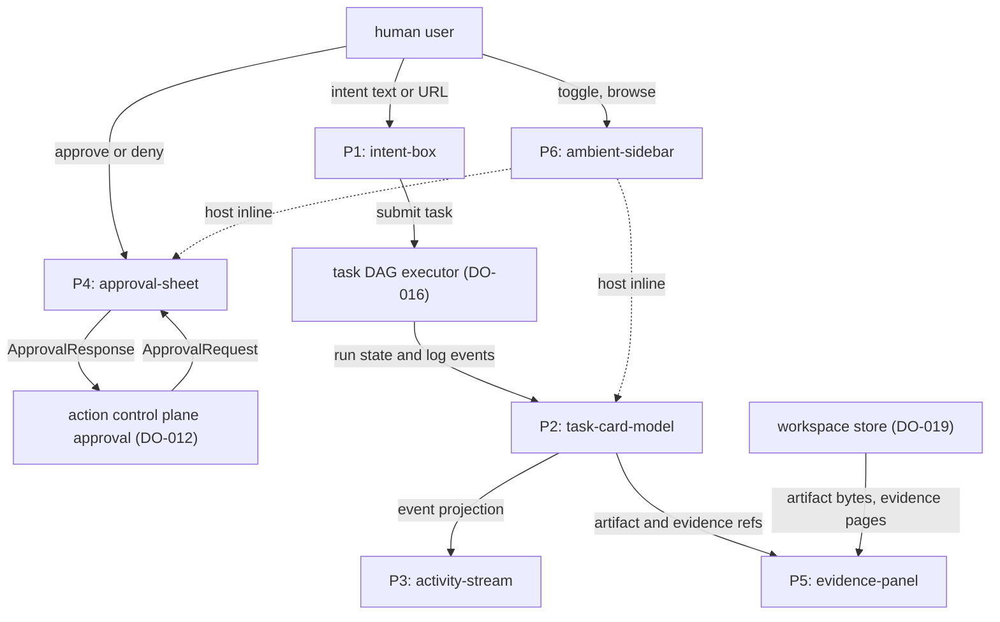
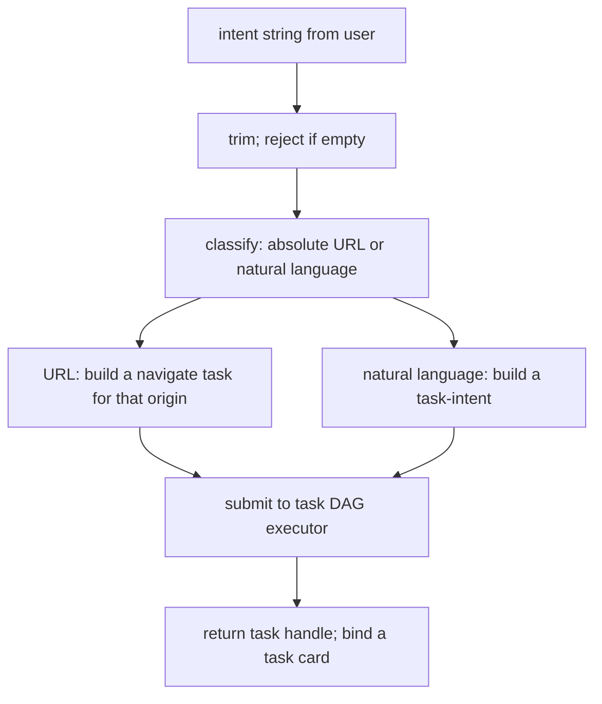
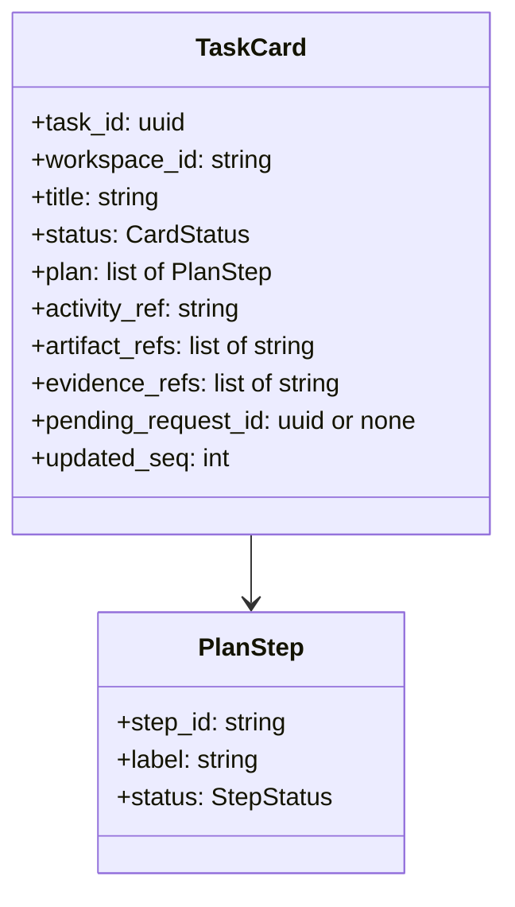
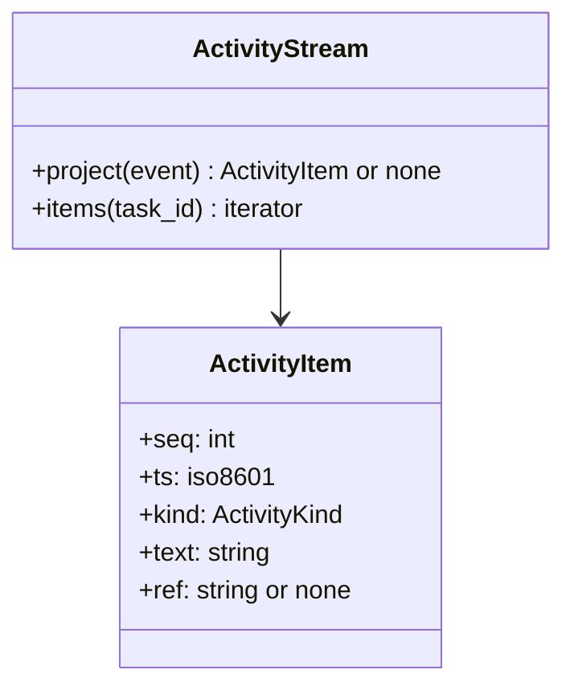
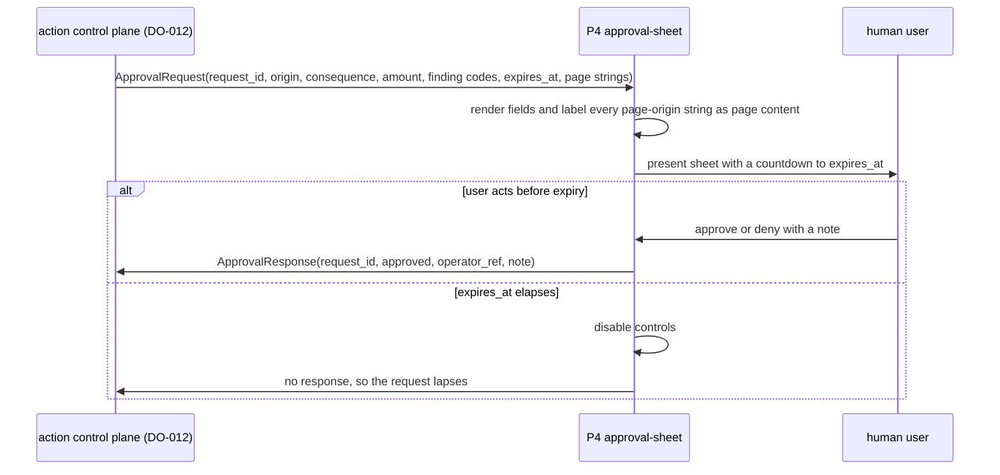
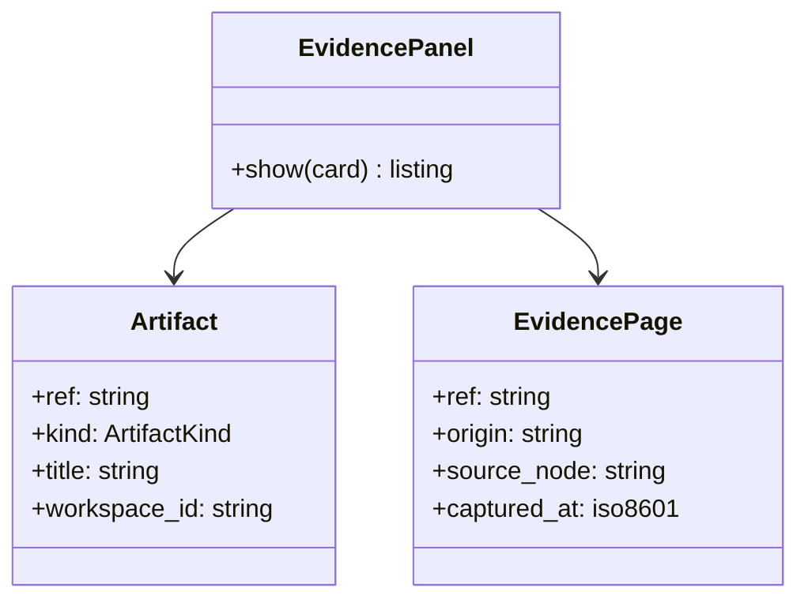
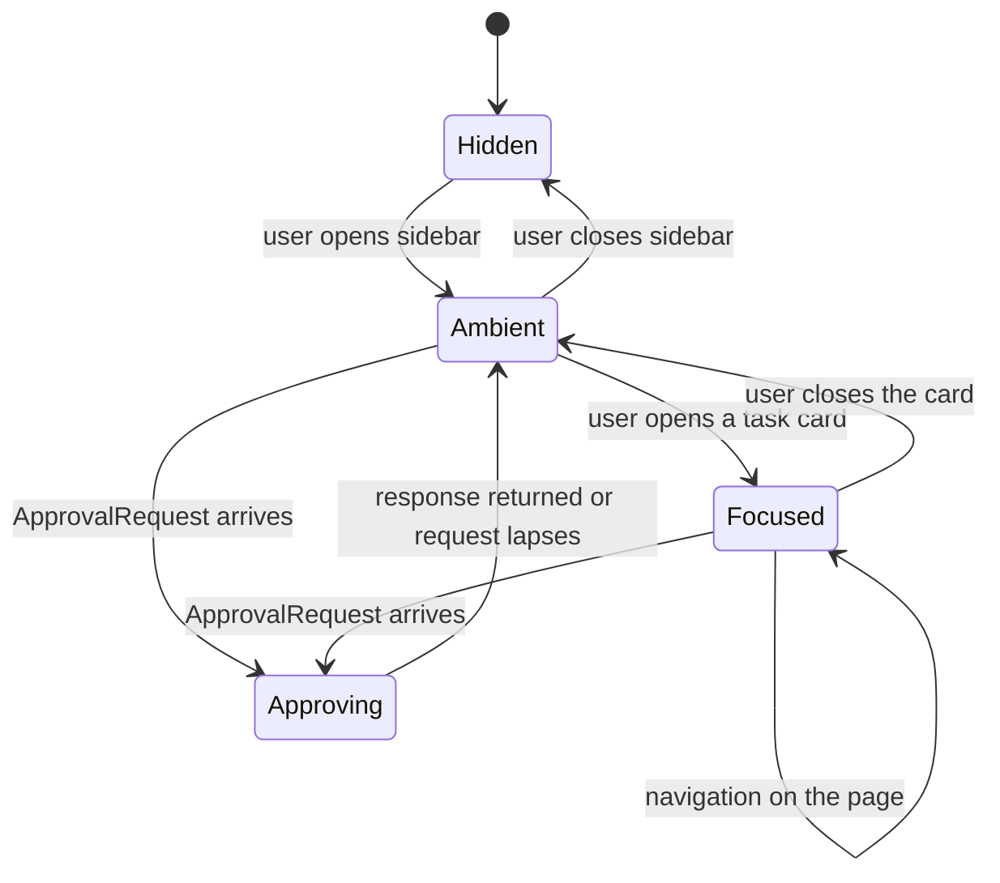

# DO-021 — Interface Shell

Presents intent, task cards, and the approval sheet as the human surface over the agent layers.

## ASSEMBLY DRAWING



The user states work in the intent-box as natural language or a URL, and the box submits one task to the task DAG executor. The card model subscribes to that task's run state and projects it into a live task card, feeding the activity-stream its event projection and the evidence-panel its artifact and evidence refs, which the panel resolves against the workspace store. When a consequential action needs approval, the action control plane sends an ApprovalRequest to the approval-sheet, which returns an ApprovalResponse. The ambient-sidebar hosts the intent-box, active card, and approval sheet inline over normal browsing.

## BILL OF MATERIALS

| Part | Name | Kind | Responsibility | Deps | Ref |
|------|------|------|----------------|------|-----|
| P1 | intent-box | module | Turns a natural-language string or a URL from the user into one submitted task and returns its handle. | none | local |
| P2 | task-card-model | module | Projects a task's DO-016 run state into a live task-card view-model of plan, status, activity, artifacts, and evidence. | none | local |
| P3 | activity-stream | module | Projects run-log events into an ordered, read-only human activity feed for a card. | P2 | local |
| P4 | approval-sheet | module | Renders a DO-012 ApprovalRequest and returns an ApprovalResponse bound to its request_id. | none | local |
| P5 | evidence-panel | module | Lists a card's produced artifacts and evidence pages with provenance, read from the workspace store. | P2 | local |
| P6 | ambient-sidebar | module | Hosts the intent-box, active card, and approval sheet inline over normal browsing without a mode switch. | P1, P2, P4 | local |

## DETAIL DRAWINGS

### P1 — intent-box



The intent-box is the sole entry for new work. Classification is deterministic: a string that parses as an absolute URL with scheme and host becomes a navigate task against that origin, and every other non-empty string becomes a natural-language task-intent. The box never executes the intent itself; it submits to DO-016 and returns the task handle the card model subscribes to. An empty-after-trim string is rejected in place and creates no task, so a URL and a plain request follow the same one-intent-one-task path.

```text
submit_intent(text):
 1. s := trim(text)
 2. IF s is empty:
      RETURN reject(EMPTY_INTENT)
 3. IF s parses as an absolute URL with scheme and host:
      task := navigate_task(origin_of(s), s)
    ELSE:
      task := intent_task(s)
 4. handle := executor.submit(task, workspace_id)
 5. RETURN handle
```

### P2 — task-card-model



Enums, closed: `CardStatus` = submitted, planning, running, awaiting_approval, done, failed. The card model is the single subscriber to a task's DO-016 run state and holds no run state of its own beyond the projection. Each run-state update advances the card by a pure mapping: run.started to planning, the first ready step to running, a pending approval reported in run state to awaiting_approval, run.completed to done, and a terminal failure to failed. `plan` mirrors the DAG steps and their StepStatus, while `activity_ref`, `artifact_refs`, and `evidence_refs` name where P3 and P5 read. `updated_seq` carries the run-log seq the card reflects, so a card is a pure function of run state and identical state yields an identical card. The model issues no executing call; it displays a run, never advances one.

```text
project(card, event):
 1. IF event.seq is at or below card.updated_seq: RETURN card
 2. card.status := status_map(event, card)
 3. IF event names a plan or step change: update card.plan
 4. IF event carries an artifact ref: append to card.artifact_refs
 5. IF event carries an evidence ref: append to card.evidence_refs
 6. IF event reports a pending approval: card.pending_request_id := its request_id
 7. IF event clears the approval: card.pending_request_id := none
 8. card.updated_seq := event.seq
 9. RETURN card
```

### P3 — activity-stream



The activity-stream turns DO-016 run-log events into a human-readable feed: one ActivityItem per surfaced event, in strict run-log seq order. It is read-only. An item may link to an artifact or evidence ref through its `ref` field, but the stream carries no control path; nothing in the feed submits work or approves an action. Events outside the surfaced set project to none and never appear. Because each item is keyed on the run-log seq, replaying a run's log reconstructs a byte-identical feed.

```text
project(event):
 1. IF event.event not in SURFACED: RETURN none
 2. item := ActivityItem(event.seq, event.ts,
       kind_of(event), render_text(event), ref_of(event))
 3. RETURN item
```

### P4 — approval-sheet



The approval-sheet is the visual side of DO-012's approval contract and derives nothing itself. It displays the ApprovalRequest fields — origin, effective consequence, amount and currency when monetary, finding codes, and expiry — and labels every string that originated in the page as page content, so a page cannot impersonate the shell to the approver. The response it returns is bound to exactly the rendered request_id and is accepted by DO-012 only before expires_at; there is no blanket approval and no approval that outlives its request. The operator_ref and optional note ride the response to DO-012's audit trail.

```text
respond(request, decision, now):
 1. IF now is at or after request.expires_at:
      RETURN lapsed
 2. IF decision.request_id differs from request.request_id:
      RETURN reject(REQUEST_MISMATCH)
 3. RETURN ApprovalResponse(request.request_id, decision.approved,
       operator_ref, decision.note)
```

### P5 — evidence-panel



The evidence-panel lists a card's produced artifacts and the evidence pages behind its facts, resolving each ref against the workspace store scoped to the task's workspace. Every listed item carries provenance: an evidence page names its origin, the source node it was extracted from, and its capture timestamp, so a fact traces to its page. The panel is read-only and reads only within the card's workspace partition. Evidence-page strings are page content and are labeled as such; a ref that does not resolve renders as unavailable rather than as fabricated content.

```text
show(card):
 1. listing := []
 2. LOOP over card.artifact_refs:
      a := workspace.read(card.workspace_id, ref)
      IF a is none: append unavailable(ref)
      ELSE: append artifact_row(a)
 3. LOOP over card.evidence_refs:
      e := workspace.read(card.workspace_id, ref)
      IF e is none: append unavailable(ref)
      ELSE: append evidence_row(e) labeled page content
 4. RETURN listing
```

### P6 — ambient-sidebar



The ambient-sidebar makes normal browsing copilotable without a mode switch: it hosts the intent-box, the active task card, and the approval sheet alongside the page the user is already on, addressed only by its page handle. Attaching or detaching the sidebar changes no page or engine state; the primary browsing surface is unmodified, and this part imports no engine or Electron code, so live page rendering stays with L0. When a task on the foreground workspace raises a DO-012 ApprovalRequest, the sidebar surfaces the approval sheet inline, and the response still binds to request_id only. Sidebar placement changes where the sheet appears, never what it authorizes.

## CONTRACTS & TOLERANCES

P1 — intent-box:

| Operation | Input domain | Nominal behavior | Tolerance | Inspection op | Failure mode outside tolerance |
|-----------|--------------|------------------|-----------|---------------|--------------------------------|
| submit_intent(text) | any string from the human user | Trims, classifies as absolute URL or natural language, submits one task to DO-016, returns its handle. | URL-versus-natural-language classification deterministic; a string parseable as an absolute URL routes to a navigate task, all else to a task-intent; exact | Op 10 | An empty-after-trim string is rejected in place and no task is submitted. |
| submit_intent — one task per intent | any accepted intent | Submits exactly one task and returns exactly one handle. | Tasks submitted per accepted intent equal one; exact | Op 10, Op 70 | A double submission would fork the work; inspection counts submissions per accepted intent. |

P2 — task-card-model:

| Operation | Input domain | Nominal behavior | Tolerance | Inspection op | Failure mode outside tolerance |
|-----------|--------------|------------------|-----------|---------------|--------------------------------|
| project(card, event) | DO-016 run-state events for a task | Advances card status, plan, and refs by the fixed run-state mapping. | Card is a pure function of run state; identical event stream yields an identical card; exact | Op 20 | A card diverging from run state misleads the user; inspection replays a recorded run and compares. |
| status mapping | any run-state event | Maps run.started to planning, first ready step to running, a reported pending approval to awaiting_approval, completion to done, terminal failure to failed. | Mapping exact and total; every event yields a defined status | Op 20 | An undefined or wrong status is rejected at inspection. |
| project latency | run-state events under load | Reflects a received event in the card within the latency budget. | p99 at or below 50 ms from event receipt to updated card on the Op 90 corpus | Op 90 | Over-budget projection lags the run; the op rejects the build. |

P3 — activity-stream:

| Operation | Input domain | Nominal behavior | Tolerance | Inspection op | Failure mode outside tolerance |
|-----------|--------------|------------------|-----------|---------------|--------------------------------|
| project(event) | DO-016 run-log taxonomy event | Projects a surfaced event into one ActivityItem; non-surfaced events project to none. | One item per surfaced event; feed order equals run-log seq order; exact | Op 30 | Out-of-order or duplicated items misattribute activity; inspection compares to seq order. |
| stream read-only | any activity item | Items link to refs but expose no control path. | Action-submitting or approving paths from the stream equal zero; exact | Op 30, Op 80 | A control affordance in the feed is rejected at inspection. |

P4 — approval-sheet:

| Operation | Input domain | Nominal behavior | Tolerance | Inspection op | Failure mode outside tolerance |
|-----------|--------------|------------------|-----------|---------------|--------------------------------|
| render(request) | a DO-012 ApprovalRequest | Renders origin, consequence, amount and currency when monetary, finding codes, and expiry; labels every page-origin string as page content. | All request fields present; every page-origin string labeled page content; exact | Op 50, Op 80 | An unlabeled page string could social-engineer the approver; inspection scans rendered sheets. |
| respond(request, decision, now) | a human approve or deny on a live request | Returns an ApprovalResponse bound to the rendered request_id with operator_ref and note. | Response bound to exactly one request_id; accepted only before expires_at; no blanket approval; exact | Op 50, Op 80 | A response for a stale or foreign request_id is rejected; a late response lapses. |
| expiry | a request past expires_at | Disables controls and emits no response after expiry. | Responses emitted after expires_at equal zero; exact | Op 80 | A response outliving its request would authorize stale state; the battery falsifies it. |

P5 — evidence-panel:

| Operation | Input domain | Nominal behavior | Tolerance | Inspection op | Failure mode outside tolerance |
|-----------|--------------|------------------|-----------|---------------|--------------------------------|
| show(card) | a card's artifact and evidence refs | Resolves each ref against the workspace store and lists it with provenance; unresolved refs render as unavailable. | Every listed item carries a resolvable workspace ref and provenance; reads scoped to the card's workspace; read-only; exact | Op 40 | A dangling ref renders as unavailable, never as fabricated content. |
| evidence labeling | evidence-page strings | Labels every evidence-page string as page content. | Page-origin strings labeled page content; exact | Op 40, Op 80 | An unlabeled evidence string could impersonate the shell; inspection scans the panel. |

P6 — ambient-sidebar:

| Operation | Input domain | Nominal behavior | Tolerance | Inspection op | Failure mode outside tolerance |
|-----------|--------------|------------------|-----------|---------------|--------------------------------|
| attach(page_handle) | a foreground page handle from the workspace | Hosts the intent-box, active card, and approval sheet alongside the page. | Attach and detach change no page or engine state; no engine or Electron import; exact | Op 60 | A page-state or engine mutation from attach is rejected at inspection. |
| mode transitions | user toggle and page navigation | Advances Hidden, Ambient, Focused, and Approving by the fixed transition set. | Transition set exact and deterministic on toggle and navigation | Op 60 | An undefined transition is rejected at inspection. |
| inline approval | an ApprovalRequest for the foreground task | Surfaces the approval sheet inside the sidebar without leaving the page. | The sheet still binds to request_id only regardless of placement; exact | Op 60, Op 80 | A sidebar-surfaced approval that broadens scope fails the battery. |

Consumed boundaries (external subsystems; only the interface this shell consumes is toleranced, never their internals):

| Operation | Input domain | Nominal behavior | Tolerance | Inspection op | Failure mode outside tolerance |
|-----------|--------------|------------------|-----------|---------------|--------------------------------|
| DO-016 submit(task) | an accepted intent | The intent-box submits a task and receives a task handle. | Exactly one task per accepted intent; the shell issues no run-executing call; exact | Op 10, Op 70 | A second submission or an execute-side call from L6 is rejected at inspection. |
| DO-016 run state, run-log | a submitted task | The card model and activity stream subscribe and receive run state and log events as data. | Projection only; zero step-executing or checkpoint-writing calls from L6; exact | Op 20, Op 70 | An executing call from the interface is rejected at inspection. |
| DO-012 ApprovalRequest, ApprovalResponse | a CONFIRM-tier action | The approval sheet renders the request and returns a response bound to request_id. | Response accepted only for a live request_id within expiry; page strings labeled page content; exact | Op 50, Op 80 | A late, replayed, or foreign-id response is discarded. |
| DO-019 read(workspace_id, ref) | artifact and evidence refs on a card | The evidence panel reads artifacts and evidence pages scoped to the task's workspace. | Reads scoped to one workspace partition; read-only; exact | Op 40 | A cross-workspace or write call is rejected at inspection. |

## PROCESS PLAN

| Op | Task | Tooling | Inspection |
|----|------|---------|------------|
| 10 | Implement P1 intent-box over a DO-016 submit stub: trim, URL-versus-natural-language classification, submission. | language stdlib, URL parser, unit test runner | Absolute-URL strings route to navigate tasks and all other non-empty strings to task-intents; empty-after-trim rejected with no submission; each accepted intent submits exactly one task. |
| 20 | Implement P2 task-card-model over a DO-016 run-state stub: projection, status mapping, refs. | language stdlib, unit test runner | Replaying a recorded run yields an identical card; every event maps to a defined CardStatus; the card is a pure function of the event stream and issues no executing call. |
| 30 | Implement P3 activity-stream over P2 and the run-log stub. | language stdlib, unit test runner | Each surfaced event yields one activity item in seq order; non-surfaced events yield none; the feed exposes no control path. |
| 40 | Implement P5 evidence-panel over P2 and a DO-019 read stub. | language stdlib, stub store, unit test runner | Artifact and evidence refs resolve within the card's workspace with provenance; a dangling ref renders unavailable; a cross-workspace read is refused; evidence strings labeled page content. |
| 50 | Implement P4 approval-sheet over a DO-012 request-response stub. | language stdlib, stub control plane, unit test runner | All request fields render; every page-origin string is labeled page content; the response binds to the rendered request_id; a foreign-id response is rejected. |
| 60 | Implement P6 ambient-sidebar composing P1, P2, and P4 against a foreground page handle. | language stdlib, stub surface handle, unit test runner | Attach and detach mutate no page or engine state and import no engine code; mode transitions follow the fixed set; an ApprovalRequest surfaces the sheet inline still bound to request_id. |
| 70 | Integrate the full pipeline: intent to task handle, run state to card, activity, and evidence, against the assembled parts and stubs. | language stdlib, stub harness, unit test runner | One intent produces one task, one card, and a feed and evidence list that match the recorded run; no interface path executes or checkpoints a run. |
| 80 | Labeling and approval-binding battery with a hostile page-content corpus and a fake clock. | adversarial harness, fake clock, unit test runner | Every page-origin string in approval sheets and the evidence panel is labeled page content; responses bind to request_id only; responses after expires_at emit nothing; no stream or sidebar control path authorizes an action. |
| 90 | Latency measurement over reference run-state and log corpora. | benchmark harness with high-resolution clock | p99 card projection at or below 50 ms from event receipt to updated card; feed and evidence projections measured under load. |

## REVISION HISTORY

| Rev | Date | Author | Change summary |
|-----|------|--------|----------------|
| A | 2026-07-18 | Claude Fable 5 | Initial draft. |
