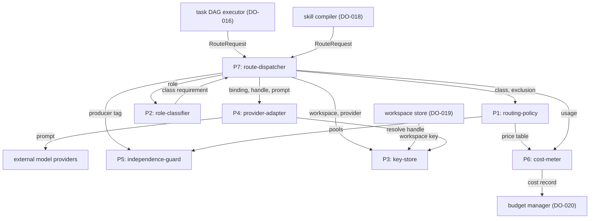
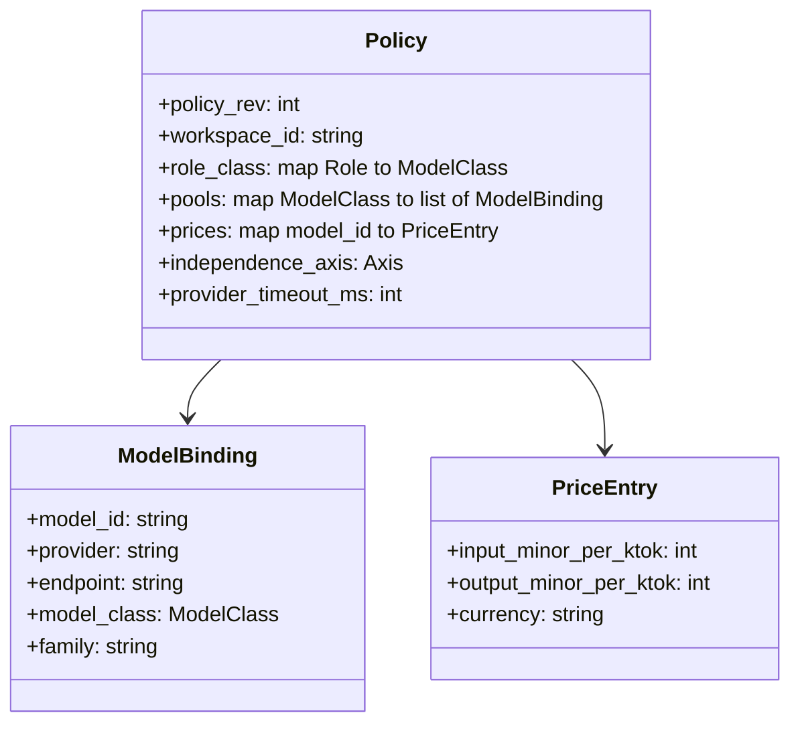
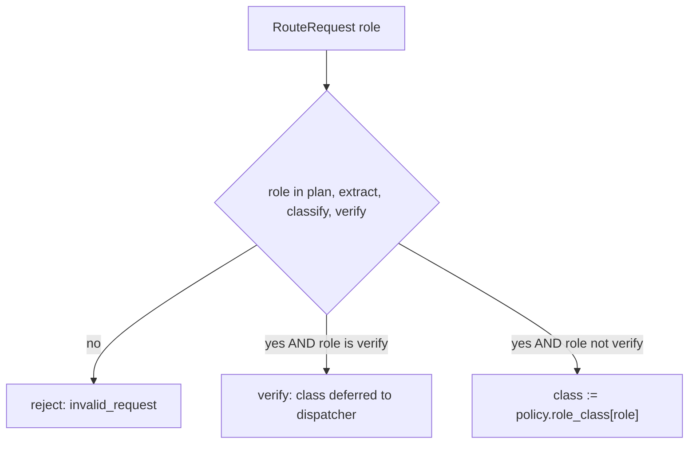
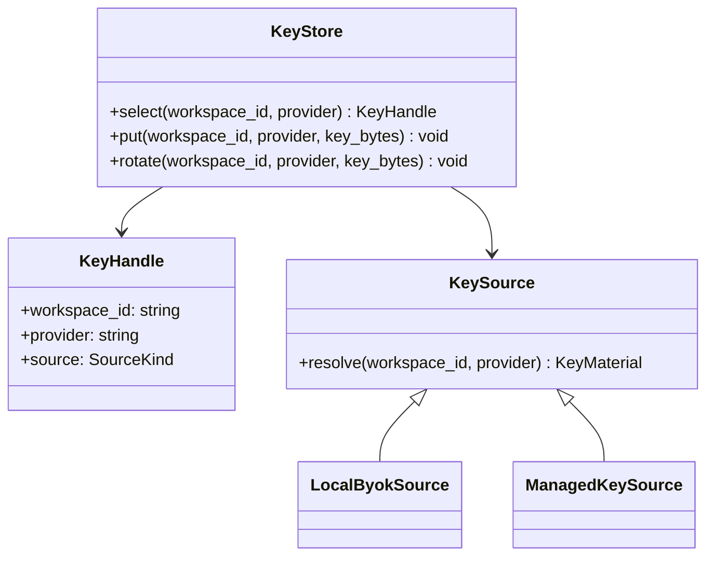
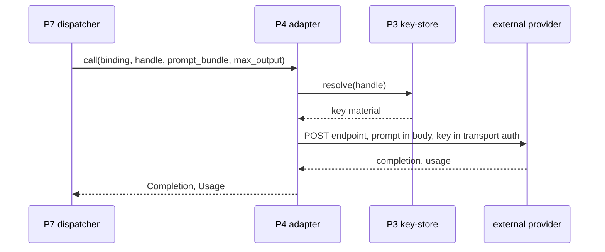
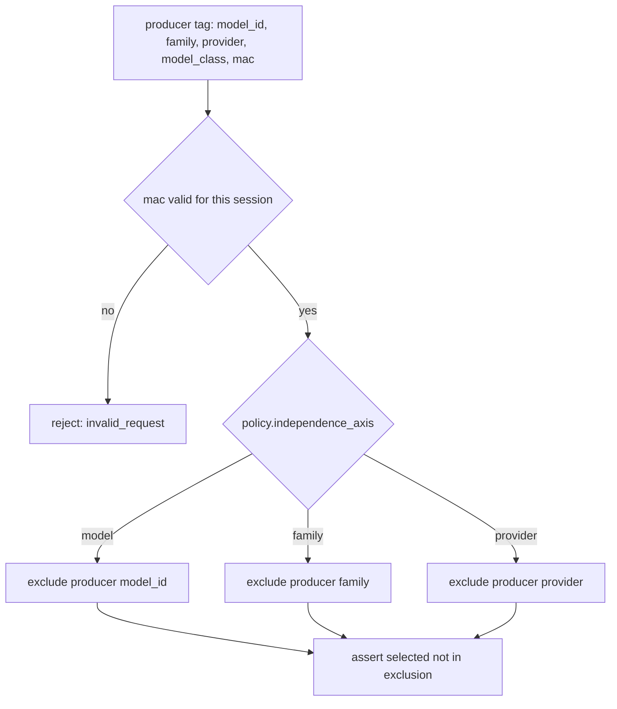
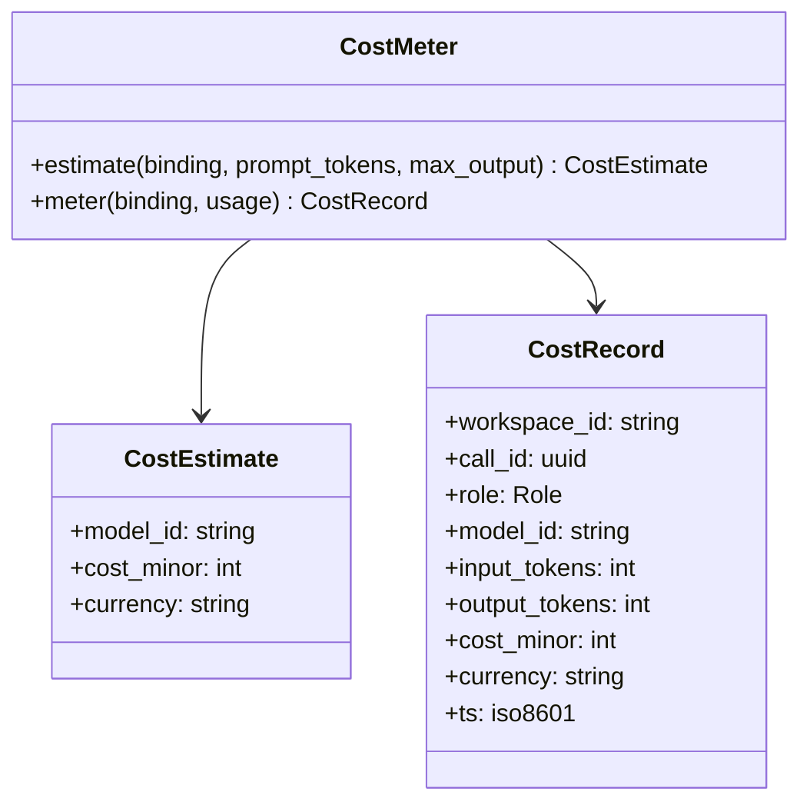
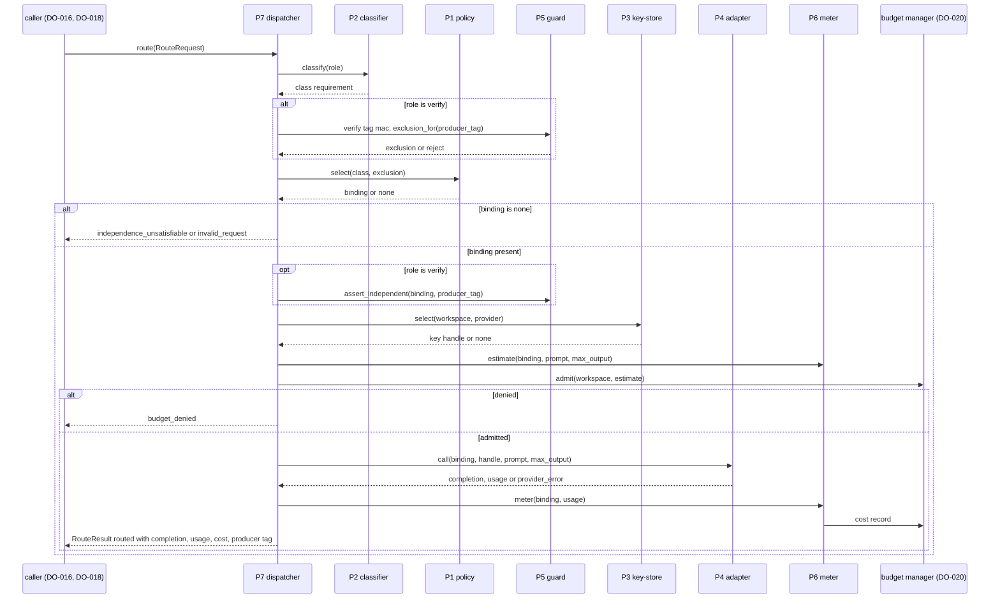

# DO-017 — Model Router

The L2 subsystem that binds each agent role to a concrete model under a per-workspace routing policy, holds the caller's own provider keys encrypted, and guarantees that a verifier never runs on the model that produced the artifact under review.

## ASSEMBLY DRAWING



A caller — the task DAG executor or the skill compiler — submits a typed RouteRequest naming a role and a prompt bundle to the route-dispatcher, the single entry point. The dispatcher has the role-classifier resolve the role to a model class, asks the routing-policy to select a concrete model binding from that class pool, and for a verification request first excludes the producing model through the independence-guard so the verifier is never the producer. It draws a key handle for that binding from the key-store, which holds BYO keys encrypted under a per-workspace key from the workspace store, then forwards the prompt with that handle through the provider-adapter, which resolves the handle to key material at transport, to the external provider. The cost-meter prices the returned usage against the policy price table and reports a cost record to the budget manager. Prompt content and provider keys are forwarded, never inspected or returned; the router selects providers and meters spend and owns no site credential.

## BILL OF MATERIALS

| Part | Name | Kind | Responsibility | Deps | Ref |
|------|------|------|----------------|------|-----|
| P1 | routing-policy | module | Loads, validates, and serves the routing policy and performs deterministic priority-ordered model selection over its class pools. | none | local |
| P2 | role-classifier | module | Maps a request role to a model-class requirement over the closed role set; rejects unknown roles. | P1 | local |
| P3 | key-store | store | Holds BYO provider keys encrypted under the workspace key and selects a key handle by workspace and provider behind a pluggable key source. | none | local |
| P4 | provider-adapter | module | Uniform call surface over heterogeneous providers; attaches the key at transport and forwards the prompt, returning completion and token usage. | P3 | local |
| P5 | independence-guard | module | Computes the producer-exclusion set and asserts the selected verifier model differs from the producer; fail-closed. | P1 | local |
| P6 | cost-meter | module | Estimates and meters per-call cost from token usage and the price table and emits a cost record to the budget manager. | P1 | local |
| P7 | route-dispatcher | module | Sole entry point orchestrating classify, select, independence, key selection, provider call, and cost accounting. | P1, P2, P3, P4, P5, P6 | local |

## DETAIL DRAWINGS

### P1 — routing-policy



Enums, closed: `Role` = plan, extract, classify, verify. `ModelClass` = frontier, fast. `Axis` = model, family, provider. A `model_id` is the identity triple provider, model, and version rendered as one string; `family` groups model_ids that share correlated behavior.

The policy is the single source of routing truth, read only by deterministic code. Selection is priority-ordered: pools list bindings best-first, and selection returns the first eligible binding, so identical inputs yield an identical binding. Eligibility requires both that the binding is outside the exclusion set and that the price table prices it.

```text
select(class_req, exclusion):
 1. pool := policy.pools[class_req]
 2. LOOP over pool in priority order as candidate:
 3.   IF candidate.model_id in exclusion: continue
 4.   IF policy.prices has no entry for candidate.model_id: continue
 5.   RETURN candidate
 6. RETURN none
```

Load refusals, fail-closed: an empty pool for any class named by `role_class`; a binding whose provider has no endpoint; a pooled model_id with no price entry; a price that is zero or negative; a currency not in ISO-4217; an empty workspace_id. `policy_rev` increments on every accepted reload and stamps each selection so a caller can detect a mid-task policy change. While no valid policy is loaded, every request fails closed as invalid_request.

### P2 — role-classifier



The classifier is a total function over the closed role set; an out-of-enum role is rejected rather than defaulted. The fixed map is plan to frontier, extract to fast, classify to fast. Verify is the one role the classifier does not assign a class: the classifier admits it, and the dispatcher sets its class from the producer tag it carries, so verification runs at the capability of the work it checks. Classification is deterministic and holds no state.

### P3 — key-store



`SourceKind` = byok, managed. BYO keys are stored encrypted at rest under a per-workspace key provisioned by the workspace store, in a local file with owner-only permissions. `select` returns an opaque KeyHandle for a provisioned workspace-and-provider pair and refuses any pair with no provisioned key. The plaintext key is never returned across the KeyStore boundary; only the provider-adapter resolves a handle to key material through the KeySource, at transport, inside one call.

The KeySource interface is the managed-tier seam. v0 ships only `LocalByokSource`, which decrypts a local key. A later `ManagedKeySource` returns a short-lived broker token behind the identical `resolve` signature, so adding the managed tier changes no other part contract and no KeyHandle field a caller reads.

### P4 — provider-adapter



The adapter normalizes heterogeneous provider APIs into one Completion and Usage shape, so no other part branches on provider identity. The prompt bundle is forwarded to the provider body unmodified; the resolved key is placed only in the transport authorization header, never in the request body, the returned Completion, a log line, or a cost record. `Usage` carries input_tokens and output_tokens read from the provider response; any cached tokens the provider reports are already counted within input_tokens and billed at the input rate. A call that exceeds `provider_timeout_ms` is abandoned and returned as a provider_error; the adapter invents no token counts for a failed call.

### P5 — independence-guard



The guard is the mechanism behind the hard rule that a verifier is never the producer. Producer identity is not taken from caller free text: every routed result carries a producer tag whose `mac` the dispatcher stamps with a per-session key, and a verify request must echo that tag. The guard rejects a tag with an invalid mac, so a caller cannot force verification onto a chosen model by asserting a false producer.

```text
exclusion_for(producer_tag, axis):
 1. IF axis is model: RETURN set of model_id equal to producer_tag.model_id
 2. IF axis is family: RETURN set of model_id whose family equals producer_tag.family
 3. IF axis is provider: RETURN set of model_id whose provider equals producer_tag.provider

assert_independent(selected_id, producer_tag, axis):
 1. IF selected_id in exclusion_for(producer_tag, axis): RETURN violation
 2. RETURN ok
```

The exclusion feeds P1 selection, and the guard re-asserts independence on the chosen binding as defence in depth. When the class pool minus the exclusion is empty, selection returns none and the dispatcher fails closed with independence_unsatisfiable rather than routing to the producer.

### P6 — cost-meter



Cost is integer arithmetic in minor units, never floating point, so totals are exact and reproducible. The price table gives minor units per one thousand tokens; the per-call cost rounds each bucket up to the next minor unit so a metered total never understates spend.

```text
meter(binding, usage):
 1. price := policy.prices[binding.model_id]
 2. in_cost  := ceil(usage.input_tokens  * price.input_minor_per_ktok  / 1000)
 3. out_cost := ceil(usage.output_tokens * price.output_minor_per_ktok / 1000)
 4. RETURN CostRecord with cost_minor := in_cost + out_cost, currency := price.currency
```

`estimate` prices the prompt token count plus the requested max output before the call, and the dispatcher passes the estimate to the budget manager for admission; `meter` prices the actual usage after the call and emits exactly one cost record per completed call. The meter reports spend and never enforces a ceiling — enforcement is the budget manager's.

### P7 — route-dispatcher



The dispatcher is the only path to a provider call, so every guarantee on this sheet holds at one choke point. It fails closed at each step: an invalid request, an empty selection, a missing key, or a budget denial each return before any provider call. Exactly one provider call runs per admitted request, and exactly one cost record reaches the budget manager per completed call. Every routed result is stamped with a fresh producer tag whose mac binds the call to this session, so the artifact can later be verified against an independent model.

```text
route(request):
 1. IF request invalid: RETURN RouteResult(invalid_request)
 2. class_req := P2.classify(request.role)
 3. IF request.role is verify:
      IF request.producer_tag absent OR mac invalid: RETURN RouteResult(invalid_request)
      class_req := request.producer_tag.model_class
      exclusion := P5.exclusion_for(request.producer_tag, policy.independence_axis)
    ELSE: exclusion := empty set
 4. binding := P1.select(class_req, exclusion)
 5. IF binding is none:
      IF request.role is verify: RETURN RouteResult(independence_unsatisfiable)
      ELSE: RETURN RouteResult(invalid_request)
 6. IF request.role is verify AND NOT P5.assert_independent(binding.model_id, request.producer_tag, policy.independence_axis):
      RETURN RouteResult(independence_unsatisfiable)
 7. handle := P3.select(request.workspace_id, binding.provider)
 8. IF handle is none: RETURN RouteResult(key_missing)
 9. estimate := P6.estimate(binding, request.prompt_tokens, request.max_output)
10. IF budget_manager.admit(request.workspace_id, estimate) is deny: RETURN RouteResult(budget_denied)
11. completion, usage := P4.call(binding, handle, request.prompt_bundle, request.max_output)
12. IF provider error: RETURN RouteResult(provider_error)
13. record := P6.meter(binding, usage); emit record to budget_manager
14. tag := stamp_producer_tag(new call_id, binding)
15. RETURN RouteResult(routed, completion, usage, record, tag)
```

## CONTRACTS & TOLERANCES

P1 — routing-policy:

| Operation | Input domain | Nominal behavior | Tolerance | Inspection op | Failure mode outside tolerance |
|-----------|--------------|------------------|-----------|---------------|--------------------------------|
| load(path) | policy file bytes | Validates against the P1 schema; on acceptance increments policy_rev and serves; on refusal keeps the prior policy if any. | Refusal set exact: empty pool for a mapped class, provider without endpoint, pooled model without a price, non-positive price, unknown currency, empty workspace_id | Op 10 | A refused file leaves the store unchanged; with no valid policy every request fails closed as invalid_request. |
| select(class_req, exclusion) | a ModelClass and a set of excluded model_ids | Returns the first pool binding that is outside the exclusion set and is priced, else none. | Deterministic and priority-ordered: identical inputs yield an identical binding; exact | Op 10, Op 80 | Nondeterminism is rejected at inspection; an empty eligible pool returns none and the caller fails closed. |
| current() | none | Returns the live policy and policy_rev. | policy_rev strictly monotonic across accepted loads; exact | Op 10 | A non-monotonic rev would hide a mid-task policy change; inspection rejects it. |

P2 — role-classifier:

| Operation | Input domain | Nominal behavior | Tolerance | Inspection op | Failure mode outside tolerance |
|-----------|--------------|------------------|-----------|---------------|--------------------------------|
| classify(role) | one Role value, possibly out of enum | Maps plan to frontier, extract and classify to fast, and admits verify with its class deferred to the dispatcher, which sets it from the producer tag; rejects an unknown role. | Total and deterministic over the closed role set; exact | Op 20 | An out-of-enum role is rejected as invalid_request, never defaulted to a class. |

P3 — key-store:

| Operation | Input domain | Nominal behavior | Tolerance | Inspection op | Failure mode outside tolerance |
|-----------|--------------|------------------|-----------|---------------|--------------------------------|
| select(workspace_id, provider) | a workspace and provider pair | Returns an opaque KeyHandle for a provisioned pair; the plaintext key never crosses the boundary. | Handle returned only for a provisioned pair; plaintext key bytes in returns, logs, and records equal zero; exact | Op 30, Op 90 | An unprovisioned pair is refused and the dispatcher returns key_missing; any observable key byte fails inspection. |
| put, rotate | workspace, provider, key bytes | Stores the key encrypted at rest under the per-workspace key with owner-only file permissions. | Ciphertext at rest only; file mode owner-only; exact | Op 30 | A plaintext-at-rest or world-readable key fails inspection. |
| KeySource.resolve(workspace_id, provider) | a provisioned handle, byok or managed source | Resolves the handle to key material for one transport call behind a source-independent signature. | Signature identical across byok and managed sources; managed tier adds no new caller-visible field; exact | Op 30 | A source-specific signature would break the non-breaking managed-tier addition; inspection rejects it. |

P4 — provider-adapter:

| Operation | Input domain | Nominal behavior | Tolerance | Inspection op | Failure mode outside tolerance |
|-----------|--------------|------------------|-----------|---------------|--------------------------------|
| call(binding, handle, prompt_bundle, max_output) | a valid binding, a resolvable handle, a caller prompt bundle | Forwards the prompt to the provider with the key at transport and returns a normalized Completion and Usage. | Prompt bundle forwarded unmodified; key present only in transport auth; usage counts equal the provider response; exact | Op 40, Op 90 | A modified prompt, a key in body or return, or an invented count fails inspection. |
| call — normalization | responses from any configured provider | Returns one Completion and Usage shape regardless of provider. | Shape identical across providers; exact | Op 40 | A provider-specific shape leaking upward fails inspection. |
| call — timeout | provider slower than provider_timeout_ms | Abandons the call and returns provider_error with no usage. | Abandonment at provider_timeout_ms; no usage on a failed call; exact | Op 40, Op 100 | A hung call stalls the dispatcher; the op rejects any call exceeding the bound. |

P5 — independence-guard:

| Operation | Input domain | Nominal behavior | Tolerance | Inspection op | Failure mode outside tolerance |
|-----------|--------------|------------------|-----------|---------------|--------------------------------|
| exclusion_for(producer_tag, axis) | a mac-valid producer tag and a policy axis | Returns the set of model_ids excluded from verification under the axis. | Producer model_id always in the exclusion for a verify request; axis widening to family or provider exact; exact | Op 50, Op 80 | A tampered or absent tag is rejected as invalid_request; a producer left in the pool fails inspection. |
| assert_independent(selected_id, producer_tag, axis) | a selected model and a producer tag | Returns violation when the selection lies in the exclusion set, else ok. | selected_id equal to the producer under the axis is always a violation; fail-closed; exact | Op 50, Op 80 | A verifier equal to the producer reaching a provider call fails the Op 80 battery. |

P6 — cost-meter:

| Operation | Input domain | Nominal behavior | Tolerance | Inspection op | Failure mode outside tolerance |
|-----------|--------------|------------------|-----------|---------------|--------------------------------|
| estimate(binding, prompt_tokens, max_output) | a binding and a token budget | Prices prompt plus max output against the table before the call. | Deterministic integer minor units; estimate never below the sum of its priced buckets; exact | Op 60 | A non-reproducible estimate is rejected at inspection. |
| meter(binding, usage) | a binding and a returned Usage | Prices actual usage in minor units and returns a cost record. | Cost equals the per-bucket sum with round-up, currency from the price table; exact to the minor unit | Op 60, Op 90 | Arithmetic drift or a floating-point cost breaks accounting; inspection rejects both against golden vectors. |
| emit | a completed call | Sends exactly one cost record to the budget manager. | One record per completed call; exact | Op 60, Op 70 | A dropped or duplicated record misstates spend; inspection counts records against calls. |

P7 — route-dispatcher. Each guarantee names the op that could falsify it:

| Operation | Input domain | Nominal behavior | Tolerance | Inspection op | Failure mode outside tolerance |
|-----------|--------------|------------------|-----------|---------------|--------------------------------|
| route(request) | a typed RouteRequest from a caller | Orchestrates classify, select, independence, key, admission, provider call, and metering; the only path to a provider call. | Exactly one provider call per admitted request; zero calls for invalid, unsatisfiable, key-missing, or denied requests; exact | Op 70 | A second call or a bypass observed at the stub provider rejects the build. |
| route — independence guarantee | adversarial verify requests, forged tags included | No verify request routes to the producing model. | Verifier equal to producer dispatches equal zero across the Op 80 battery; exact | Op 80 | A single producer-as-verifier dispatch fails the battery; the exclusion and mac check are the mechanism. |
| route — key guarantee | adversarial request streams | No provider key or provisioned secret reaches a caller or a log. | Key bytes in RouteResult, logs, and cost records equal zero; exact | Op 90 | One leaked byte fails the battery; transport-only key handling is the mechanism. |
| route — cost guarantee | any admitted request | Every completed call yields one cost record to the budget manager. | Records equal completed calls, one to one; exact | Op 70, Op 90 | A missing or extra record fails inspection against the call count. |
| route — admission | requests over the workspace budget | Honors the budget manager admission verdict before calling a provider. | A deny verdict yields budget_denied and zero provider calls; exact | Op 70 | A provider call after a deny fails inspection at the stub provider. |
| route — producer tag | any routed result | Stamps a session-mac producer tag on the result for downstream verification. | Tag mac valid for this session; a forged verify tag rejected; exact | Op 80 | An unverifiable or forgeable tag breaks the independence chain; the battery falsifies it. |
| route — overhead latency | non-provider path on the stub provider | Adds bounded overhead excluding provider wait. | p99 at or below 15 ms on the Op 100 corpus | Op 100 | Over-budget overhead is rejected at inspection. |

Boundary contracts (external actors; the router consumes these interfaces and does not restate their internals):

| Operation | Input domain | Nominal behavior | Tolerance | Inspection op | Failure mode outside tolerance |
|-----------|--------------|------------------|-----------|---------------|--------------------------------|
| caller submission protocol (DO-016, DO-018) | typed RouteRequest only | Callers reach the router solely through route; results return as data. | Non-conforming requests rejected as invalid_request; zero free-form provider access; exact | Op 70 | A caller reaching a provider around the dispatcher fails inspection; no such path exists. |
| budget manager admission and reporting (DO-020) | a CostEstimate before a call, a CostRecord after | Returns an admit or deny verdict for the estimate and accepts one cost record per call. | Verdict honored before any provider call; one record per completed call; exact | Op 60, Op 70 | An unhonored deny or a lost record breaks spend control; inspection checks both against the run. |
| workspace key provisioning (DO-019) | workspace open | Supplies the per-workspace encryption key and the provisioned provider keys the key-store holds. | Encryption key scoped to exactly one workspace_id; exact | Op 30 | A shared key would collapse workspace isolation; inspection verifies per-workspace separation. |
| provider call surface | a normalized request with transport auth | The provider returns a completion and token usage; authentication is the transport key. | Usage counts read from the provider response; call bounded by provider_timeout_ms; exact | Op 40, Op 100 | A provider timeout or error returns provider_error with no usage; inspection asserts the bound. |

## PROCESS PLAN

| Op | Task | Tooling | Inspection |
|----|------|---------|------------|
| 10 | Implement P1 routing-policy: schema, load refusals, priority-ordered select, price lookup, policy_rev. | language stdlib, unit test runner | A valid policy loads and serves; empty-pool, no-endpoint, missing-price, non-positive-price, and unknown-currency files each refuse; select is priority-ordered and excludes the exclusion set; identical inputs give an identical binding; policy_rev strictly increments. |
| 20 | Implement P2 role-classifier over the closed role set. | language stdlib, unit test runner | Each role maps to its class per the P2 table; an unknown role is rejected as invalid_request; classification is deterministic and stateless. |
| 30 | Implement P3 key-store: encrypted store, workspace-key decryption, select, pluggable KeySource, managed-source stub. | language stdlib, AEAD cipher primitive, unit test runner | Keys are ciphertext at rest with owner-only permissions; select returns a handle for provisioned pairs and refuses others; the managed-source stub resolves behind the identical signature; the plaintext key appears in no return, log, or record; per-workspace key separation is verified. |
| 40 | Implement P4 provider-adapter over two stub providers. | language stdlib, stub provider harness, unit test runner | The prompt bundle is forwarded byte-identical; the key is present only in transport auth; Completion and Usage shape is identical across both stubs; usage counts equal the stub response; a slow stub is abandoned at provider_timeout_ms with no usage. |
| 50 | Implement P5 independence-guard: exclusion computation and assertion. | language stdlib, unit test runner | The exclusion always contains the producer model for verify; axis widening to family and provider matches fixtures; assert_independent rejects a selection equal to the producer; an absent or mac-invalid tag is rejected. |
| 60 | Implement P6 cost-meter: estimate, meter, and record emission. | language stdlib, unit test runner | Cost equals the per-bucket round-up sum in minor units against golden vectors; estimate is deterministic; exactly one record is emitted per call; currency comes from the price table. |
| 70 | Implement P7 route-dispatcher and wire the pipeline to the stub providers and a stub budget manager. | language stdlib, stub harness, unit test runner | An admitted request yields exactly one provider call and one cost record; invalid, key-missing, and unsatisfiable requests yield zero calls; a budget deny yields budget_denied and zero calls; records equal completed calls one to one. |
| 80 | Independence battery: adversarial producer and verifier vectors with forged tags. | adversarial harness, unit test runner | No verify request routes to the producing model across all vectors; forged producer tags are rejected by the session mac; a single-frontier-key verify yields independence_unsatisfiable and zero calls; family and provider axis widening are honored. |
| 90 | Key non-leak and cost-integrity battery. | adversarial harness with leak detectors, unit test runner | Provider-key and provisioned-secret bytes crossing to callers, logs, or cost records equal zero; every model in every pool has a price entry; metered totals equal the sum of per-call costs exactly. |
| 100 | Latency and throughput measurement over reference corpora. | benchmark harness with high-resolution clock measurement | p99 dispatch overhead at or below 15 ms excluding provider wait; the adapter timeout is enforced under load; selection over large pools stays within budget. |

## REVISION HISTORY

| Rev | Date | Author | Change summary |
|-----|------|--------|----------------|
| A | 2026-07-18 | Claude Fable 5 | Initial draft. |
