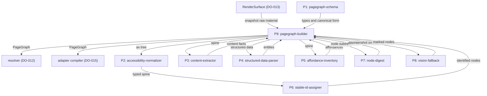
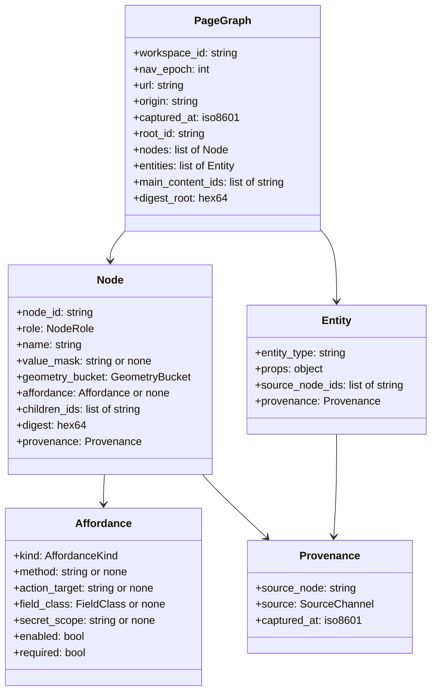
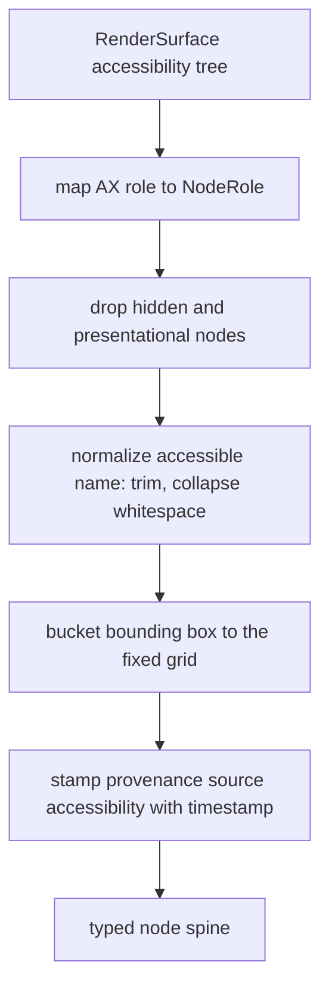
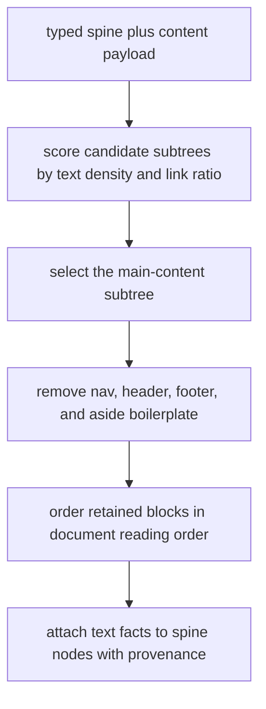
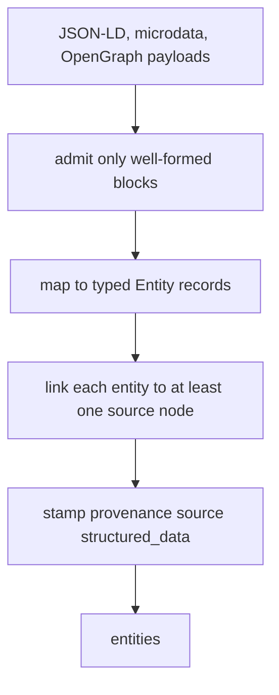
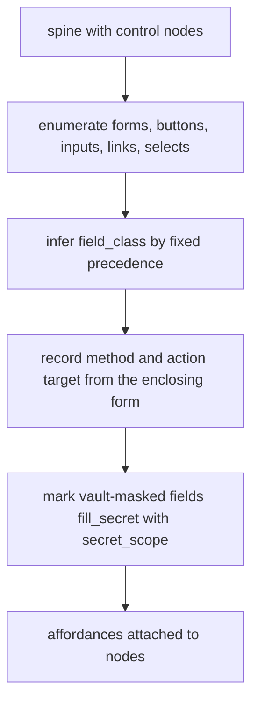
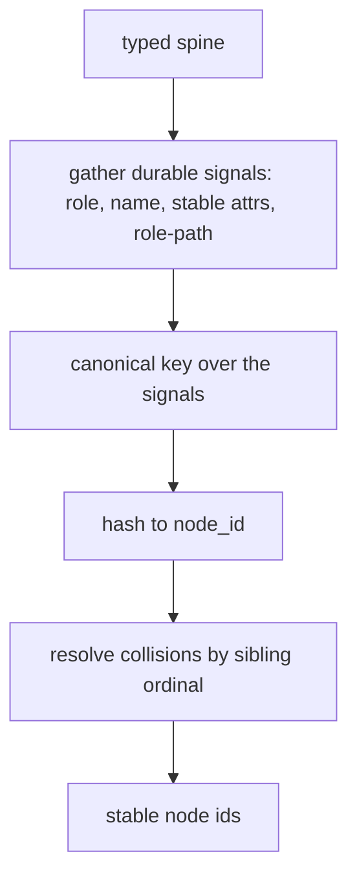
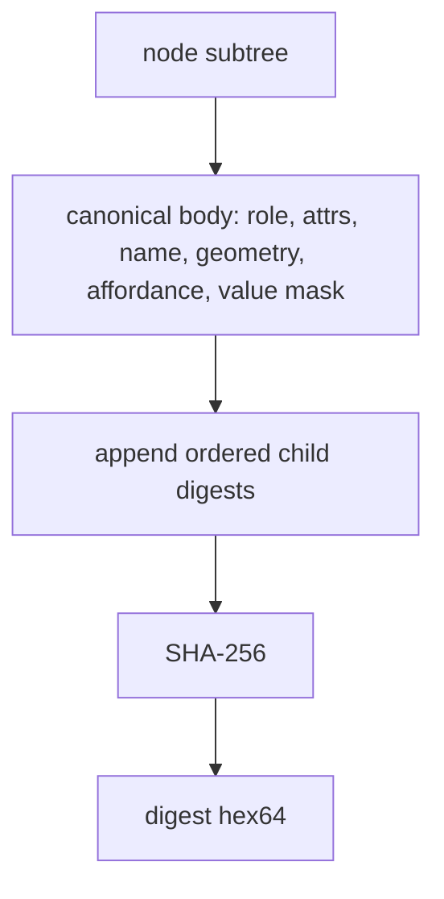
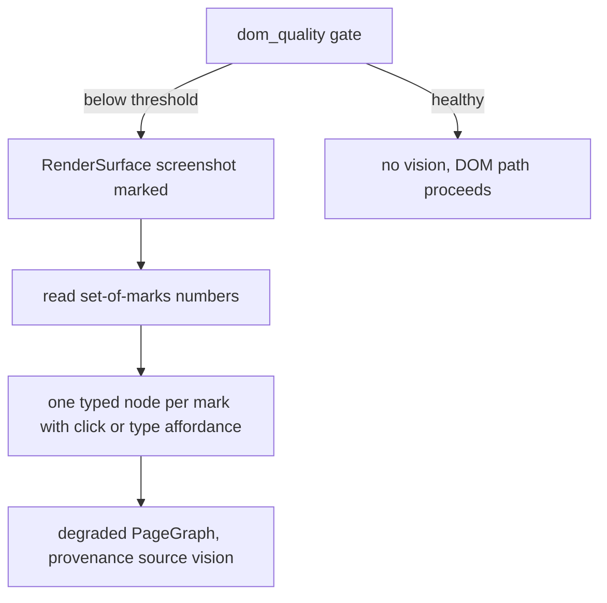
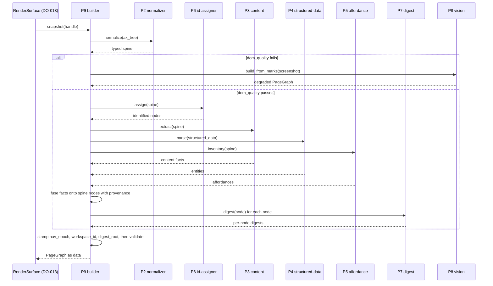

# DO-014 — PageGraph Perception Model

The typed fusion of a rendered page into stable-id, provenance-tagged nodes and affordances — the single structured surface models read and actions target, so that nothing above the render boundary ever sees raw HTML.

## ASSEMBLY DRAWING



RenderSurface hands the pagegraph-builder one snapshot — DOM, accessibility tree, structured-data payload, nav_epoch, and workspace_id. The builder drives the accessibility-normalizer to produce the typed spine, runs the stable-id-assigner over it, fuses content-extractor text, structured-data-parser entities, and affordance-inventory controls onto the spine nodes, computes a per-node digest through the node-digest function, and stamps provenance, nav_epoch, and workspace_id from the snapshot. When the DOM path fails a quality gate the builder falls back to vision. The resolver, the adapter compiler, and the executor and agent runtime beyond them read the emitted PageGraph by stable node id and never touch raw HTML.

## BILL OF MATERIALS

| Part | Name | Kind | Responsibility | Deps | Ref |
|------|------|------|----------------|------|-----|
| P1 | pagegraph-schema | module | Defines the typed node, edge, entity, affordance, and provenance schema with canonical serialization. | none | local |
| P2 | accessibility-normalizer | module | Normalizes the accessibility tree into the typed node spine with provenance and bucketed geometry. | P1 | local |
| P3 | content-extractor | module | Selects the main-content subtree, removes boilerplate, and attaches reading-order text facts to spine nodes. | P1 | local |
| P4 | structured-data-parser | module | Parses JSON-LD, microdata, and OpenGraph into typed entities linked to their source nodes. | P1 | local |
| P5 | affordance-inventory | module | Enumerates interactables and infers field class, affordance kind, method, and action target. | P1 | local |
| P6 | stable-id-assigner | module | Assigns each node a drift-stable id from durable role, name, and structural-path signals. | P1, P2 | local |
| P7 | node-digest | function | Computes a content and geometry fingerprint of a node subtree for change detection. | P1 | local |
| P8 | vision-fallback | module | Builds a degraded typed graph from a marked screenshot when the DOM path fails its quality gate. | P1 | local |
| P9 | pagegraph-builder | module | Sole entry point: fuses the sources into one PageGraph and emits digests, nav_epoch, and workspace_id. | P1, P2, P3, P4, P5, P6, P7, P8 | local |

## DETAIL DRAWINGS

### P1 — pagegraph-schema



Enums, closed: `NodeRole` is document, region, heading, paragraph, link, button, textbox, checkbox, radio, select, option, image, list, listitem, form, table, cell, unknown. `AffordanceKind` is click, type, select, submit, navigate, fill_secret, none. `FieldClass` is text, identifier, credential_ref, payment, address, search, free_form. `SourceChannel` is accessibility, readability, structured_data, affordance, vision.

The Node is the only addressable unit; every consumer reaches page state through a `node_id`, never through a selector or raw markup. Canonical serialization is deterministic JSON — sorted keys, no whitespace, UTF-8. `validate(graph)` rejects unknown roles, out-of-enum values, missing required fields, and child references that name no node in the graph; rejection is total, never partial. Provenance is mandatory on every Node and every Entity: a fact with no source node and timestamp is not representable.

### P2 — accessibility-normalizer



The accessibility tree is the spine because it is already a tree of typed, named nodes with the presentational noise removed by the engine. Role mapping is a total function into the closed `NodeRole` enum; an unmapped AX role becomes `unknown` rather than a guess. Geometry is quantized to a sixteen-pixel grid so that sub-pixel and scroll shifts do not perturb it. Normalization is deterministic: identical accessibility input yields an identical spine. Every emitted node carries provenance to its originating accessibility node.

### P3 — content-extractor



Extraction reads the same document the normalizer read and attaches its result to existing spine nodes; it never creates free-floating text. Reading order equals the document order of retained blocks, so a consumer replays the article as authored. Boilerplate removal follows a fixed rule set over role and text-density thresholds, so the result is deterministic. Each retained block records `main_content_ids` order and stamps provenance source readability.

### P4 — structured-data-parser



Structured data is treated strictly as data, never as instruction. A malformed or partial block is skipped, not repaired by inference — a fabricated entity would carry fabricated provenance. Every emitted Entity links to at least one source node so that a claim traces back to the page position that made it. Parsing is deterministic over the payload.

### P5 — affordance-inventory



Affordance inference decides what an action against a node would do, so its posture must never under-classify. Field class follows a fixed precedence, and the credential and payment classes are never allowed to fall through to `free_form`.

```text
infer_field_class(node):
 1. IF the autocomplete token maps to a known class: RETURN that class
 2. IF input type is password OR the field is vault-masked: RETURN credential_ref
 3. IF input type is one of email, tel, url: RETURN identifier
 4. IF name or label matches the payment lexicon: RETURN payment
 5. IF name or label matches the address lexicon: RETURN address
 6. IF role is searchbox OR name matches the search lexicon: RETURN search
 7. IF role is textbox OR the node is a text input: RETURN text
 8. RETURN free_form
```

Method and action target come from the enclosing form for submit-class controls; a vault-masked field classifies as `credential_ref` with `secret_scope` set from the mask label. Every affordance is provenance-tagged.

### P6 — stable-id-assigner



The stable id is the anchor skills and grants bind to, so it must survive minor DOM drift. It is derived only from durable signals and excludes exactly the volatile ones — raw sibling index, churning attribute values, class lists, and geometry.

```text
assign_id(node, graph):
 1. signals := [ node.role,
                 normalized(node.accessible_name),
                 stable_attrs(node),      durable id, name, data-testid, and ARIA only
                 role_path(node) ]        ordered roles from the nearest landmark to node
 2. key := canonical(signals)
 3. base := SHA-256(key) truncated to the id width
 4. IF base is already assigned in this graph:
      base := base with the node ordinal among siblings sharing the key appended
 5. RETURN base
```

`role_path` walks roles, not indices, from the nearest landmark region, so inserting an unrelated sibling does not shift it. Ids are collision-free within a graph and deterministic across re-snapshots when the durable signals are unchanged.

### P7 — node-digest



The digest is the counterpart to the stable id: the id is the semantic anchor that survives content change, the digest is the content and geometry fingerprint that changes when content changes. DO-012 grant binding consumes it as `target_digest` and, over a form subtree, as `form_digest`.

```text
digest(node):
 1. body := canonical({
      role,
      attrs:            stable and volatile attributes,
      name:             accessible name,
      geometry:         geometry_bucket(node),
      affordance:       affordance metadata or none,
      value_mask:       value mask label or none,
      child_digests:    [ digest(c) for c in node.children in order ] })
 2. RETURN SHA-256(body)
```

The digest covers precisely what the id excludes — geometry bucket and current values — so a mutation invisible to the id is visible to the digest. It is byte-identical for equal subtrees.

### P8 — vision-fallback



Vision costs about ten times the DOM path — a screenshot plus a vision-model call — so it runs only when the DOM path cannot answer.

```text
dom_quality(spine, snapshot):
 1. IF spine has zero interactable nodes AND the snapshot reports non-trivial paint area: RETURN fail
 2. IF accessibility coverage over the painted area is below the coverage threshold: RETURN fail
 3. RETURN pass

build_from_marks(image, snapshot):
 1. marks := set_of_marks(image)          numbered one through n in reading order
 2. LOOP over each mark:
      node := Node( role:       inferred from visual features,
                    affordance: click or type,
                    node_id:    the mark id,
                    provenance: source vision with the snapshot timestamp )
 3. RETURN PageGraph(marks as nodes, snapshot.nav_epoch, snapshot.workspace_id, snapshot.ts)
```

Mark ids are capture-local and lower-stability than DOM ids; the builder labels the graph vision-sourced so consumers treat its bindings as short-lived.

### P9 — pagegraph-builder



The builder is the sole entry point and the only part that touches the raw snapshot. Construction is deterministic end to end: an identical snapshot produces a byte-identical PageGraph.

```text
build(snapshot):
 1. spine := P2.normalize(snapshot.ax_tree)
 2. IF dom_quality(spine, snapshot) is fail:
      RETURN P8.build_from_marks(RenderSurface.screenshot(handle, marked: true), snapshot)
 3. spine := P6.assign(spine)
 4. LOOP over P3.extract(spine), P4.parse(snapshot.structured_data), P5.inventory(spine):
      attach each fact to its spine node with provenance source and timestamp
 5. LOOP over every node in spine:
      node.digest := P7.digest(node)
 6. graph := PageGraph(spine, entities, nav_epoch: snapshot.nav_epoch,
                       workspace_id: snapshot.workspace_id, captured_at: snapshot.ts)
 7. IF P1.validate(graph) is reject: ERROR invalid_graph
 8. RETURN graph
```

Every fused fact attaches to a spine node; an orphan fact is a resolution failure, not a floating record. `nav_epoch` and `workspace_id` are copied from the snapshot unchanged and are the fields DO-012 and DO-013 bind against.

## CONTRACTS & TOLERANCES

P1 — pagegraph-schema:

| Operation | Input domain | Nominal behavior | Tolerance | Inspection op | Failure mode outside tolerance |
|-----------|--------------|------------------|-----------|---------------|--------------------------------|
| canonical(obj) | any schema-typed node, entity, or graph | Serializes to deterministic JSON with sorted keys, no whitespace, UTF-8. | Byte-identical output for equal values regardless of key order; exact | Op 10 | Divergent bytes break digests and grant bindings; the op rejects the build. |
| validate(graph) | any candidate PageGraph | Checks roles, enum values, required fields, and child-reference integrity; rejects on any violation. | Acceptance and rejection deterministic; exact | Op 10 | A malformed graph is rejected before emission; no consumer receives an invalid graph. |

P2 — accessibility-normalizer:

| Operation | Input domain | Nominal behavior | Tolerance | Inspection op | Failure mode outside tolerance |
|-----------|--------------|------------------|-----------|---------------|--------------------------------|
| normalize(ax_tree) | RenderSurface accessibility tree for one handle | Maps roles to the enum, drops hidden and presentational nodes, normalizes names, buckets geometry, stamps provenance. | Deterministic; every node typed to the closed enum and provenance-tagged; geometry quantized to the fixed grid; exact | Op 30 | An untyped or unprovenanced node is rejected at inspection; the builder blocks rather than emit it. |

P3 — content-extractor:

| Operation | Input domain | Nominal behavior | Tolerance | Inspection op | Failure mode outside tolerance |
|-----------|--------------|------------------|-----------|---------------|--------------------------------|
| extract(spine) | typed spine plus raw content payload | Selects the main-content subtree, removes boilerplate, orders blocks, attaches text facts to spine nodes. | Reading order equals document order of retained blocks; every fact provenance-tagged; deterministic; exact | Op 50 | Misordered or unattributed content misleads consumers; inspection compares against document order. |

P4 — structured-data-parser:

| Operation | Input domain | Nominal behavior | Tolerance | Inspection op | Failure mode outside tolerance |
|-----------|--------------|------------------|-----------|---------------|--------------------------------|
| parse(raw) | JSON-LD, microdata, and OpenGraph payloads | Admits well-formed structured data as typed entities linked to source nodes; skips malformed blocks. | Every entity links to at least one source node; malformed blocks skipped not guessed; deterministic; exact | Op 60 | A guessed entity fabricates provenance; inspection rejects any entity without a source node. |

P5 — affordance-inventory:

| Operation | Input domain | Nominal behavior | Tolerance | Inspection op | Failure mode outside tolerance |
|-----------|--------------|------------------|-----------|---------------|--------------------------------|
| inventory(spine) | typed spine with form and control nodes | Enumerates interactables, infers field class and affordance kind, records method and action target. | Field class by the fixed precedence; credential and payment fields never free_form; each affordance provenance-tagged; exact | Op 70 | A payment field mistyped as free_form evades DO-012 classification; inspection checks the precedence and the credential and payment cases. |

P6 — stable-id-assigner:

| Operation | Input domain | Nominal behavior | Tolerance | Inspection op | Failure mode outside tolerance |
|-----------|--------------|------------------|-----------|---------------|--------------------------------|
| assign(spine) | normalized spine for one snapshot | Derives a drift-stable node_id per node from durable signals and resolves collisions deterministically. | Ids collision-free within a graph and deterministic; at least 0.98 of durable nodes retain id across the drift corpus | Op 40, Op 100 | An id that churns on minor drift breaks skill and grant binding; the drift corpus falsifies instability. |

P7 — node-digest:

| Operation | Input domain | Nominal behavior | Tolerance | Inspection op | Failure mode outside tolerance |
|-----------|--------------|------------------|-----------|---------------|--------------------------------|
| digest(node) | any node subtree | Hashes the canonical form of role, attributes, name, geometry bucket, affordance, value mask, and ordered child digests. | Byte-identical for equal subtrees; changes when any covered field changes; exact | Op 20, Op 100 | A digest blind to a change lets a stale DO-012 grant survive; inspection mutates each covered field and requires a changed digest. |

P8 — vision-fallback:

| Operation | Input domain | Nominal behavior | Tolerance | Inspection op | Failure mode outside tolerance |
|-----------|--------------|------------------|-----------|---------------|--------------------------------|
| build_from_marks(screenshot) | marked screenshot when the DOM gate fails | Turns set-of-marks numbers into typed nodes with click or type affordances and vision provenance. | Invoked only when dom_quality is fail; marks numbered one through n stable within a capture; exact | Op 80, Op 120 | Running vision on a healthy DOM burns about ten times the cost; the battery confirms the gate holds and a populated tree never triggers it. |

P9 — pagegraph-builder:

| Operation | Input domain | Nominal behavior | Tolerance | Inspection op | Failure mode outside tolerance |
|-----------|--------------|------------------|-----------|---------------|--------------------------------|
| build(snapshot) | snapshot with DOM, accessibility tree, structured data, nav_epoch, workspace_id | Drives normalization, id assignment, fusion, digesting, and provenance stamping into one typed PageGraph, or routes to vision on gate failure. | Identical snapshot yields a byte-identical PageGraph; nav_epoch and workspace_id equal the snapshot values; every fact provenance-tagged; exact | Op 90, Op 120 | Nondeterminism or a dropped provenance link is rejected at inspection; consumers never receive an untraceable fact. |
| fusion integrity | multi-source snapshot | Attaches every content, entity, and affordance fact to a spine node addressable by stable node_id. | Zero orphan facts; every node addressable by stable node_id; exact | Op 90 | An orphan fact has no provenance target; inspection rejects any fact not bound to a spine node. |
| build latency | snapshots up to 20000 nodes | Returns the PageGraph within the latency budget. | p99 at or below 150 ms on the Op 110 corpus | Op 110 | Over-budget construction stalls every consumer; the op rejects the build until within budget. |

RenderSurface additions consumed (DO-013 boundary; this sheet reads them, DO-013 owns them):

| Operation | Input domain | Nominal behavior | Tolerance | Inspection op | Failure mode outside tolerance |
|-----------|--------------|------------------|-----------|---------------|--------------------------------|
| snapshot(handle) raw material | any open page handle | Supplies DOM, accessibility tree, structured-data payload, nav_epoch, and workspace_id as the sole page input above L0. | nav_epoch monotonic per handle; workspace_id present on every snapshot; exact | Op 90 | Missing nav_epoch or workspace_id makes id and grant binding impossible; the builder blocks or falls back rather than guess. |
| screenshot(handle, marked) | pages failing the DOM gate | Returns a set-of-marks overlay image for the vision path. | Marks numbered one through n stable within a capture; exact | Op 80 | An unstable overlay yields unstable mark ids; inspection checks numbering within a capture. |
| import boundary | every module in the subsystem | Consumes page state only through RenderSurface snapshot and screenshot outputs. | Zero engine or Electron symbols imported anywhere in the subsystem; exact | Op 90 | An engine import couples perception to the substrate and breaks swappability; inspection scans the import graph. |

Consumer boundary (DO-012 resolver, DO-015 adapter compiler, DO-016 executor, L2 agent runtime):

| Operation | Input domain | Nominal behavior | Tolerance | Inspection op | Failure mode outside tolerance |
|-----------|--------------|------------------|-----------|---------------|--------------------------------|
| read(PageGraph) | the emitted PageGraph | Consumers read typed nodes by stable node_id and their per-node digests and never receive raw HTML. | PageGraph exposes no raw HTML field; every node addressable by node_id and carrying a digest; exact | Op 20, Op 90 | A raw HTML field lets a consumer bypass the typed surface; inspection asserts its absence and per-node digest presence. |

## PROCESS PLAN

| Op | Task | Tooling | Inspection |
|----|------|---------|------------|
| 10 | Implement P1: node, entity, affordance, and provenance types, enums, canonical serialization, and schema validation. | language stdlib, JSON library | Golden-vector round trips; canonical bytes identical across key orderings; graphs with unknown roles, out-of-enum values, missing fields, and dangling child references rejected. |
| 20 | Implement P7 node-digest over P1. | language stdlib, SHA-256 primitive, unit test runner | Digest byte-identical for equal subtrees across key orderings; a change to role, name, attribute, geometry bucket, affordance, value mask, or any child digest changes it; an unrelated node change leaves it unchanged. |
| 30 | Implement P2 accessibility-normalizer over recorded accessibility-tree fixtures. | language stdlib, fixture corpus, unit test runner | Every emitted node carries a NodeRole from the closed enum and provenance source accessibility with a timestamp; hidden and presentational nodes dropped; identical fixture yields an identical spine; geometry buckets quantized to the fixed grid. |
| 40 | Implement P6 stable-id-assigner over the normalized spine. | language stdlib, fixture corpus, unit test runner | Ids collision-free within a graph; identical spine yields identical ids; the durable-signal rule set excludes raw sibling index, volatile attribute values, and geometry. |
| 50 | Implement P3 content-extractor over the spine. | language stdlib, readability fixture corpus, unit test runner | Main-content ids in document reading order; boilerplate removed per the rule set; every content fact carries provenance to a spine node and a timestamp; identical input yields identical extraction. |
| 60 | Implement P4 structured-data-parser. | language stdlib, JSON library, fixture corpus, unit test runner | Well-formed JSON-LD, microdata, and OpenGraph fixtures yield typed entities each linked to a source node; malformed blocks skipped, never guessed; identical input yields identical entities. |
| 70 | Implement P5 affordance-inventory over the spine. | language stdlib, form fixture corpus, unit test runner | Field class assigned by the fixed precedence; credential and payment fields never free_form; method and action target recorded for form-enclosed controls; provenance present on every affordance. |
| 80 | Implement P8 vision-fallback against a marked-screenshot stub and a vision-model stub. | language stdlib, screenshot fixture corpus, vision-model stub, unit test runner | Set-of-marks nodes numbered one through n stable within a capture; each mark node carries a click or type affordance and provenance source vision; the path runs only when the DOM quality gate reports fail. |
| 90 | Implement P9 pagegraph-builder and wire the full pipeline over recorded snapshots. | language stdlib, snapshot fixture corpus, unit test runner | Identical snapshot yields a byte-identical PageGraph; nav_epoch and workspace_id equal the snapshot values; every node and entity carries provenance with a source node and timestamp; every fused fact attaches to a spine node with no orphans; the PageGraph exposes no raw HTML field; no module imports engine or Electron symbols and the only page input is RenderSurface snapshot and screenshot. |
| 100 | Drift and stability battery over minor-perturbation snapshot pairs. | fault-injection fixture corpus, unit test runner | Across attribute churn, sibling insertion and removal, and geometry shift, at least 0.98 of durable nodes retain their id; a node whose content or geometry bucket changes gets a changed digest; a node whose durable signals are unchanged keeps its id. |
| 110 | Latency and throughput measurement over reference corpora. | benchmark harness with high-resolution clock | p99 build measured at or below 150 ms on 20000-node snapshots; memory within the stated bound. |
| 120 | Provenance, determinism, and fallback battery end to end. | adversarial fixture corpus, vision-model stub, unit test runner | Every extracted fact resolves to a source node and timestamp; degenerate and canvas-only fixtures trigger the vision path exactly once and produce a typed graph; a fixture with a populated accessibility tree never triggers the vision path; repeated runs over the corpus are byte-identical. |

## REVISION HISTORY

| Rev | Date | Author | Change summary |
|-----|------|--------|----------------|
| A | 2026-07-18 | Claude Fable 5 | Initial draft. |
