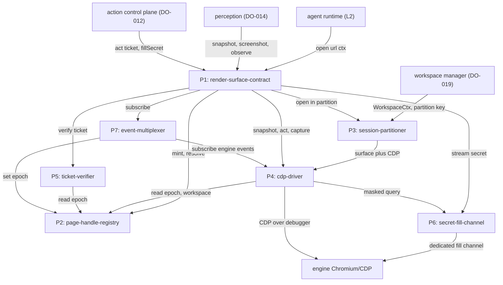
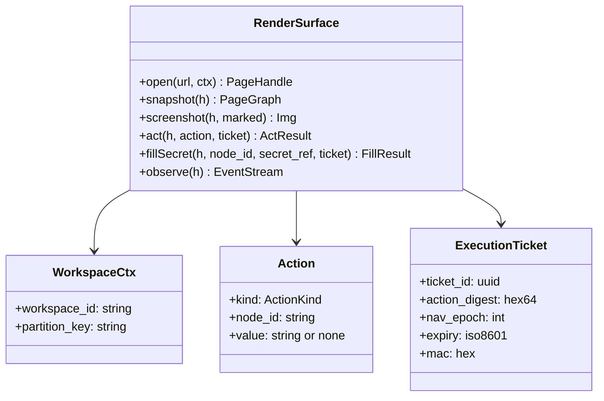
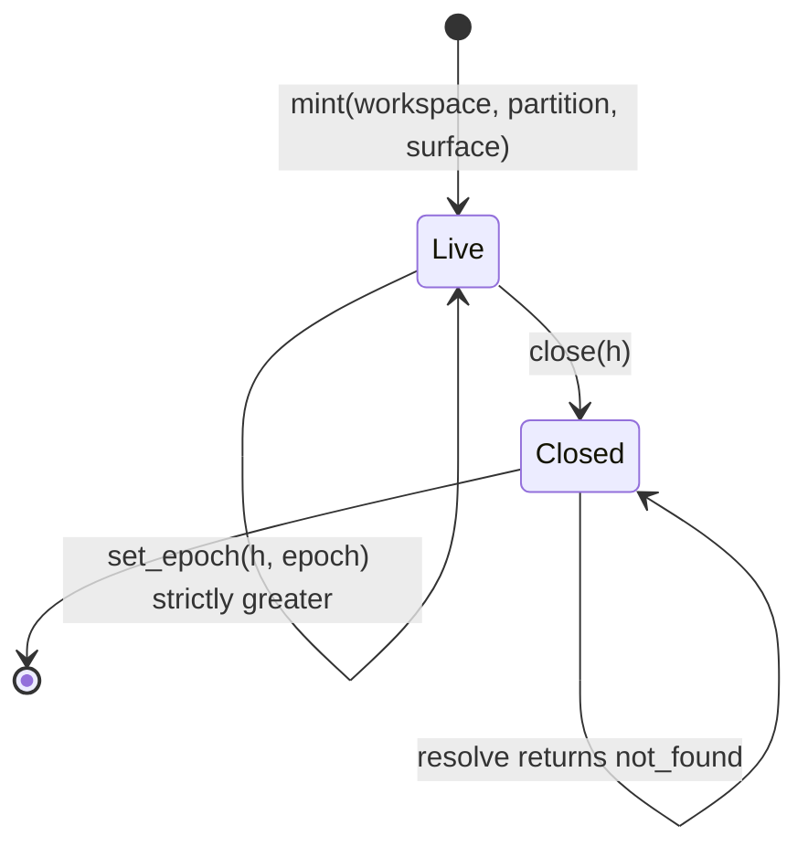
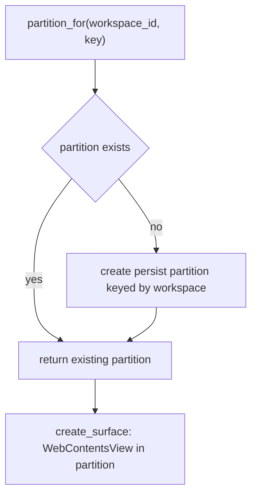
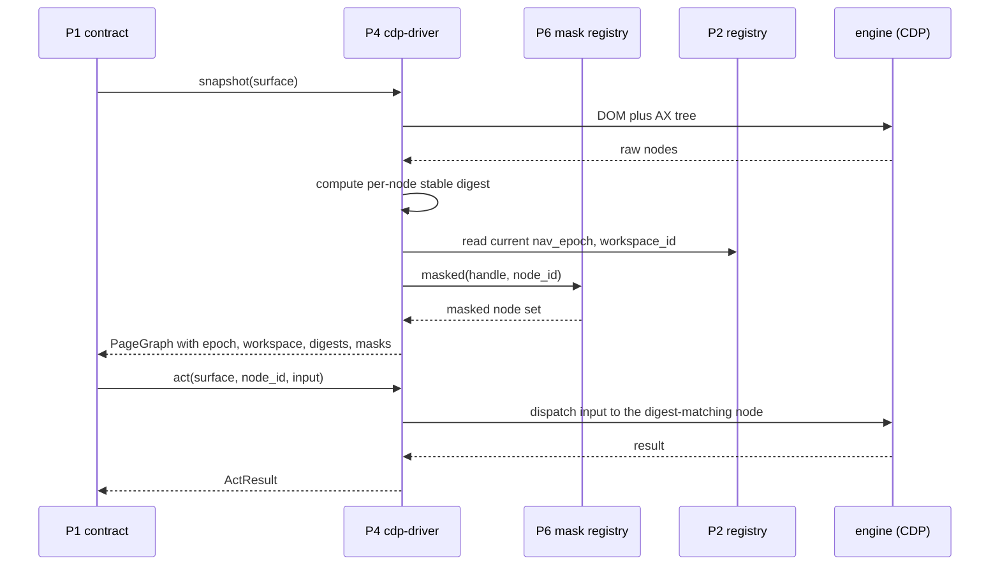
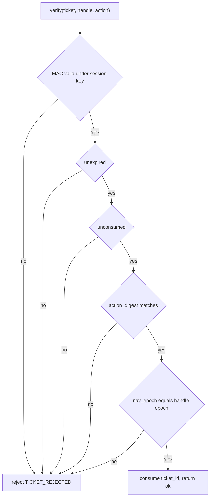
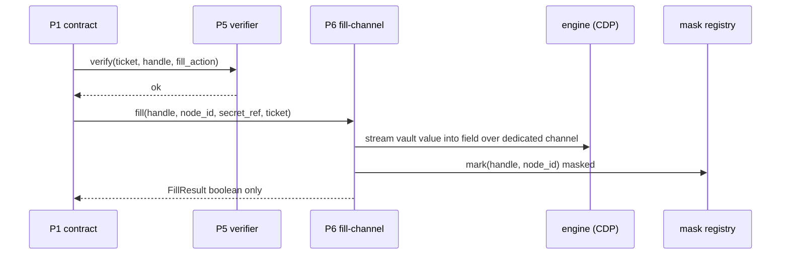
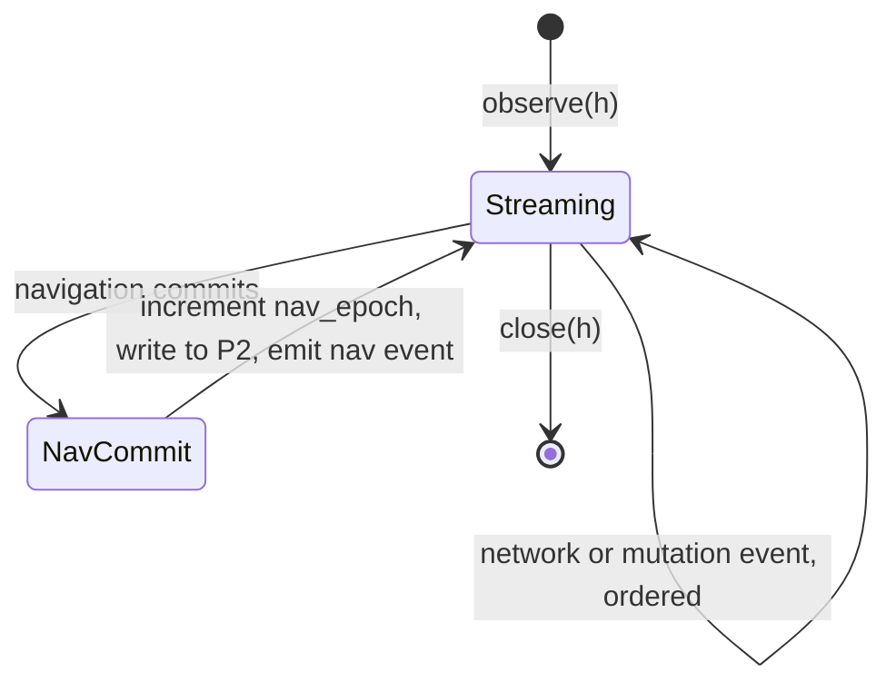

# DO-013 — Render Surface Engine Boundary

The sole boundary between the agent-native layers and a commodity rendering engine: it owns the engine and exposes pages only through the RenderSurface interface, so the engine is swappable and no code above L0 ever touches it.

## ASSEMBLY DRAWING



The agent runtime opens a page through the render-surface-contract, the single entry point above L0; the session-partitioner places every surface in its workspace's Electron partition and the cdp-driver attaches the engine. Perception reads pages only through snapshot, screenshot, and observe, and the action control plane executes only through act and fillSecret, each carrying an ExecutionTicket. The contract dispatches each call to the internal parts, and the cdp-driver is the general engine touchpoint; the secret-fill-channel keeps a separate narrow channel so credential bytes never transit the general driver. At surface construction the contract and the action control plane share a per-session ticket key that is unreadable above L0.

## BILL OF MATERIALS

| Part | Name | Kind | Responsibility | Deps | Ref |
|------|------|------|----------------|------|-----|
| P1 | render-surface-contract | module | Defines the RenderSurface interface and dispatches every call to the internal parts; the sole entry point above L0. | P2, P3, P4, P5, P6, P7 | local |
| P2 | page-handle-registry | store | Holds each live PageHandle bound to its workspace, partition, surface, and current nav_epoch. | none | local |
| P3 | session-partitioner | module | Maps each workspace to exactly one Electron session partition and provisions isolated surfaces within it. | none | local |
| P4 | cdp-driver | module | The general engine touchpoint: pulls the page graph, injects input by stable node id, and captures pixels over CDP. | P2, P6 | local |
| P5 | ticket-verifier | module | Verifies an ExecutionTicket against the per-session key, expiry, single-use state, action digest, and nav_epoch. | P2 | local |
| P6 | secret-fill-channel | module | Streams a vault secret into a field over a dedicated channel without returning it and marks the field masked. | none | local |
| P7 | event-multiplexer | module | Multiplexes engine events into one ordered stream and assigns a new nav_epoch on committed navigation. | P2, P4 | local |

## DETAIL DRAWINGS

### P1 — render-surface-contract

The engine-neutral interface. Every caller above L0 sees only these six operations; the contract owns no engine code itself and dispatches to the internal parts. The additions DO-012 specified as boundary rows — the ExecutionTicket on act, fillSecret, and the extra snapshot fields — are first-class here, owned by this sheet.



The contract is engine-neutral by construction: it names no Chromium or CDP type, and a second driver satisfies it without any change above L0. Actions target a stable node id from the last snapshot; a raw CSS selector is outside the input domain and is rejected. open flows through the partitioner before the driver, so no surface exists outside a workspace partition.

```text
open(url, ctx):
 1. IF ctx.workspace_id is empty OR ctx.partition_key is absent:
      RETURN ERROR invalid_ctx
 2. partition := P3.partition_for(ctx.workspace_id, ctx.partition_key)
 3. surface := P3.create_surface(partition, url)
 4. P4.attach(surface)
 5. handle := P2.mint(ctx.workspace_id, partition, surface)
 6. establish per-session ticket key with the action control plane
 7. RETURN handle
```

### P2 — page-handle-registry

The registry is the single source of a handle's identity: which workspace it belongs to, which partition and surface back it, and its current nav_epoch. The workspace binding is set at mint and never changes; a handle cannot migrate workspaces.



```text
set_epoch(handle, epoch):
 1. rec := lookup(handle)
 2. IF rec is none: RETURN ERROR not_found
 3. IF epoch <= rec.nav_epoch: RETURN ERROR non_monotonic
 4. rec.nav_epoch := epoch
 5. RETURN ok
```

resolve of a closed or unknown handle returns not_found, never a stale surface. The registry holds no page content and no secret material; it is pure identity and epoch state.

### P3 — session-partitioner

One Electron session partition per workspace. Two workspaces never share a partition, so a compromised task cannot reach another workspace's cookies, storage, or logins. The partitioner is the only part that touches the Electron session API.



A partition is created once per workspace and reused for every surface in that workspace. Cookies and local storage written under one workspace are absent from any surface of another. open refuses a ctx whose partition key is not scoped to the ctx workspace, so a caller cannot smuggle a surface into a foreign partition.

### P4 — cdp-driver

The general engine touchpoint. It reads the DOM and accessibility tree, computes a per-node stable digest, stamps nav_epoch and workspace_id onto the graph, injects input addressed by stable node id, and captures pixels with the set-of-marks overlay. It consults P6 so vault-filled fields carry no value. It also opens the raw engine event feed, so P7 subscribes to navigation, network, and mutation events through the driver rather than touching the engine itself.



Identical DOM state yields an identical per-node digest, which is what a ticket binds against. inject addresses the node whose digest matches the last snapshot; a raw selector is rejected before any engine call. screenshot marks map one-to-one to the last snapshot's node ids so a mark number always resolves to a stable node.

### P5 — ticket-verifier

act and fillSecret execute only against a valid ExecutionTicket. The verifier checks the MAC under the per-session key, the expiry, the single-use consumption state, that the action digest matches the resolved action, and that the ticket's nav_epoch matches the handle's current epoch.



```text
verify(ticket, handle, action):
 1. IF hmac(session_key, ticket.body) != ticket.mac: RETURN reject
 2. IF now >= ticket.expiry: RETURN reject
 3. IF ticket.ticket_id in consumed: RETURN reject
 4. IF ticket.action_digest != digest(action): RETURN reject
 5. IF ticket.nav_epoch != registry.epoch(handle): RETURN reject
 6. record ticket.ticket_id in consumed
 7. RETURN ok
```

The per-session key is shared with the action control plane at surface construction and is unreadable above L0; it appears in no snapshot, event, or return value. A consumed ticket_id never verifies a second time, so a captured ticket cannot be replayed.

### P6 — secret-fill-channel

fillSecret streams a vault secret into a field over a dedicated channel that is separate from the general driver, so the value never transits general driver buffers. It returns only a boolean and records the field masked; the mask registry is what P4 consults so later snapshots carry no value.



The secret value appears in no return value, no snapshot, no event, and no log field; the fill records the SecretRef only. A masked field stays masked in every later snapshot until a committed navigation clears the field. fill requires a valid ticket, so a secret fill is a gated action like any other.

### P7 — event-multiplexer

observe multiplexes navigation, network, and mutation events from the engine into one ordered stream. On a committed navigation it increments the handle's nav_epoch through P2 and emits a nav event carrying the new epoch, so a stale grant above L0 is invalidated the moment the page changes under it.



```text
on_navigation_commit(handle):
 1. next := registry.epoch(handle) + 1
 2. P2.set_epoch(handle, next)
 3. emit NavEvent(handle, nav_epoch: next)
```

The nav event's epoch equals the epoch stamped on the next snapshot, so a caller can order a snapshot against the navigation that produced it. Events are delivered in occurrence order. Under buffer pressure the multiplexer drops the oldest network or mutation event but never a nav event, so an epoch change is never lost.

## CONTRACTS & TOLERANCES

P1 — render-surface-contract:

| Operation | Input domain | Nominal behavior | Tolerance | Inspection op | Failure mode outside tolerance |
|-----------|--------------|------------------|-----------|---------------|--------------------------------|
| open(url, ctx) | absolute url; WorkspaceCtx with a non-empty workspace_id and a workspace-scoped partition key | Places a surface in the workspace partition and returns a PageHandle bound to it. | Handle bound to exactly one workspace partition; no surface shares a partition across workspaces; exact | Op 60, Op 70 | A ctx missing a workspace-scoped key returns invalid_ctx; no surface opens. |
| snapshot(h) | live handle | Returns a PageGraph carrying nav_epoch, workspace_id, and per-node stable digests, with vault-filled fields masked. | The three fields present on every snapshot; nav_epoch monotonic per handle; masked fields carry no value; exact | Op 40, Op 50, Op 90 | A missing field or an exposed filled value fails inspection; the driver blocks rather than emit a partial graph. |
| screenshot(h, marked) | live handle; marked boolean | Returns an Img; when marked, a set-of-marks overlay numbers the last snapshot nodes. | Mark ids correspond one-to-one to last snapshot node ids; exact | Op 40 | A mark that resolves to no snapshot node fails inspection. |
| act(h, action, ticket) | action targeting a stable node id from the last snapshot; ExecutionTicket | Executes only against a valid ticket by stable node id, never a raw selector. | Invalid tickets rejected; one dispatch per valid ticket; raw selectors rejected; exact | Op 20, Op 80, Op 90 | act without a valid ticket returns TICKET_REJECTED and performs nothing. |
| fillSecret(h, node_id, secret_ref, ticket) | node_id from the last snapshot; secret_ref to a vault stream; valid ticket | Streams the vault value into the field, returns a FillResult without the value, marks the field masked. | Secret bytes in returns, snapshots, events, and logs equal zero; exact | Op 30, Op 90 | Any observable secret byte fails the battery; an out-of-scope or ticketless fill is refused. |
| observe(h) | live handle | Returns an ordered stream of navigation, network, and mutation events; navigation events carry the new nav_epoch. | Nav event epoch equals the next snapshot epoch; occurrence order preserved; exact | Op 50, Op 80 | Epoch skew or reordering would let a stale grant survive navigation; the battery falsifies it. |

P2 — page-handle-registry:

| Operation | Input domain | Nominal behavior | Tolerance | Inspection op | Failure mode outside tolerance |
|-----------|--------------|------------------|-----------|---------------|--------------------------------|
| mint(workspace, partition, surface) | an opened surface in a workspace partition | Registers a handle with workspace_id, partition, surface, and nav_epoch zero. | handle_id unique; workspace binding immutable after mint; exact | Op 10 | A duplicate handle_id or a mutable workspace binding fails inspection. |
| resolve(h) | any handle value | Returns the live record or not_found. | A closed or unknown handle resolves to not_found, never a stale surface; exact | Op 10 | A stale surface returned for a closed handle fails inspection. |
| set_epoch(h, epoch) | epoch strictly greater than the handle's current epoch | Advances the handle's nav_epoch. | nav_epoch strictly increases per handle; exact | Op 10, Op 50 | A non-monotonic epoch is refused, so a stale grant cannot survive navigation. |

P3 — session-partitioner:

| Operation | Input domain | Nominal behavior | Tolerance | Inspection op | Failure mode outside tolerance |
|-----------|--------------|------------------|-----------|---------------|--------------------------------|
| partition_for(workspace_id, key) | non-empty workspace_id; workspace-scoped partition key | Returns the one Electron partition for the workspace, creating it once. | Exactly one partition per workspace_id; two workspaces never share a partition; exact | Op 60 | A shared partition collapses workspace isolation and fails inspection. |
| create_surface(partition, url) | an existing partition; absolute url | Instantiates a surface inside the partition only. | Cookies and storage set in one workspace absent from every surface of another; exact | Op 60 | Cross-workspace cookie visibility fails the isolation inspection. |

P4 — cdp-driver:

| Operation | Input domain | Nominal behavior | Tolerance | Inspection op | Failure mode outside tolerance |
|-----------|--------------|------------------|-----------|---------------|--------------------------------|
| pull_graph(surface) | an attached surface | Reads DOM and AX tree, computes per-node digests, stamps nav_epoch and workspace_id, applies the P6 mask set. | Identical DOM yields identical digests; masked fields carry no value; p99 at or below 250 ms on a 20000-node graph | Op 40, Op 100 | A digest that varies on identical DOM breaks ticket binding and fails inspection. |
| inject(surface, node_id, input) | node_id whose digest matches the last snapshot | Dispatches input to the digest-matching node. | Targets only the digest-matching node; a raw selector is rejected; exact | Op 40, Op 80 | A selector-addressed action or a mismatched node is rejected before any engine call. |
| capture(surface, marked) | an attached surface; marked boolean | Captures pixels; overlays set-of-marks when marked. | Overlay marks map to last snapshot node ids; exact | Op 40 | A mark resolving to no node fails inspection. |
| subscribe_events(surface) | an attached surface | Exposes the raw engine event feed for the surface so P7 consumes navigation, network, and mutation events. | Every engine event on the surface is delivered exactly once in occurrence order; exact | Op 40, Op 50 | A dropped or duplicated engine event leaves P7 unable to order the stream and fails inspection. |

P5 — ticket-verifier:

| Operation | Input domain | Nominal behavior | Tolerance | Inspection op | Failure mode outside tolerance |
|-----------|--------------|------------------|-----------|---------------|--------------------------------|
| verify(ticket, handle, action) | an ExecutionTicket, a handle, a resolved action | Checks MAC, expiry, single-use state, action digest, and nav_epoch, then consumes the ticket. | Rejects any ticket failing one check; a consumed ticket_id never verifies twice; exact | Op 20, Op 80, Op 90 | A forged, expired, replayed, digest-mismatched, or epoch-mismatched ticket verifies false. |
| session_key handshake | surface construction with the action control plane | Establishes the per-session MAC key shared with the gate. | Key material absent from any snapshot, event, or return; unreadable above L0; exact | Op 20, Op 70, Op 90 | A key readable above L0 fails inspection; forged MACs would then pass. |

P6 — secret-fill-channel:

| Operation | Input domain | Nominal behavior | Tolerance | Inspection op | Failure mode outside tolerance |
|-----------|--------------|------------------|-----------|---------------|--------------------------------|
| fill(handle, node_id, secret_ref, ticket) | in-scope secret_ref; node_id from the last snapshot; valid ticket | Streams the value into the field over the dedicated channel; returns a boolean only. | Secret bytes in returns, snapshots, events, and logs equal zero; exact | Op 30, Op 90 | Any observable secret byte fails the battery; a ticketless fill is refused. |
| mark, masked | a filled field node | Records the node masked and answers the mask query for snapshots. | A filled field is masked in every later snapshot until navigation clears it; exact | Op 30, Op 40 | A snapshot exposing a filled value leaks the secret to L1; inspection rejects it. |

P7 — event-multiplexer:

| Operation | Input domain | Nominal behavior | Tolerance | Inspection op | Failure mode outside tolerance |
|-----------|--------------|------------------|-----------|---------------|--------------------------------|
| observe(handle) | a live handle | Multiplexes engine events into one ordered stream and delivers them to the caller. | Occurrence order preserved; nav events never dropped under buffer pressure; exact | Op 50, Op 80 | A dropped or reordered nav event would hide a navigation; inspection falsifies it. |
| on_navigation_commit(handle) | a committed navigation | Increments nav_epoch through P2 and emits a nav event carrying it. | Nav event epoch equals the next snapshot epoch; delivery p99 at or below 20 ms | Op 50, Op 100 | Epoch skew lets a stale grant survive navigation; the invalidation battery falsifies it. |

Engine boundary and caller layers (the L0 invariant and the external contracts at the boundary):

| Operation | Input domain | Nominal behavior | Tolerance | Inspection op | Failure mode outside tolerance |
|-----------|--------------|------------------|-----------|---------------|--------------------------------|
| engine confinement | the whole codebase | All engine and Electron access originates inside L0 parts; the contract names no engine type. | No symbol above L0 imports engine or Electron; exact | Op 110 | An above-L0 import of engine code fails the import-graph inspection. |
| engine swap | a second driver behind the contract | Replacing the driver changes only L0 parts and leaves the RenderSurface contract unchanged. | The acceptance suite passes on both drivers with no change above L0; exact | Op 110 | A contract that shifts on engine swap fails inspection; the boundary would leak. |
| DO-012 ticket protocol | act and fillSecret from the action control plane | The gate calls act and fillSecret with an ExecutionTicket bound to the action digest and nav_epoch. | Every act and fillSecret requires a valid ticket; the session key is shared once at construction; exact | Op 20, Op 70 | A ticketless call performs nothing; a leaked key fails inspection. |
| DO-014 perception protocol | snapshot, screenshot, observe from perception | Perception reads pages only through the contract; PageGraph is the only page representation crossing to L1. | Perception imports no engine symbol; raw HTML never crosses the boundary; exact | Op 110 | A perception path reaching the engine directly fails the import-graph inspection. |
| DO-019 provisioning | workspace open | The workspace manager supplies the WorkspaceCtx with the workspace_id and partition key. | A surface opens only with a valid workspace-scoped ctx; exact | Op 70 | A ctx without a workspace-scoped key opens no surface. |

## PROCESS PLAN

| Op | Task | Tooling | Inspection |
|----|------|---------|------------|
| 10 | Implement P2 page-handle-registry: mint, resolve, close, set_epoch. | language stdlib, unit test runner | mint returns a unique handle bound to a workspace; resolve of a closed handle returns not_found; set_epoch strictly increases and refuses a non-monotonic value; the workspace binding does not change after mint. |
| 20 | Implement P5 ticket-verifier over golden tickets with a test session key. | language stdlib, HMAC primitive, unit test runner | A valid ticket verifies; expired, MAC-mutated, digest-mismatched, and epoch-mismatched tickets each verify false; a consumed ticket_id never verifies twice; the session key appears in no return. |
| 30 | Implement P6 secret-fill-channel against a stub surface with a mask registry. | language stdlib, stub surface harness, unit test runner | fill streams to the stub and returns only a boolean; the secret value appears in no return, log, event, or masked stub snapshot; the mask registry records the node and masks it until navigation clears the field. |
| 40 | Implement P4 cdp-driver over recorded engine fixtures with digests and forms. | language stdlib, CDP fixture corpus, unit test runner | Identical DOM yields identical per-node digests; snapshot stamps nav_epoch and workspace_id and masks P6-marked fields; screenshot marks map one-to-one to snapshot node ids; inject targets the digest-matching node and rejects a raw selector. |
| 50 | Implement P7 event-multiplexer over navigation fixtures. | language stdlib, fixture corpus, unit test runner | A committed navigation increments nav_epoch, writes it to P2, and emits a nav event carrying it; the event epoch equals the next snapshot epoch; events are ordered by occurrence; a nav event is never dropped under buffer pressure. |
| 60 | Implement P3 session-partitioner and open two workspaces on the engine. | language stdlib, engine harness, unit test runner | Each workspace maps to exactly one partition; a cookie set in one workspace is absent from another workspace's surface; partition_for refuses a key not scoped to its workspace_id. |
| 70 | Implement P1 render-surface-contract and wire all parts to the engine. | language stdlib, engine harness, unit test runner | The six operations dispatch to their parts; open establishes the per-session ticket key with the gate; open refuses a ctx without a workspace-scoped key; act with no ticket performs nothing; every engine call originates inside an L0 part. |
| 80 | Ticket and epoch invalidation battery with fault injection and a fake clock. | fault-injection harness, fake clock, unit test runner | Navigation, target mutation, ticket reuse, ticket expiry, digest mismatch, and epoch skew each cause act to reject and perform nothing; observe emits the new epoch on every committed navigation; each act follows a matching ticket verification. |
| 90 | Adversarial secret and ticket battery with a scripted hostile caller. | adversarial harness, stub surface with leak detectors, unit test runner | No proposal stream reads a secret byte across returns, snapshots, or events; forged and expired tickets never execute; masked fields never expose a filled value; the session key never surfaces above L0. |
| 100 | Latency and throughput measurement over reference corpora. | benchmark harness with high-resolution clock | p99 measured at or below budget: snapshot 250 ms on a 20000-node graph, nav-event delivery 20 ms; measured under concurrent load with an instrumented engine harness. |
| 110 | Engine-swap and boundary conformance with a second driver stub. | import-graph analyzer, second driver stub, unit test runner | No symbol above L0 imports engine or Electron; swapping P3 and P4 for a second driver leaves the RenderSurface contract and all above-L0 code unchanged; the acceptance suite passes on both drivers. |

## REVISION HISTORY

| Rev | Date | Author | Change summary |
|-----|------|--------|----------------|
| A | 2026-07-18 | Claude Fable 5 | Initial draft. |
