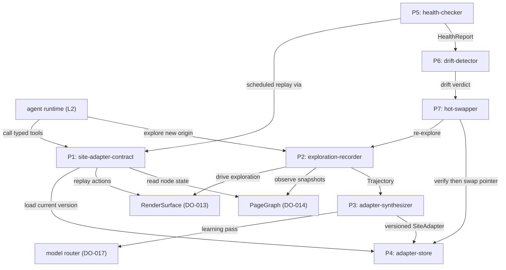
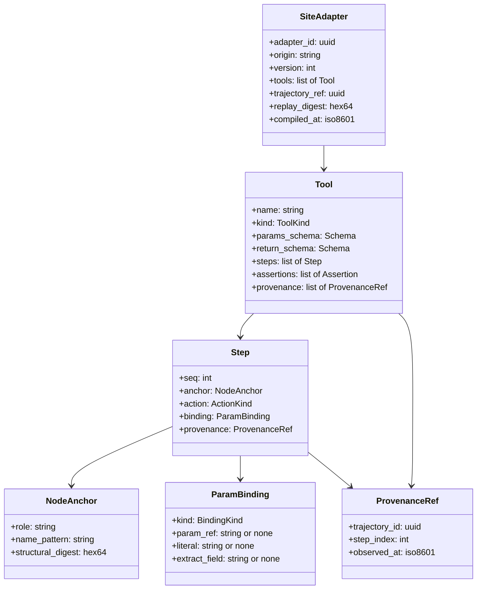
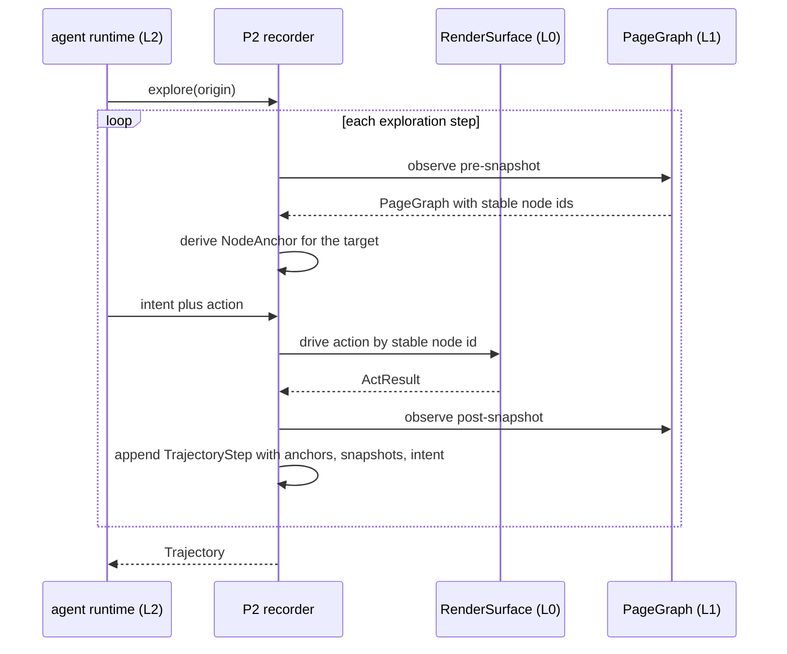
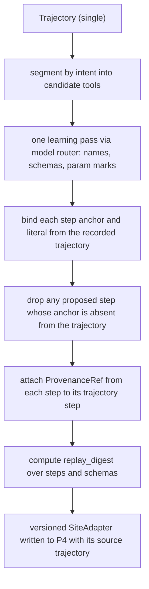
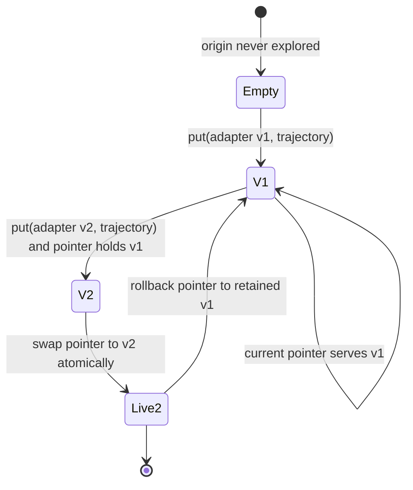
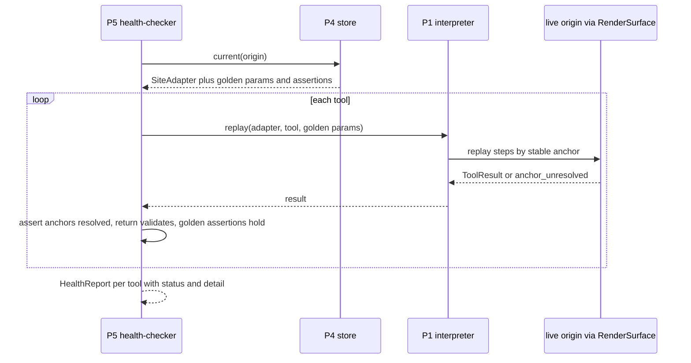
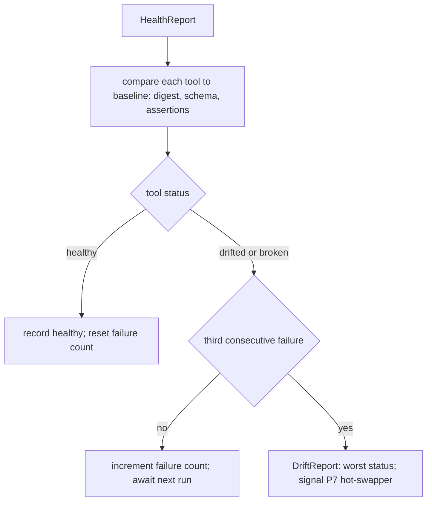
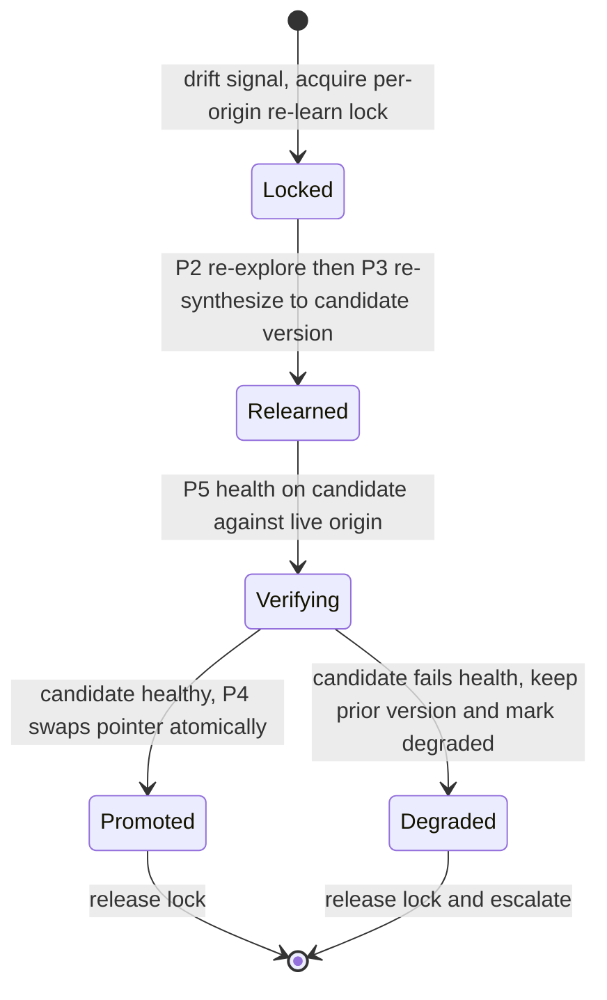

# DO-015 — Site Adapter Compiler

Compiles an origin into typed, self-testing tools with provenance and hot-swap on drift: an agent explores an origin once, the compiler generalizes that single trajectory into a replayable SiteAdapter of typed tools, and the adapter self-tests on a schedule and re-learns when the page changes under it.

## ASSEMBLY DRAWING



The agent runtime asks the exploration-recorder to explore a new origin; the recorder drives one pass through RenderSurface, observes each PageGraph snapshot, and emits a Trajectory. The adapter-synthesizer runs a single learning pass over that trajectory through the model router and writes a versioned SiteAdapter, plus its source trajectory, into the adapter-store. Thereafter the agent runtime calls the adapter's typed tools through the site-adapter-contract, which loads the current version from the store and replays each tool's parameterized steps against RenderSurface and PageGraph with no further model call. The health-checker replays every tool on a schedule; the drift-detector classifies the report against the compiled baseline; and on drift the hot-swapper re-explores, re-synthesizes, verifies, and atomically swaps the store's current-version pointer.

## BILL OF MATERIALS

| Part | Name | Kind | Responsibility | Deps | Ref |
|------|------|------|----------------|------|-----|
| P1 | site-adapter-contract | module | Defines the typed SiteAdapter tool interface and deterministically replays a tool's parameterized steps against RenderSurface and PageGraph. | P4 | local |
| P2 | exploration-recorder | module | Records one exploration of an origin into a replayable Trajectory of stable-anchor steps with per-step snapshots and intents. | P1 | local |
| P3 | adapter-synthesizer | module | Generalizes a single trajectory into typed tools through one model-router learning pass, binding anchors and literals from the recorded trajectory. | P1, P2, P4 | local |
| P4 | adapter-store | store | Holds versioned SiteAdapters and their source trajectories keyed by origin, with a per-origin current-version pointer and atomic swap. | none | local |
| P5 | health-checker | module | Replays every tool on a schedule against the live origin with golden trajectory params and emits a HealthReport. | P1, P4 | local |
| P6 | drift-detector | module | Classifies a HealthReport against the compiled baseline into healthy, drifted, or broken and signals re-learn on sustained drift. | P1, P5 | local |
| P7 | hot-swapper | module | Re-explores and re-synthesizes a drifted origin, verifies the candidate against health, and promotes it by atomic pointer swap or keeps the prior version degraded. | P2, P3, P4, P5, P6 | local |

## DETAIL DRAWINGS

### P1 — site-adapter-contract

The typed tool interface every SiteAdapter exposes, and the deterministic interpreter that replays it. A SiteAdapter for an origin carries an ordered set of typed Tools; each Tool is a list of parameterized Steps addressed by stable node anchors, never raw selectors. Replay resolves each anchor against the current PageGraph, binds the caller's params, and crosses RenderSurface. The interpreter calls no model; the model appears only in synthesis and re-learn.



Enums, closed: `ToolKind` = search, extract, act, navigate. `ActionKind` = open, click, type, select, submit, read. `BindingKind` = literal, param, extract. A search tool returns a typed list of records, an extract tool returns one typed record, an act tool returns an ActResult, a navigate tool returns a PageRef. `Schema` is a closed field-type descriptor; typing is by schema, never by example.

The interface. `invoke` is the front door: it loads the current adapter, validates params, replays, and validates the result. `replay` is the pure interpreter over a supplied adapter. `provenance` resolves a tool to the trajectory steps it was compiled from.

```text
invoke(origin, tool_name, params):
 1. adapter := P4.current(origin)
 2. IF adapter is none: RETURN ERROR no_adapter
 3. tool := adapter.tools[tool_name]
 4. IF tool is none: RETURN ERROR no_such_tool
 5. IF params do not validate against tool.params_schema: RETURN ERROR bad_params
 6. result := replay(adapter, tool, params)
 7. IF result.record does not validate against tool.return_schema: RETURN ERROR schema_violation
 8. RETURN result with provenance attached
```

```text
replay(adapter, tool, params):
 1. actions := []
 2. record := empty per tool.return_schema
 3. LOOP over tool.steps in seq order:
      a. node := resolve(step.anchor, current PageGraph snapshot)
      b. IF node is none: RETURN ERROR anchor_unresolved(step.seq)
      c. value := bind(step.binding, params, record)
      d. IF step.action is read: read node fields into record per return_schema
         ELSE: act := RenderSurface action(node.stable_id, step.action, value); append act to actions; execute act
 4. RETURN ToolResult(record, actions, tool.provenance)
```

Replay is deterministic: identical params against an identical PageGraph state yield a byte-identical action sequence and record. Anchors resolve by structural digest and role, so an adapter survives minor DOM drift; an anchor that no longer resolves is a replay failure, never a raw-selector fallback. `replay_digest` is the digest of the ordered steps and schemas and is the adapter version's identity for health and drift comparison.

### P2 — exploration-recorder

One exploration, one trajectory. The recorder observes an agent's single pass over an origin: for each step it captures the pre-action PageGraph snapshot, the RenderSurface action taken, the post-action snapshot, any fields the step read, and the agent's declared intent. Every step is addressed by a stable node anchor derived from the recorded PageGraph, so the trajectory itself replays. The trajectory is the single source of provenance for the adapter compiled from it.



```text
record_step(origin, target_node, action, intent, read_fields):
 1. pre := PageGraph.snapshot(handle)
 2. anchor := NodeAnchor(target_node.role, target_node.name, target_node.structural_digest)
 3. IF anchor.structural_digest is absent from pre: RETURN ERROR unstable_target
 4. result := RenderSurface.act(handle, action on target_node.stable_id)
 5. post := PageGraph.snapshot(handle)
 6. append TrajectoryStep(seq, intent, pre.ref, anchor, action, read_fields, post.ref, now)
 7. RETURN result
```

A step whose target has no stable structural digest in the snapshot is rejected at record time rather than recorded as a guess. The recorder reads only PageGraph and acts only through RenderSurface; it touches no raw HTML and no engine code. Exactly one trajectory is produced per exploration, and that trajectory both seeds synthesis and supplies the golden params the health-checker later replays.

### P3 — adapter-synthesizer

The learning pass, and the only model-calling part. It segments one trajectory into candidate tools by intent boundary, then calls the model router once per compilation to name each tool, propose its typed param and return schemas, and mark which recorded literals are parameters. The compiler binds anchors and literals from the recorded trajectory, never from the model's free text: the model proposes structure, the trajectory supplies truth. A proposed step whose anchor is absent from the trajectory is dropped, not invented.



Rules, each a decision on this sheet:

- The model router is called exactly once per compilation. Its output is structure only: tool names, param schemas, return schemas, and a parameter mark on each recorded literal. Node anchors are copied verbatim from the trajectory; the model never names a selector or a node.
- A literal typed or selected during exploration becomes a typed param when the model marks it variable, and a fixed literal binding otherwise. Every param traces to exactly one trajectory literal; the return schema covers every field the trajectory's read steps captured.
- Every synthesized step carries a ProvenanceRef to the trajectory step it generalizes, and the adapter carries the whole trajectory's id. Provenance is total: no tool and no step exists without a trajectory anchor.
- Synthesis is deterministic given the trajectory and the model response: the same pair yields a byte-identical SiteAdapter and replay_digest. The nondeterministic model call is isolated to this step; the emitted adapter replays with no model.
- The synthesizer also records golden assertions from the trajectory outcome for each tool: for a search tool, at least one record with the required fields present; for an extract tool, the full return schema populated. These assertions are the health baseline.

### P4 — adapter-store

Versioned, per-origin, append-only. The store holds each compiled SiteAdapter and the source Trajectory that produced it, keyed by origin and version, and a single current-version pointer per origin. New versions append; prior versions stay for rollback and provenance. The pointer swap is atomic, so a reader sees exactly one live version at every instant.



```text
put(origin, adapter, trajectory):
 1. version := max retained version for origin, plus 1
 2. adapter.version := version
 3. persist (origin, version) -> adapter and its source trajectory, append-only
 4. RETURN version    -- current pointer is unchanged; promotion is a separate swap
```

`put` never moves the pointer; only `swap(origin, version)` does, and it is atomic. `current(origin)` returns the one live version; `get(origin, version)` returns any retained version byte-identical for rollback. Each stored adapter retains its source trajectory, so provenance resolves for every version, not only the current one. The store is local and encrypted at rest with owner-only permissions, consistent with the local-first posture; it holds no engine code and no page content beyond the recorded snapshots' stable references.

### P5 — health-checker

Scheduled self-test. On each adapter's configured interval the checker replays every tool through P1 against the live origin, using the golden params recorded from the trajectory, and evaluates the tool's golden assertions. It emits a HealthReport classifying each tool. The checker is the mechanism behind the adapter's `health()` affordance.



```text
health(adapter):
 1. report := []
 2. LOOP over adapter.tools:
      a. result := P1.replay(adapter, tool, tool.golden_params)
      b. IF result is anchor_unresolved: status := broken
         ELSE IF result.record does not validate against tool.return_schema: status := drifted
         ELSE IF any of tool.assertions fails on result: status := drifted
         ELSE: status := healthy
      c. append (tool.name, status, detail)
 3. RETURN HealthReport(adapter.adapter_id, adapter.version, now, report)
```

The health run replays only; it calls no model and mutates no adapter. Health probing hits the live origin on a schedule and honors the origin's terms and rate posture; it never evades a bot check and yields to a present-in-the-loop operator on a gated origin. A tool passes only when every anchor resolves, the return validates against the schema, and every golden assertion holds.

### P6 — drift-detector

Classification and debounce. The detector compares a HealthReport against the adapter's compiled baseline — the replay_digest and the golden assertions — and assigns each tool healthy, drifted, or broken. The adapter status is the worst tool status. To avoid thrashing on a transient network failure, drift is declared only after three consecutive failing health runs for the same tool; a single failing run is recorded and awaited.



A tool that binds and validates but fails a golden assertion is drifted; a tool whose anchors no longer resolve at all is broken; an origin that no longer serves the tool's entry page is broken. The distinction routes re-learn effort: a drifted tool is usually recoverable by re-synthesis over a fresh trajectory, and a broken adapter escalates. The three-consecutive-run rule is the debounce; transient single failures never trigger a re-learn.

### P7 — hot-swapper

Re-learn and swap, fail-closed. On a drift signal the swapper acquires a per-origin re-learn lock, drives a fresh exploration through P2, re-synthesizes through P3 into a new candidate version in the store, and verifies the candidate against P5 health on the live origin. It promotes the candidate by atomic pointer swap only when the candidate passes; otherwise the prior version stays live, marked degraded, and the failure escalates. A candidate is never promoted unverified.



```text
relearn_and_swap(origin):
 1. IF a re-learn lock is held for origin: RETURN busy
 2. acquire re-learn lock for origin
 3. trajectory := P2.explore(origin)
 4. candidate_version := P3.synthesize(trajectory)          -- written to P4, pointer unchanged
 5. report := P5.health(P4.get(origin, candidate_version))
 6. IF report is all healthy:
      P4.swap(origin, candidate_version); outcome := promoted
    ELSE:
      mark current version degraded; outcome := degraded_kept_prior
 7. release re-learn lock for origin
 8. RETURN outcome
```

The pointer swap is atomic: an in-flight tool call resolved against the prior version completes on the prior version, and every new invocation binds the promoted version. At most one re-learn runs per origin at a time, held by the lock, so two drift signals cannot race two swaps. Fail-closed is the load-bearing rule: a re-learned adapter that does not pass health on the live origin is never made current, so a swap can only improve or hold, never regress into an unverified adapter.

## CONTRACTS & TOLERANCES

P1 — site-adapter-contract:

| Operation | Input domain | Nominal behavior | Tolerance | Inspection op | Failure mode outside tolerance |
|-----------|--------------|------------------|-----------|---------------|--------------------------------|
| invoke(origin, tool_name, params) | an origin with a current adapter; a known tool name; params matching the tool param schema | Loads the current adapter, validates params, replays, validates the result, and returns it with provenance. | Result validates against the tool return schema; provenance attached on every return; exact | Op 20, Op 100 | Params off schema return bad_params; a result off schema returns schema_violation; nothing partial returns. |
| replay(adapter, tool, params) | a SiteAdapter and a tool; validated params; a live PageGraph and RenderSurface | Resolves each anchor, binds params, and crosses RenderSurface, reading fields into the typed record. | Identical params and PageGraph state yield a byte-identical action sequence and record; zero model calls; exact | Op 20, Op 80 | An unresolved anchor returns anchor_unresolved with the step index and performs no further action; no raw-selector fallback. |
| tools(origin) | an origin with a current adapter | Returns the typed signatures of every tool the current adapter exposes. | Signatures equal the stored adapter exactly; exact | Op 20 | A signature diverging from the stored adapter fails inspection. |
| provenance(adapter, tool_name) | a SiteAdapter and a tool name | Returns the trajectory step range every step of the tool was compiled from. | Every tool and every step resolves to a trajectory step; no step lacks a ProvenanceRef; exact | Op 40, Op 100 | A tool or step with no trajectory anchor fails the provenance inspection. |

P2 — exploration-recorder:

| Operation | Input domain | Nominal behavior | Tolerance | Inspection op | Failure mode outside tolerance |
|-----------|--------------|------------------|-----------|---------------|--------------------------------|
| explore(origin) | an origin reachable through RenderSurface | Records one exploration pass into a replayable Trajectory of stable-anchor steps with per-step snapshots and intents. | Exactly one trajectory per exploration; every step carries pre and post snapshot refs and a stable anchor; the trajectory replays; exact | Op 30 | A step with no stable target is rejected as unstable_target; the trajectory never records a guessed target. |
| record_step(origin, target, action, intent, fields) | a target node present in the current snapshot | Derives a NodeAnchor, drives the action through RenderSurface, and appends a TrajectoryStep. | Zero raw-selector steps; every anchor resolves to a PageGraph stable node id; exact | Op 30, Op 90 | A target with no structural digest in the snapshot returns unstable_target and records nothing. |

P3 — adapter-synthesizer:

| Operation | Input domain | Nominal behavior | Tolerance | Inspection op | Failure mode outside tolerance |
|-----------|--------------|------------------|-----------|---------------|--------------------------------|
| synthesize(trajectory) | one Trajectory; the model router available | Segments the trajectory, runs one learning pass, binds anchors and literals from the trajectory, and writes a versioned SiteAdapter to the store. | Anchors and literals bound from the recorded trajectory, never invented by the model; deterministic given trajectory and model response; exact | Op 40, Op 80 | A proposed step whose anchor is absent from the trajectory is dropped, not guessed; a nondeterministic synthesis fails inspection. |
| synthesize — parameterization | a segmented trajectory with marked literals | Turns marked literals into typed params and derives the return schema from the read steps. | Every param traces to one trajectory literal; the return schema covers every recorded read field; exact | Op 40 | A param with no trajectory literal, or an uncovered read field, fails inspection. |
| synthesize — model isolation | any compilation or re-learn | Calls the model router exactly once per compilation, for structure only. | The model router is called only during synthesis and re-learn; the replay and health paths call no model; exact | Op 80 | A model call on the replay or health path fails the isolation inspection. |

P4 — adapter-store:

| Operation | Input domain | Nominal behavior | Tolerance | Inspection op | Failure mode outside tolerance |
|-----------|--------------|------------------|-----------|---------------|--------------------------------|
| put(origin, adapter, trajectory) | a synthesized adapter and its source trajectory | Appends a new version keyed by origin and retains the source trajectory; leaves the current pointer unchanged. | Version numbers strictly increase per origin; prior versions and their trajectories retained; put never moves the pointer; exact | Op 10, Op 100 | A reused version number or a moved pointer on put fails inspection. |
| current(origin), get(origin, version) | an origin; a retained version | Returns the one live version, or any retained version byte-identical for rollback. | Exactly one live version per origin; any retained version retrievable byte-identical; exact | Op 10 | Two live versions, or a version that does not round-trip, fails inspection. |
| swap(origin, version) | a retained version of the origin | Moves the current-version pointer to the given version atomically. | Pointer swap atomic; a reader observes exactly one live version at every instant; exact | Op 10, Op 90 | A reader observing zero or two live versions during a swap fails inspection. |

P5 — health-checker:

| Operation | Input domain | Nominal behavior | Tolerance | Inspection op | Failure mode outside tolerance |
|-----------|--------------|------------------|-----------|---------------|--------------------------------|
| health(adapter) | a current adapter with golden params and assertions | Replays every tool with its golden params and evaluates its golden assertions, emitting a per-tool HealthReport. | Every tool probed; a tool passes only if all anchors resolve, the return validates, and every golden assertion holds; exact | Op 50, Op 90 | A tool that fails to bind or validate is reported broken or drifted; the run mutates no adapter and calls no model. |
| schedule(adapter, interval) | a positive interval per adapter | Runs health once per configured interval on the live origin. | Runs once per interval within one scheduler tick; exact | Op 50 | A missed or duplicated run per interval fails the scheduler inspection. |

P6 — drift-detector:

| Operation | Input domain | Nominal behavior | Tolerance | Inspection op | Failure mode outside tolerance |
|-----------|--------------|------------------|-----------|---------------|--------------------------------|
| classify(report, baseline) | a HealthReport and the compiled baseline | Classifies each tool healthy, drifted, or broken and sets the adapter status to the worst tool status. | Adapter status equals the worst tool status; classification exact per the baseline digest, schema, and assertions | Op 60 | A misclassified tool or an adapter status below its worst tool fails inspection. |
| debounce | consecutive HealthReports for an origin | Declares drift and signals re-learn only after three consecutive failing runs for a tool. | Drift declared only on the third consecutive failing run; a single failing run never signals re-learn; exact | Op 60, Op 90 | A re-learn triggered by one transient failure fails the debounce inspection. |

P7 — hot-swapper:

| Operation | Input domain | Nominal behavior | Tolerance | Inspection op | Failure mode outside tolerance |
|-----------|--------------|------------------|-----------|---------------|--------------------------------|
| relearn_and_swap(origin) | a drift signal for an origin | Re-explores, re-synthesizes a candidate, verifies it against health, and promotes it or keeps the prior version degraded. | A candidate is promoted only after it passes health; an unverified candidate is never promoted; exact | Op 70, Op 90 | A candidate failing health leaves the prior version live and marked degraded; a promoted unverified candidate fails the battery. |
| swap continuity | a promotion during live tool calls | Swaps the pointer atomically so in-flight calls finish on the prior version and new calls bind the new version. | In-flight calls complete on the prior version; new invocations bind the promoted version; exact | Op 70, Op 90 | A call that binds two versions mid-flight fails the continuity inspection. |
| re-learn lock | concurrent drift signals for one origin | Serializes re-learn so at most one runs per origin at a time. | At most one re-learn per origin concurrently; exact | Op 70 | Two concurrent re-learns of one origin fail the lock inspection. |

Layer boundaries (DO-013, DO-014, DO-017, and the L2 caller) and the L0 engine invariant:

| Operation | Input domain | Nominal behavior | Tolerance | Inspection op | Failure mode outside tolerance |
|-----------|--------------|------------------|-----------|---------------|--------------------------------|
| engine confinement | the whole subsystem | No part reaches the engine; all page reads and actions cross RenderSurface and PageGraph. | No symbol in DO-015 imports engine or Electron code; exact | Op 110 | An engine or Electron import anywhere in the subsystem fails the import-graph inspection. |
| DO-014 PageGraph ingestion | snapshots from the perception model | Anchors are PageGraph stable node identities; the compiler reads no raw HTML. | Every anchor is a PageGraph stable node id; zero raw-selector or raw-HTML reads; exact | Op 30, Op 90 | A raw selector or raw-HTML read fails inspection; the recorder rejects an unstable target rather than guess. |
| DO-013 RenderSurface actions | actions addressed by stable node id | Exploration and every tool step act only through RenderSurface by stable node id. | Every action crosses RenderSurface and targets a stable node id; exact | Op 20, Op 30 | An action bypassing RenderSurface or naming a raw selector fails inspection. |
| DO-017 model router | the learning pass | Synthesis and re-learn call the router once per compilation; replay and health call no model. | Exactly one router learning pass per compilation; zero model calls on replay and health; exact | Op 40, Op 80 | A model call outside synthesis or re-learn fails the isolation inspection. |
| L2 tool protocol | typed tool calls from the agent runtime | Returns typed results with provenance; a consequential act step emits an action the runtime submits through the action control plane. | Tool results carry provenance; act steps produce actions crossing RenderSurface, never a direct engine call; exact | Op 20, Op 100 | A result without provenance, or an act step touching the engine directly, fails inspection. |

## PROCESS PLAN

| Op | Task | Tooling | Inspection |
|----|------|---------|------------|
| 10 | Implement P4 adapter-store: versioned put, current, get, atomic swap, per-origin pointer, trajectory retention. | language stdlib, unit test runner | put strictly increments the version and never moves the pointer; current returns exactly one live version; get round-trips any retained version byte-identical; swap moves the pointer atomically; every version retains its source trajectory. |
| 20 | Implement P1 site-adapter-contract and the replay interpreter over a fixture adapter and a stub RenderSurface and PageGraph. | language stdlib, stub surface and graph harness, unit test runner | invoke loads the current version, validates params and result, and attaches provenance; replay resolves anchors by digest and crosses the stub surface; identical inputs yield a byte-identical action sequence; an unresolved anchor returns anchor_unresolved with no selector fallback; tools returns the stored signatures. |
| 30 | Implement P2 exploration-recorder over stub RenderSurface and PageGraph fixtures. | language stdlib, stub surface and graph harness, unit test runner | One exploration yields exactly one Trajectory; every step carries pre and post snapshot refs and a stable anchor; a target with no structural digest is rejected as unstable_target; the recorded trajectory replays through P1 to the same result. |
| 40 | Implement P3 adapter-synthesizer with a stub model router returning fixed structure. | language stdlib, stub model router, unit test runner | One learning pass per compilation; anchors and literals bound from the trajectory, never from model text; a proposed step whose anchor is absent from the trajectory is dropped; every param traces to a trajectory literal; the return schema covers every read field; every step carries a ProvenanceRef; identical trajectory and model response yield a byte-identical adapter. |
| 50 | Implement P5 health-checker over a stub live origin with golden trajectory params and a fake-clock scheduler. | language stdlib, stub origin harness, fake clock, unit test runner | health replays every tool and classifies each; a tool passes only when anchors resolve, the return validates, and all golden assertions hold; the run mutates no adapter and calls no model; the scheduler fires health once per configured interval. |
| 60 | Implement P6 drift-detector and the debounce counter. | language stdlib, unit test runner | Each tool is classified healthy, drifted, or broken against the baseline; adapter status equals the worst tool status; drift and the re-learn signal fire only on the third consecutive failing run; a single transient failure never signals re-learn. |
| 70 | Implement P7 hot-swapper wiring P2, P3, P5, P6, and P4 with a per-origin re-learn lock. | language stdlib, stub origin harness, unit test runner | A drift signal drives re-explore then re-synthesize to a candidate version; the candidate is promoted by atomic swap only after it passes health; a candidate failing health keeps the prior version and marks it degraded; two concurrent drift signals for one origin serialize under the lock. |
| 80 | Determinism and model-isolation battery over recorded adapters and page states. | replay harness, model-call detector, unit test runner | Replaying a tool with identical params and page state yields a byte-identical action sequence and record across repeated runs; the replay and health paths make zero model calls; synthesis is byte-identical for a fixed trajectory and model response. |
| 90 | Drift and hot-swap battery with fault injection on the stub origin and a fake clock. | fault-injection harness, fake clock, unit test runner | Anchor removal, return-schema change, and assertion failure are each detected and classified; drift fires only after three consecutive failures; a re-learn that fails health never promotes and leaves the prior version degraded; a successful swap lets in-flight calls finish on the prior version while new calls bind the new one; the swap is observed atomic. |
| 100 | Seed five hand-tuned adapters and verify the pattern end to end. | language stdlib, recorded exploration fixtures for two e-commerce, one flights, one news, and one docs origin, unit test runner | Each of the five adapters loads, exposes typed tools with param and return schemas, passes health, and resolves provenance from every tool back to its trajectory; each adapter round-trips through the store byte-identical. |
| 110 | Latency, throughput, and engine-confinement conformance. | benchmark harness with high-resolution clock, import-graph analyzer | Replay overhead per tool, one synthesis learning pass, and one full health run each measured at or below budget on the reference corpus; no symbol in the subsystem imports engine or Electron code. |

## REVISION HISTORY

| Rev | Date | Author | Change summary |
|-----|------|--------|----------------|
| A | 2026-07-18 | Claude Fable 5 | Initial draft. |
