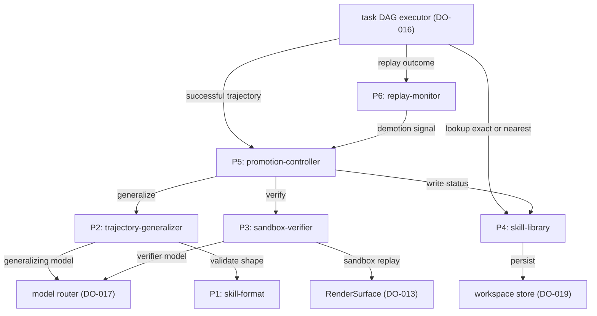
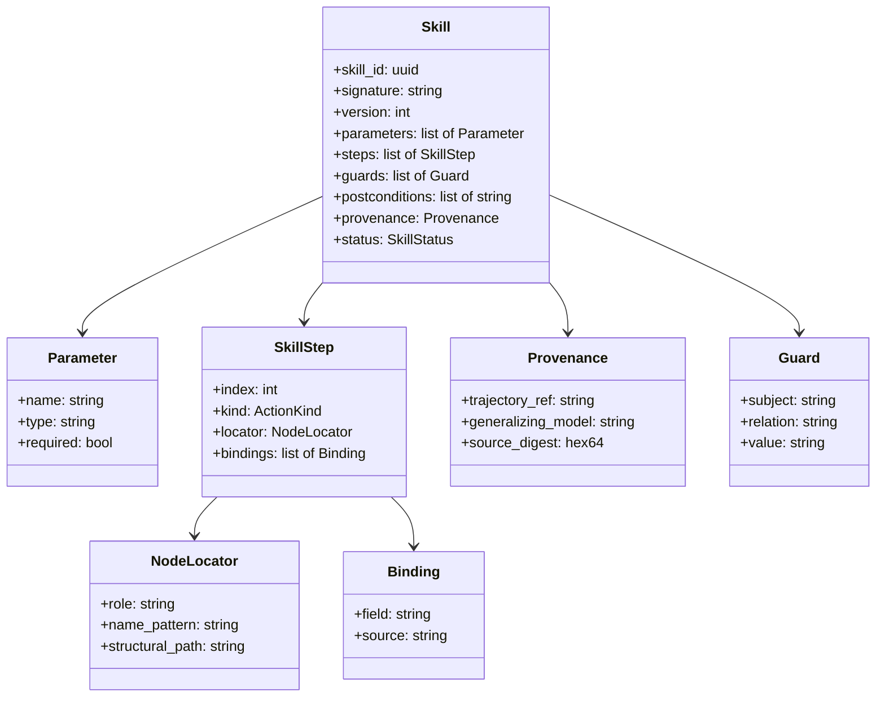
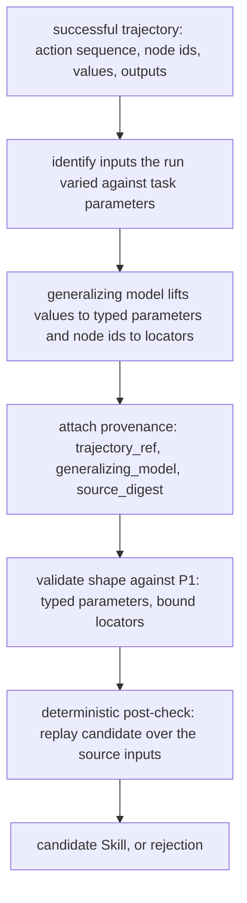
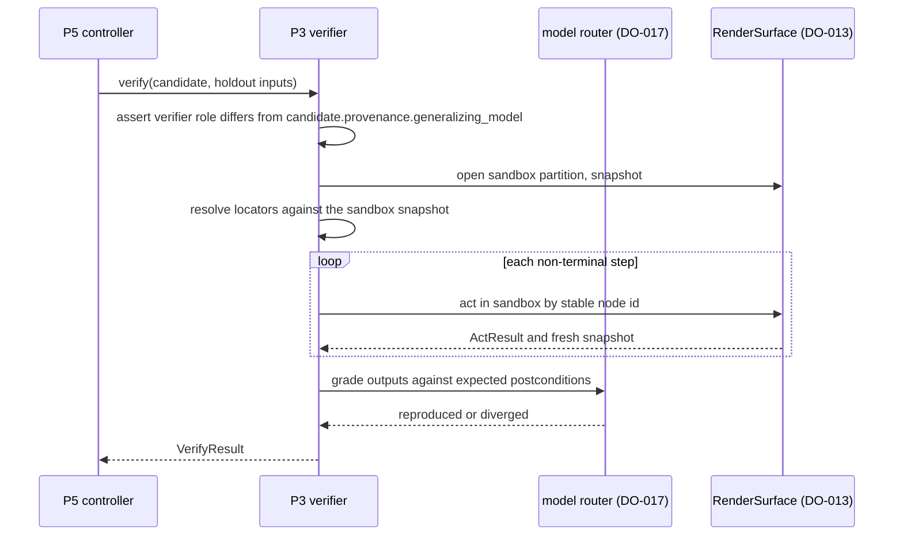
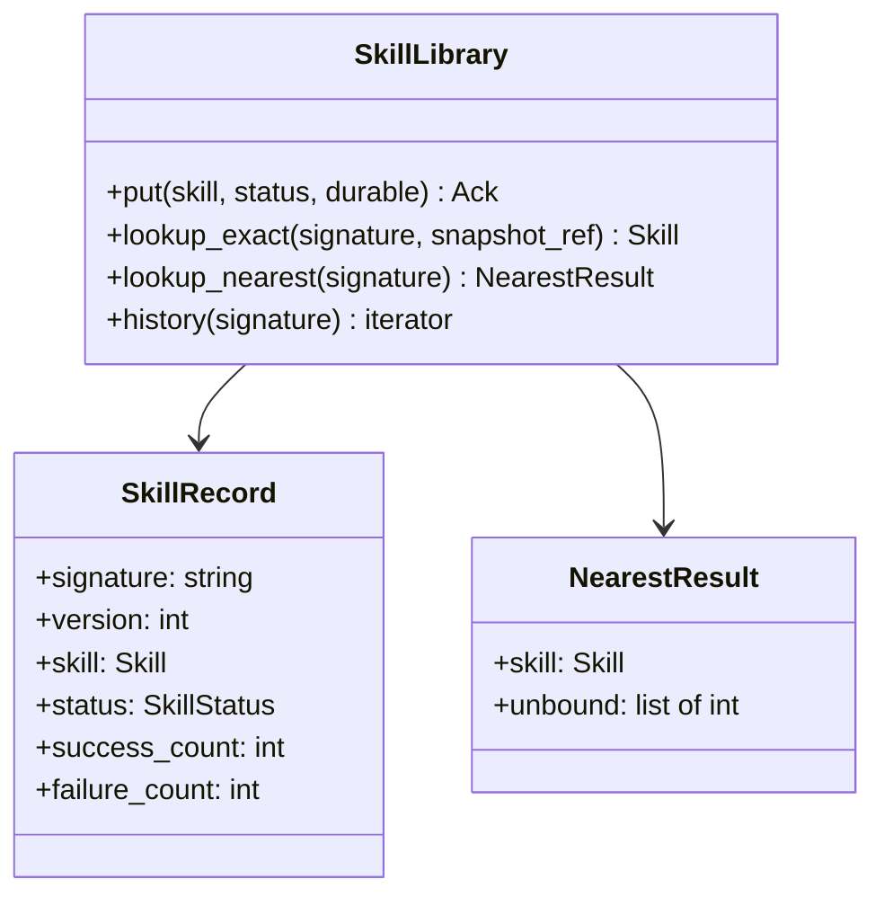
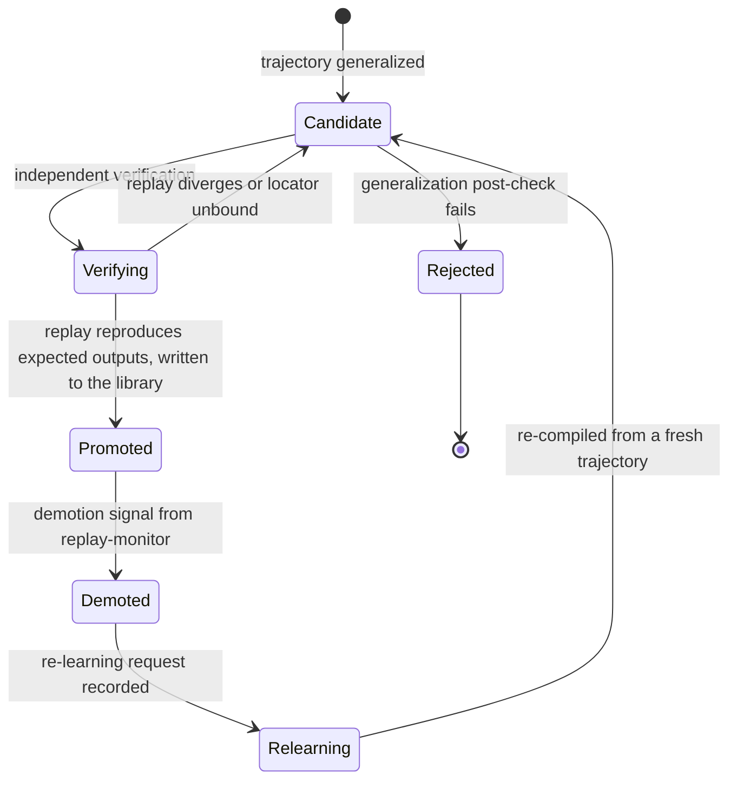
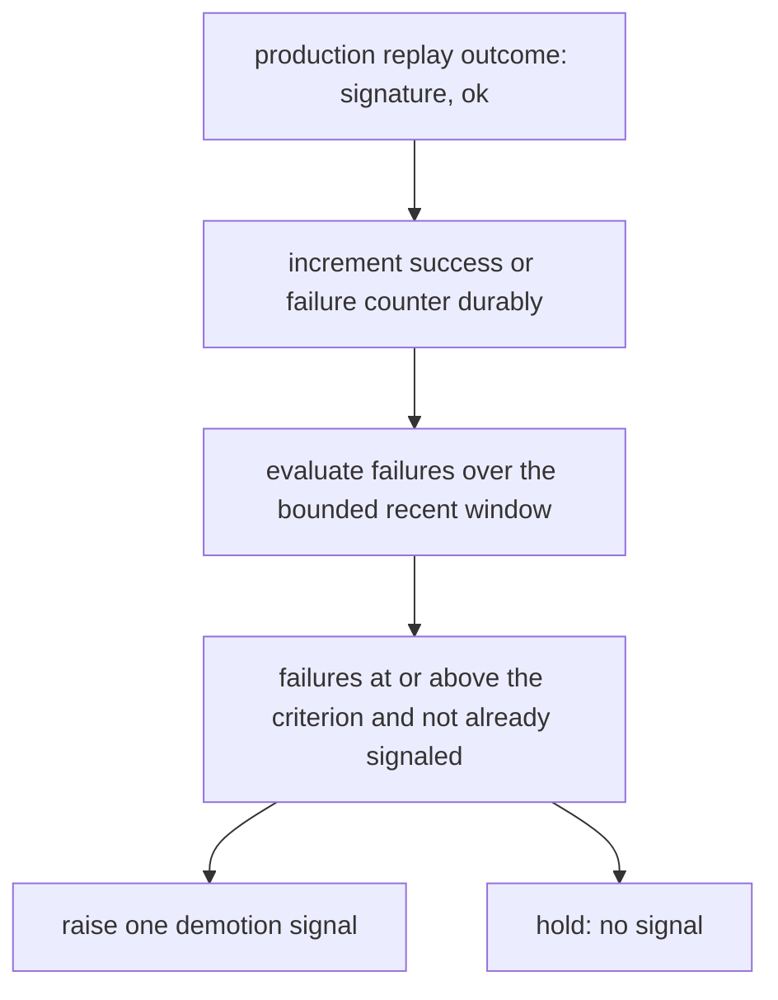

# DO-018 — Skill Compiler and Library

Compiles a successful trajectory into a verified, parameterized, replayable skill and manages its lifecycle in the library, so a task that once cost a full model-driven run resolves to a cheap deterministic replay.

## ASSEMBLY DRAWING



The task DAG executor submits a successful trajectory to the promotion-controller, the single entry point for compilation. The controller has the trajectory-generalizer lift it into a candidate skill through a generalizing model, then has the sandbox-verifier replay that candidate in an isolated partition against the live site through RenderSurface using a different model, and on a reproducing replay writes the skill to the library as promoted. The library serves the executor two lookups — an exact skill and the nearest skill with its gaps named — pinned to a snapshot reference, and persists every version through the workspace store. The executor reports each production replay outcome to the replay-monitor, which counts failures and raises a demotion signal to the controller when a promoted skill stops replaying; the controller demotes it and the task returns to a model-driven run whose next success re-enters compilation.

## BILL OF MATERIALS

| Part | Name | Kind | Responsibility | Deps | Ref |
|------|------|------|----------------|------|-----|
| P1 | skill-format | module | Defines and validates the Skill type — a parameterized action script over stable node locators with typed parameters, guards, postconditions, and provenance — with canonical serialization and a skill digest. | none | local |
| P2 | trajectory-generalizer | module | Lifts a successful trajectory into a candidate skill by generalizing concrete node ids to locators and concrete values to typed parameters, then deterministically checks the lift against the source. | P1 | local |
| P3 | sandbox-verifier | module | Replays a candidate skill in an isolated sandbox partition against the live site with a model distinct from the generalizer and confirms it reproduces the expected outputs. | P1 | local |
| P4 | skill-library | store | Versioned per-workspace store of skills keyed by signature; serves exact and nearest lookups pinned to a snapshot reference and holds append-only version history. | P1 | local |
| P5 | promotion-controller | module | Sole writer of skill status: orchestrates compile, verify, promote, demote, and re-learning across the fixed lifecycle. | P1, P2, P3, P4, P6 | local |
| P6 | replay-monitor | module | Ingests production replay outcomes, maintains per-skill success and failure counters, and raises a demotion signal when the failure criterion trips. | P1, P4 | local |

## DETAIL DRAWINGS

### P1 — skill-format



Enums, closed: `SkillStatus` = candidate, promoted, demoted, relearning. `ActionKind` = click, type, select, submit, navigate, extract — the RenderSurface action kinds, with extract standing for a read-only snapshot read.

A skill is a script, not a recording. Each `SkillStep` names a `NodeLocator` — role, accessible-name pattern, and structural path — never a raw CSS selector and never a snapshot-specific node id, so the step survives minor DOM drift by resolving to a fresh stable node id against the replay snapshot. A `Binding` sets one action field either from a named `Parameter` or from a literal captured at compile time. `provenance.source_digest` is the digest of the source trajectory, and `generalizing_model` names the model that produced the lift so the verifier can refuse to grade its own work. A `Guard` — subject, relation, value — is a precondition asserted against the replay snapshot before the first action, and a postcondition is a natural-language assertion the verifier's grader model evaluates against the run outputs.

Canonical serialization is deterministic JSON — sorted keys, no whitespace, UTF-8. `skill_digest(skill)` is the SHA-256 hex of the canonical form over the signature, parameters, steps, and guards, excluding the mutable status; it is the version identity. Validation rejects an untyped parameter, a binding to an undeclared parameter, an unbound locator, an unknown action kind, and absent provenance.

```text
resolve_locators(skill, snapshot):
 1. bound := []
 2. LOOP over steps in the skill:
 3.   matches := nodes in snapshot matching step.locator role, name_pattern, structural_path
 4.   IF matches has exactly one node: append (step.index, node.stable_id) to bound
 5.   ELSE: RETURN unbound(step.index)
 6. RETURN bound
```

### P2 — trajectory-generalizer



The generalizer treats the model as a proposer and the post-check as the judge. A generalizing model call proposes which concrete values become typed parameters and which concrete node ids become locators; the deterministic post-check then re-binds the candidate to the source trajectory's own inputs and confirms it reproduces the source action sequence step for step. A candidate that leaves a varied value un-parameterized, binds to an undeclared parameter, or diverges from its source is rejected before any verification cost is spent. The model never writes provenance or status; the generalizer stamps `generalizing_model` from the router role identity so the verifier's independence check has a value to compare against.

```text
generalize(trajectory):
 1. params, locators := generalizing_model.lift(trajectory)
 2. candidate := assemble Skill(signature: trajectory.signature,
       parameters: params, steps: locators bound to params,
       provenance: {trajectory.ref, model_identity, digest(trajectory)},
       status: candidate)
 3. IF not P1.validate_skill(candidate): RETURN reject(SHAPE_INVALID)
 4. replayed := bind candidate to trajectory.source_inputs and enumerate its actions
 5. IF replayed differs from trajectory.actions: RETURN reject(SOURCE_DIVERGED)
 6. RETURN candidate
```

### P3 — sandbox-verifier



Verification is adversarial by construction: the model that grades the replay is a different model than the one that produced it, resolved through a distinct router role, and a candidate whose provenance names the verifier role is refused with `VERIFIER_NOT_INDEPENDENT` rather than graded. Replay runs only in a sandbox workspace partition opened for the verification, isolated from every production partition, so a replay never touches the user's live logins or artifacts. The verifier binds the held-out parameter inputs, resolves each locator against the sandbox snapshot, and executes each step by stable node id; a candidate that fails to bind a locator or produces outputs the grader marks diverged fails verification. A terminal irreversible or monetary step is bound and resolved to prove the script reaches it, but its committing effect is not executed in the sandbox — the commit stays gated at production run time, so verification never spends money or sends a message to grade a skill.

```text
verify(candidate, holdout):
 1. IF candidate.provenance.generalizing_model equals verifier_role_identity:
      RETURN VerifyResult(refused, VERIFIER_NOT_INDEPENDENT)
 2. handle := RenderSurface.open(sandbox_ctx)
 3. snapshot := RenderSurface.snapshot(handle)
 4. bound := P1.resolve_locators(candidate, snapshot)
 5. IF bound is unbound: RETURN VerifyResult(failed, LOCATOR_UNBOUND)
 6. LOOP over candidate.steps bound to holdout inputs:
 7.   IF step is terminal AND consequence is irreversible or monetary:
        confirm bind and resolve only; do not commit
 8.   ELSE: RenderSurface.act(handle, step action in sandbox)
 9. graded := verifier_model.grade(outputs, candidate.postconditions)
10. IF graded is diverged: RETURN VerifyResult(failed, OUTPUT_DIVERGED)
11. RETURN VerifyResult(passed)
```

### P4 — skill-library



The library is keyed by signature and versioned by `skill_digest`; the version id is strictly monotonic per signature and history is append-only, so a demoted version and its promoted successor both remain readable. `lookup_exact` returns the promoted skill for the signature only when every locator binds against the referenced snapshot, and none otherwise; `lookup_nearest` returns the promoted skill regardless and names the steps whose locators do not bind as gaps for the executor to patch with a model call. Both lookups are deterministic for a fixed library version and a fixed snapshot. Together they realize the execution order the task DAG executor consumes: an exact skill, else the nearest skill with model-patched gaps, else a full model-driven run. A demoted skill is served by neither lookup. Every record persists under the workspace key through the workspace store; a durable write flushes before the skill is served.

```text
lookup_exact(signature, snapshot_ref):
 1. rec := latest promoted record for signature
 2. IF rec is none: RETURN none
 3. snapshot := workspace_store.read(snapshot_ref)
 4. bound := P1.resolve_locators(rec.skill, snapshot)
 5. IF bound is unbound: RETURN none
 6. RETURN rec.skill
```

### P5 — promotion-controller



The controller is the only writer of skill status and drives the lifecycle in one fixed order. On a submitted trajectory it calls the generalizer, and on a candidate it calls the verifier with a role the router guarantees differs from the generalizer; only a passing verification writes the skill to the library as promoted. A demotion signal moves a promoted skill to demoted, which the library immediately drops from both lookups, and records a re-learning request against the signature. Re-learning needs no separate learner: with the skill demoted the executor's next run of that signature falls to a model-driven run, and its success is submitted here as a fresh trajectory that re-enters compilation. Promotion is idempotent per candidate digest — a resubmitted identical candidate promotes the existing version rather than forking a duplicate.

```text
compile_and_verify(trajectory):
 1. candidate := P2.generalize(trajectory)
 2. IF candidate is rejected: RETURN not_promoted(candidate.reason)
 3. P4.put(candidate, status: candidate, durable: true)
 4. result := P3.verify(candidate, holdout(trajectory))
 5. IF result is not passed:
      P4.put(candidate, status: candidate, durable: true); RETURN not_promoted(result.reason)
 6. P4.put(candidate, status: promoted, durable: true)
 7. RETURN promoted(candidate.skill_id)
```

```text
demote(signal):
 1. rec := P4.latest_promoted(signal.signature)
 2. IF rec is none: RETURN noop
 3. P4.put(rec.skill, status: demoted, durable: true)
 4. record re-learning request for signal.signature
 5. RETURN demoted(rec.skill.skill_id)
```

### P6 — replay-monitor



The monitor consumes the outcome of every production replay the executor reports for a served skill and increments the per-skill success or failure counter durably before acknowledging, so no outcome is lost behind the reliability figure it feeds. The demotion criterion is a fixed threshold over a bounded recent window, not lifetime totals, so a long-successful skill that breaks on a site change demotes promptly. A crossing raises exactly one demotion signal; subsequent failures on the same already-signaled skill raise none, so a broken skill cannot storm the controller. Counters persist per workspace through the workspace store.

```text
record_outcome(signature, ok):
 1. IF ok: increment success_count(signature) durable
 2. ELSE: increment failure_count(signature) durable
 3. recent := failures for signature within the recent window
 4. IF recent at or above criterion AND signature not already signaled:
 5.   mark signature signaled; RETURN demotion_signal(signature)
 6. RETURN no_signal
```

## CONTRACTS & TOLERANCES

P1 — skill-format:

| Operation | Input domain | Nominal behavior | Tolerance | Inspection op | Failure mode outside tolerance |
|-----------|--------------|------------------|-----------|---------------|--------------------------------|
| validate_skill(candidate) | any candidate skill structure | Schema-checks the skill; rejects untyped parameters, bindings to undeclared parameters, unbound locators, unknown action kinds, and absent provenance. | Acceptance and rejection deterministic; exact | Op 10 | A malformed skill is rejected with SKILL_INVALID; nothing is stored or served. |
| canonical(skill), skill_digest(skill) | any Skill value | Deterministic JSON serialization and its SHA-256 hex digest over signature, parameters, steps, and guards, excluding status. | Byte-identical output for equal skills regardless of step or parameter order; exact | Op 10 | Divergent digests fork versions and defeat dedup; the op rejects the build. |
| resolve_locators(skill, snapshot) | a skill and a PageGraph snapshot | Resolves each NodeLocator to at most one stable node id against the snapshot. | Deterministic and total: each locator resolves to exactly one node or reports unbound; exact | Op 10, Op 20 | A locator matching two nodes reports unbound; the skill does not bind and is not returned exact. |

P2 — trajectory-generalizer:

| Operation | Input domain | Nominal behavior | Tolerance | Inspection op | Failure mode outside tolerance |
|-----------|--------------|------------------|-----------|---------------|--------------------------------|
| generalize(trajectory) | a successful trajectory with action sequence, node ids, values, and outputs | Lifts varied values to typed parameters and node ids to locators, attaches provenance, returns a candidate skill. | Every varied value appears as exactly one typed parameter; provenance names the source trajectory and generalizing model; exact | Op 30 | An un-parameterized varied value or missing provenance fails the shape check; no candidate is emitted. |
| generalization post-check | a proposed candidate and its source trajectory | Re-binds the candidate to the source inputs and enumerates its actions. | Candidate reproduces the source action sequence step for step or is rejected; exact | Op 30, Op 80 | A candidate diverging from its own source is rejected before any verification cost is spent. |
| generalize overhead | trajectories up to 200 actions | Post-processing completes within the overhead budget excluding the model call. | p99 at or below 30 ms excluding the generalizing model call, on the Op 90 corpus | Op 90 | Over-budget post-processing is rejected at inspection. |

P3 — sandbox-verifier:

| Operation | Input domain | Nominal behavior | Tolerance | Inspection op | Failure mode outside tolerance |
|-----------|--------------|------------------|-----------|---------------|--------------------------------|
| verify(candidate, holdout) | a candidate skill and held-out parameter bindings | Replays the candidate in a sandbox partition and grades outputs against the expected postconditions. | Passes only when replay reproduces the expected outputs; exact | Op 40, Op 80 | A non-reproducing replay fails; the candidate is not promoted. |
| verifier independence | any candidate carrying provenance | Resolves a verifier model role distinct from the recorded generalizing model. | Verifier model identity never equals the generalizing model identity; exact | Op 40, Op 80 | A same-model candidate is refused with VERIFIER_NOT_INDEPENDENT and never graded. |
| sandbox isolation | any verification | Opens and acts only in a sandbox partition. | Zero actions on any production workspace partition; terminal irreversible or monetary steps bound and resolved but never committed; exact | Op 40, Op 70 | An action on a production partition or a committed irreversible step is rejected at inspection and fails the battery. |
| verify overhead | candidates up to 40 steps | Verifier orchestration completes within the overhead budget excluding model and page wait. | p99 at or below 50 ms excluding model and RenderSurface wait, on the Op 90 corpus | Op 90 | Over-budget orchestration is rejected at inspection. |

P4 — skill-library:

| Operation | Input domain | Nominal behavior | Tolerance | Inspection op | Failure mode outside tolerance |
|-----------|--------------|------------------|-----------|---------------|--------------------------------|
| lookup_exact(signature, snapshot_ref) | a step signature and a snapshot reference | Returns the promoted skill whose locators all bind against the referenced snapshot, or none. | Deterministic for a fixed library version and snapshot; returns a skill only when every locator binds; a demoted skill is never returned; exact | Op 20, Op 70, Op 80 | A skill with an unbound locator returned as exact is rejected at inspection; runtime falls to nearest or model. |
| lookup_nearest(signature) | a step signature | Returns the promoted skill with its unbound-locator gaps named, or none. | Deterministic for a fixed library version; gaps named exactly; a demoted skill is never returned; exact | Op 20, Op 70, Op 80 | Nondeterministic nearest resolution or a returned demoted skill is rejected at inspection. |
| put(skill, status, durable), history(signature) | a validated skill and a lifecycle status | Writes a versioned record under the workspace key and serves append-only version history. | Version id strictly monotonic per signature; history append-only; durable write flushed before the skill is served; exact | Op 20 | A lost or reordered version breaks provenance; inspection rejects a serve preceding a durable write. |
| lookup_exact latency | a reference library of 5000 skills | Returns within the latency budget. | p99 at or below 10 ms on the Op 90 corpus | Op 90 | Over-budget lookup stalls the executor; the op rejects the build. |

P5 — promotion-controller:

| Operation | Input domain | Nominal behavior | Tolerance | Inspection op | Failure mode outside tolerance |
|-----------|--------------|------------------|-----------|---------------|--------------------------------|
| compile_and_verify(trajectory) | a successful trajectory from the executor | Generalizes, verifies with an independent model, and promotes on a passing verification. | A skill reaches promoted only after a passing independent verification; exactly one promoted version per candidate digest; exact | Op 60, Op 70 | An unverified promotion or a duplicate forked version is rejected at inspection. |
| demote(signal) | a demotion signal from the replay-monitor | Sets status demoted, drops the skill from both lookups, and records a re-learning request. | A demoted skill is returned by neither lookup; each demotion records exactly one re-learning request; exact | Op 70 | A demoted skill still served is rejected at inspection and fails the battery. |
| status authority | any status transition | Applies transitions only along the fixed lifecycle order. | The promotion-controller is the only writer of skill status; every transition follows the lifecycle order; exact | Op 60, Op 70 | A status write from any other part or an out-of-order transition is rejected at inspection. |

P6 — replay-monitor:

| Operation | Input domain | Nominal behavior | Tolerance | Inspection op | Failure mode outside tolerance |
|-----------|--------------|------------------|-----------|---------------|--------------------------------|
| record_outcome(signature, ok) | a production replay outcome for a served skill | Increments the per-skill success or failure counter durably. | Counters exact to the reported outcome count; durable before acknowledged; exact | Op 50 | A lost or double-counted outcome miswrites reliability; inspection rejects a non-durable increment. |
| demotion criterion | a skill's recent outcome window | Raises a demotion signal when recent failures cross the fixed threshold. | Exactly one signal per crossing over a bounded recent window, not one per subsequent failure; exact | Op 50, Op 70 | A repeated or missed signal is rejected at inspection. |

Consumed boundaries (external subsystems; only the interface this subsystem calls is toleranced, never their internals):

| Operation | Input domain | Nominal behavior | Tolerance | Inspection op | Failure mode outside tolerance |
|-----------|--------------|------------------|-----------|---------------|--------------------------------|
| DO-016 submit_trajectory, report_outcome, lookup_exact, lookup_nearest | successful trajectories, replay outcomes, and lookups | The executor submits trajectories, reports outcomes, and queries the two lookups that order exact skill then patched skill then model run. | The execution order is served by lookup_exact then lookup_nearest with model fallback owned by the executor; resolution deterministic for a fixed snapshot_ref and library version; exact | Op 20, Op 60 | Nondeterministic resolution or a served demoted skill is rejected at inspection. |
| DO-013 open(sandbox_ctx), snapshot(handle), act(handle, action) | perception and action in a sandbox partition | The verifier opens a sandbox partition, reads snapshots, and acts by stable node id. | Actions target stable node ids; the partition is isolated from production; snapshot is read-only; exact | Op 40, Op 70 | An action on a production partition is rejected at inspection and fails the battery. |
| DO-017 call(role, inputs) | generalizer and verifier roles | The generalizer and the grader each resolve a model role through the router. | The verifier role identity always differs from the generalizer role identity; exact | Op 30, Op 40, Op 80 | A router that returns the same identity for both roles fails the independence inspection. |
| DO-019 put(key, bytes, durable), get(key), append(key, bytes) | skill records, counters, and sandbox snapshots | Durable per-workspace key-value and append storage, with a partition for sandbox snapshots. | Writes scoped to one workspace partition; the sandbox partition separate from production; durable put and append flushed before ack; exact | Op 20, Op 50 | A cross-workspace read or an unflushed durable write is rejected at inspection. |

## PROCESS PLAN

| Op | Task | Tooling | Inspection |
|----|------|---------|------------|
| 10 | Implement P1 skill-format: types, validation, canonical serialization, skill digest, locator resolution. | language stdlib, JSON library, SHA-256 primitive | Golden skills validate; untyped-parameter, undeclared-binding, unbound-locator, and no-provenance skills are rejected; digests identical across step and parameter orderings; resolve_locators returns exactly one node per locator or unbound on fixture snapshots. |
| 20 | Implement P4 skill-library over a workspace-store stub: versioned per-signature records, exact and nearest lookup, append-only history. | language stdlib, unit test runner | put then lookup_exact returns the skill when all locators bind and none when one is unbound; lookup_nearest returns the nearest with gaps named; version id strictly monotonic; per-workspace separation; durable write returns only after the stub records a flush; lookups deterministic for a fixed snapshot ref. |
| 30 | Implement P2 trajectory-generalizer over recorded trajectory fixtures and a stub generalizing model. | language stdlib, fixture corpus, unit test runner | A fixture trajectory compiles to a candidate; every varied value becomes exactly one typed parameter and every node id a locator; provenance names the source and generalizing model; the post-check rejects a candidate whose replay over the source inputs diverges from the source actions. |
| 40 | Implement P3 sandbox-verifier against a stub RenderSurface and a stub verifier model in an isolated partition. | language stdlib, stub surface harness, unit test runner | A candidate reproducing expected outputs passes; a candidate whose provenance names the verifier role is refused VERIFIER_NOT_INDEPENDENT; every act lands on the sandbox partition and none on a production partition; a terminal monetary step is bound and resolved but never committed; a non-reproducing candidate fails. |
| 50 | Implement P6 replay-monitor over P4 and the workspace-store stub. | language stdlib, unit test runner | Reported outcomes increment the matching counter durably; a stream crossing the criterion raises exactly one demotion signal and subsequent failures raise none; counters survive process restart and are per-workspace. |
| 60 | Implement P5 promotion-controller wiring compile, verify, promote, and demote across the assembled parts and stubs. | language stdlib, stub harness, unit test runner | A successful trajectory flows generalize then verify then promote and the skill becomes lookup-exact eligible; a candidate failing verification is not promoted; an identical resubmitted candidate promotes the existing version rather than forking; the promotion-controller is the only writer of status. |
| 70 | Lifecycle and demotion battery with fault injection on the stubs. | fault-injection harness, unit test runner | Each transition fires only on its trigger; a demotion signal demotes and records one re-learning request; a demoted skill is returned by neither lookup; a re-learning trajectory re-enters compilation; a status write attempted from any other part and an out-of-order transition are refused; no sandbox action reaches a production partition. |
| 80 | Determinism and independence battery. | unit test runner, recorded corpora | An identical trajectory with fixed models yields a byte-identical candidate skill; lookup_exact and lookup_nearest are deterministic for a fixed library version and snapshot; the resolved verifier identity always differs from the generalizer identity; the post-check reproduces source actions exactly. |
| 90 | Latency and throughput measurement over reference corpora. | benchmark harness with high-resolution clock | p99 measured at or below budget: lookup_exact 10 ms on a 5000-skill library, generalizer overhead 30 ms excluding the model call, verifier orchestration 50 ms excluding model and page wait; durable-write-before-serve ordering observed under load. |

## REVISION HISTORY

| Rev | Date | Author | Change summary |
|-----|------|--------|----------------|
| A | 2026-07-18 | Claude Fable 5 | Initial draft. |
