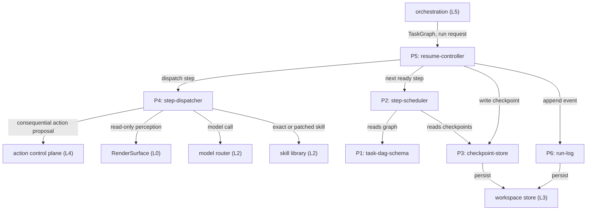
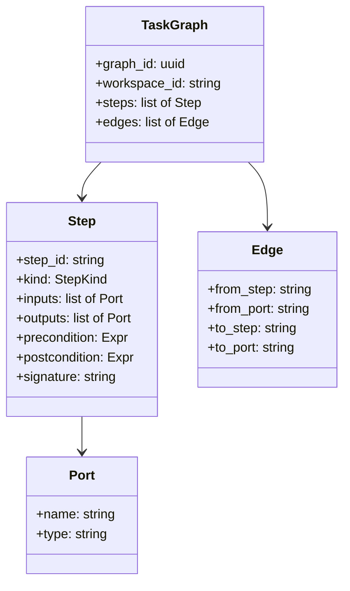
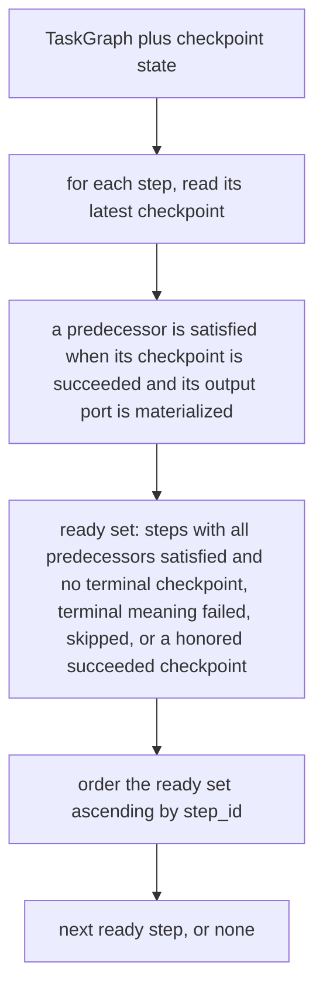
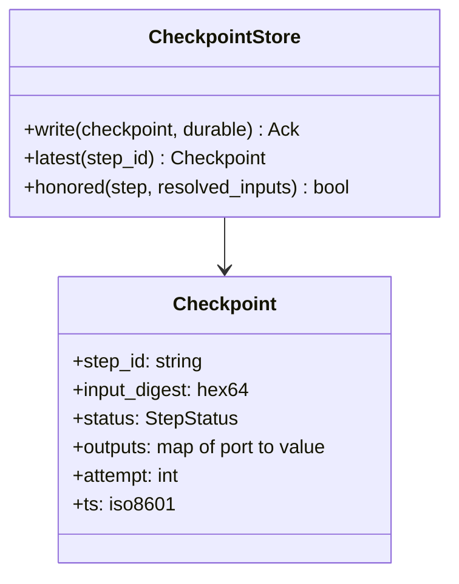
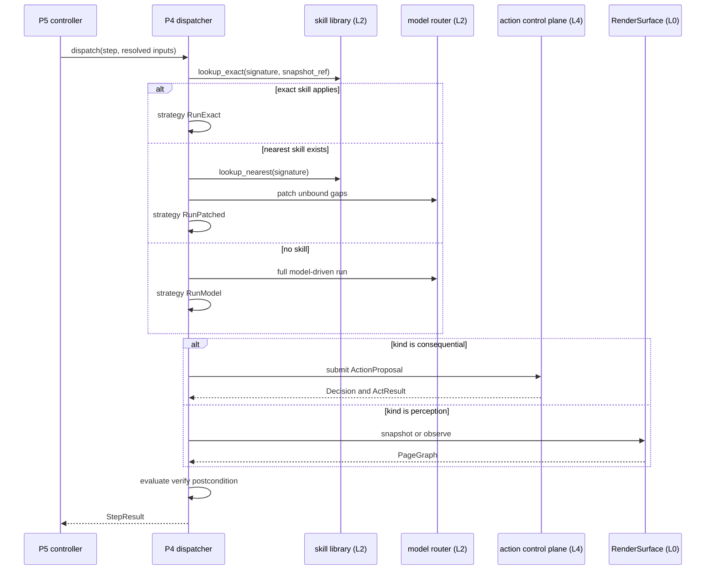
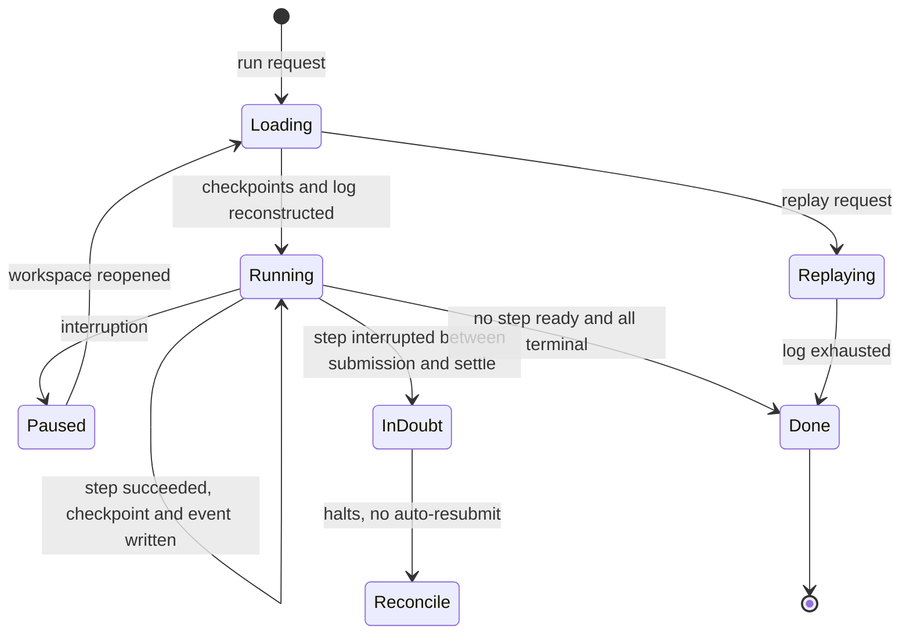
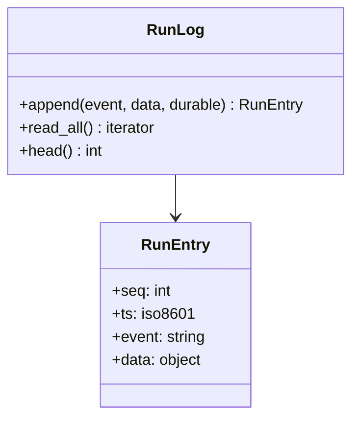

# DO-016 — Task DAG Executor

Executes an explicit task graph with per-step checkpoints so any interruption — crash, model timeout, or laptop lid-close — resumes from the last good step, and every run replays from its log.

## ASSEMBLY DRAWING



Orchestration submits a TaskGraph and a run request to the resume-controller, the single entry point for a run. The resume-controller loads any prior checkpoints and run-log for the workspace, then drives the loop: the step-scheduler names the next ready step from the graph and checkpoint state, the step-dispatcher executes it, and the resume-controller writes a checkpoint and appends a run-log event before advancing. The dispatcher routes each step by kind — read-only perception crosses RenderSurface, every consequential action crosses the action control plane, model calls cross the model router, and skills come from the skill library. The checkpoint-store and run-log persist through the workspace store. On any interruption the resume-controller reconstructs from the last durable checkpoint and continues, and from the run-log alone it replays a finished run.

## BILL OF MATERIALS

| Part | Name | Kind | Responsibility | Deps | Ref |
|------|------|------|----------------|------|-----|
| P1 | task-dag-schema | module | Defines and validates the TaskGraph type — steps with typed input and output ports, edges, kinds, and the canonical input digest. | none | local |
| P2 | step-scheduler | module | Pure function from graph and checkpoint state to the ready set and the next runnable step in deterministic order. | P1, P3 | local |
| P3 | checkpoint-store | store | Persists one checkpoint record per step to the workspace store and serves the latest, binding it to the step's resolved input digest. | P1 | local |
| P4 | step-dispatcher | module | Executes one step: resolves the exact-then-patched-then-model strategy, routes by kind, and evaluates the verify postcondition. | P1 | local |
| P5 | resume-controller | module | Drives the run loop, reconstructs state from checkpoints and log to resume from the last good step, and replays a finished run. | P2, P3, P4, P6 | local |
| P6 | run-log | store | Append-only, sequenced event log of every step lifecycle transition; the sole source of truth for replay. | P1 | local |

## DETAIL DRAWINGS

### P1 — task-dag-schema



Enums, closed: `StepKind` = navigate, extract, compare, fill, verify. `StepStatus` = pending, ready, running, succeeded, failed, skipped, in_doubt. A step declares typed input and output ports; an edge wires one upstream output port to one downstream input port of a matching type. The graph is a DAG: validation rejects cycles, duplicate step ids, an edge whose endpoints or ports do not exist, and a type mismatch across an edge. The verify postcondition is an expression over the step's resolved outputs. Canonical serialization is deterministic JSON with sorted keys; `input_digest(step, resolved_inputs)` is the SHA-256 hex of the canonical form of the step kind and its resolved input ports, and is the key under which the step's checkpoint is stored.

```text
validate(graph):
 1. IF two steps share a step_id: RETURN reject(DUPLICATE_ID, step_id)
 2. LOOP over edges:
      IF from_step or to_step is absent, or the named port is absent,
      or from_port type differs from to_port type:
        RETURN reject(BAD_EDGE, edge)
 3. IF the edge set contains a cycle: RETURN reject(CYCLE, cycle path)
 4. RETURN accept(graph)
```

### P2 — step-scheduler



The scheduler is a pure function of the graph and the checkpoint state; it holds no mutable run state. A step is ready when every incoming edge's source step holds a succeeded checkpoint whose named output port is materialized, and the step itself holds no terminal checkpoint. A checkpoint is terminal when it is failed or skipped, or when it is a succeeded checkpoint that is honored — its `input_digest` still equals the step's resolved input digest. A succeeded checkpoint gone stale, whose upstream changed so the digest no longer matches, is not terminal, so the step re-enters the ready set and re-runs. Ties break on ascending `step_id`, so the schedule is deterministic and replayable. `next` returns none only when no step is ready, which distinguishes a completed graph from one blocked on a failed predecessor by inspecting whether every step holds a terminal checkpoint.

```text
ready_set(graph, checkpoints):
 1. ready := []
 2. LOOP over steps in the graph:
      cp := checkpoints.latest(step)
      IF cp status is failed or skipped: continue
      IF cp status is succeeded AND
         checkpoints.honored(step, resolve_inputs(step, checkpoints)): continue
      IF every incoming edge source holds a succeeded checkpoint
         with the referenced output port materialized:
           append step to ready
 3. RETURN ready sorted ascending by step_id
```

### P3 — checkpoint-store



Each write persists a Checkpoint under the workspace key through the workspace store; the latest checkpoint per `step_id` wins. A durable write returns only after the workspace store confirms a flush to stable storage, so a checkpoint the resume-controller reads back survives process death. A checkpoint is honored for resume only when its `input_digest` equals the step's currently resolved input digest: if an upstream output changed between the crash and the resume, the digest differs, the checkpoint is invalidated, and the step re-runs. `attempt` increments per execution and disambiguates retries in the log.

```text
honored(step, resolved_inputs):
 1. cp := latest(step.step_id)
 2. IF cp is none OR cp.status is not succeeded: RETURN false
 3. IF cp.input_digest differs from input_digest(step, resolved_inputs):
      RETURN false
 4. RETURN true
```

### P4 — step-dispatcher



The strategy ladder is fixed and its first applicable tier wins: an exact skill for the step signature, else the nearest skill with its unbound gaps patched by a model call, else a full model-driven run. Resolution is deterministic for a fixed skill-library snapshot ref. Routing is by kind: consequential kinds (navigate, fill) build an ActionProposal and submit it to the action control plane, which is the only path to a RenderSurface act-class effect; perception kinds (extract, verify by reading) call RenderSurface `snapshot` or `observe`, which are read-only and ungated; compare and model reasoning cross the model router. This part never calls RenderSurface `act`. Every consequential submission is preceded by a durable pre-dispatch record so the effect is attributable and bounded to at most one automatic submission.

```text
dispatch(step, resolved_inputs):
 1. exact := skill_library.lookup_exact(step.signature, snapshot_ref)
 2. IF exact is present AND exact applies to resolved_inputs:
      strategy := RunExact(exact)
 3. ELSE:
      near := skill_library.lookup_nearest(step.signature)
      IF near is present: strategy := RunPatched(near, model_router)
      ELSE: strategy := RunModel(model_router)
 4. IF step.kind is navigate or fill:
      result := action_control_plane.submit(proposal(step, resolved_inputs))
    ELSE IF step.kind is extract or verify:
      result := render_surface.snapshot(step.handle)
    ELSE:
      result := strategy.run(resolved_inputs)
 5. IF not evaluate(step.postcondition, result):
      RETURN StepResult(failed, result)
 6. RETURN StepResult(succeeded, result)
```

### P5 — resume-controller



The resume-controller is the run driver. On start it loads the checkpoints and the run-log for the workspace and reconstructs run state; a fresh workspace reconstructs to an empty state. It then loops: it asks the scheduler for the next ready step, calls the dispatcher, writes the resulting checkpoint durably, and appends the lifecycle event to the log before advancing. A step whose checkpoint is honored is skipped, so no completed step re-executes across a resume. The settle record is the `step.succeeded` or `step.failed` entry appended after a step's dispatch. A consequential step, navigate or fill, whose log holds a pre-dispatch record but no settle record is in-doubt: the controller halts that branch and never auto-resubmits, because a duplicated payment or send is worse than a stall. A perception or compare step interrupted mid-dispatch carries no pre-dispatch record and simply re-runs, since re-reading is safe. Replay reads the log in order and reconstructs the sequence of steps, chosen strategies, and recorded outputs without any side-effecting call.

```text
run(graph, request):
 1. checkpoints, log := load(request.workspace_id)
 2. LOOP over steps whose checkpoint is honored: append step.skipped
 3. LOOP:
 4.   step := scheduler.next(graph, checkpoints)
 5.   IF step is none: RETURN outcome(graph, checkpoints)
 6.   inputs := resolve_inputs(step, checkpoints)
 7.   IF step.kind is navigate or fill:
 8.     IF log shows step pre-dispatched without a settle record:
 9.       append step.in_doubt; RETURN halt(step)
10.     append step.pre_dispatch durable
11.   result := dispatcher.dispatch(step, inputs)
12.   checkpoints.write(checkpoint(step, result), durable: true)
13.   IF result is succeeded: append step.succeeded
14.   ELSE: append step.failed
```

```text
replay(log):
 1. state := empty
 2. LOOP over log entries in sequence order:
 3.   apply entry to state without any control-plane, RenderSurface,
        model, or skill call
 4. RETURN state
```

### P6 — run-log



Event taxonomy, closed set:

| Event | Emitted when | Payload fields |
|-------|--------------|----------------|
| run.started | Controller begins a run. | graph_id, workspace_id |
| step.ready | Scheduler yields a ready step. | step_id, attempt |
| step.strategy_chosen | Dispatcher resolves the strategy ladder. | step_id, strategy, snapshot_ref |
| step.pre_dispatch | Durable record before a consequential submission. | step_id, input_digest, idempotency_key |
| action.submitted | Consequential proposal sent to the control plane. | step_id, proposal_ref |
| perception.read | Read-only snapshot taken for a step. | step_id, snapshot_ref |
| step.succeeded | StepResult succeeded and checkpoint written. | step_id, input_digest, output_ref |
| step.failed | Postcondition or execution failed. | step_id, reason |
| step.skipped | Honored checkpoint short-circuited the step. | step_id, input_digest |
| step.in_doubt | Interrupted between submission and settle. | step_id, idempotency_key |
| run.paused | Interruption observed. | graph_id, last_seq |
| run.resumed | Controller reconstructed and continued. | graph_id, from_seq |
| run.completed | No step ready and all terminal. | graph_id, outcome |
| replay.started | Replay reads the log from the head. | graph_id |

The log is append-only with a strictly monotonic `seq`, persisted under the workspace key through the workspace store, one file per workspace. `read_all` yields entries in sequence order for resume reconstruction and replay. A durable append flushes before the controller performs the dependent dispatch, so a pre-dispatch record can never be lost behind the effect it records.

## CONTRACTS & TOLERANCES

P1 — task-dag-schema:

| Operation | Input domain | Nominal behavior | Tolerance | Inspection op | Failure mode outside tolerance |
|-----------|--------------|------------------|-----------|---------------|--------------------------------|
| validate(graph) | any candidate TaskGraph | Checks acyclicity, unique step ids, edge endpoint existence, and port-type match. | Acceptance and rejection deterministic; cyclic, duplicate-id, and mistyped graphs rejected; exact | Op 10 | A malformed graph is rejected with the offending step or edge named; no run starts. |
| input_digest(step, resolved_inputs) | a step with resolved input ports | Canonical digest of the step kind and its resolved inputs. | Byte-identical for equal inputs regardless of port order; exact | Op 10 | Divergent digests break checkpoint matching; the op rejects the build. |

P2 — step-scheduler:

| Operation | Input domain | Nominal behavior | Tolerance | Inspection op | Failure mode outside tolerance |
|-----------|--------------|------------------|-----------|---------------|--------------------------------|
| ready_set(graph, checkpoints) | valid graph and checkpoint state | Returns steps whose predecessors all hold a succeeded checkpoint with materialized outputs and that hold no terminal checkpoint. | No step appears before all predecessors are satisfied; order deterministic ascending by step_id; exact | Op 40, Op 80 | An out-of-order or premature step is rejected at inspection. |
| next(graph, checkpoints) | valid graph and checkpoint state | Returns the first ready step or none. | Pure function; none only when no step is ready; exact | Op 40 | A spurious none stalls a runnable graph; inspection compares against the ready set. |
| ready_set latency | graphs up to 5000 steps | Returns within the latency budget. | p99 at or below 5 ms on the Op 90 corpus | Op 90 | Over-budget scheduling is rejected at inspection. |

P3 — checkpoint-store:

| Operation | Input domain | Nominal behavior | Tolerance | Inspection op | Failure mode outside tolerance |
|-----------|--------------|------------------|-----------|---------------|--------------------------------|
| write(checkpoint, durable) | a Checkpoint for a step | Persists the record under the workspace key; durable mode returns only after flush. | Latest checkpoint per step_id wins; durable write flushed before ack; exact | Op 30, Op 60 | A lost or premature ack breaks resume; inspection rejects an ack preceding flush. |
| latest(step_id), honored(step, inputs) | an existing step | Returns the most recent checkpoint and whether it is valid for resume. | A checkpoint is honored only when its input_digest equals the resolved digest; exact | Op 30, Op 70 | A checkpoint whose upstream changed is invalidated and the step re-runs. |

P4 — step-dispatcher:

| Operation | Input domain | Nominal behavior | Tolerance | Inspection op | Failure mode outside tolerance |
|-----------|--------------|------------------|-----------|---------------|--------------------------------|
| dispatch(step, inputs) | a ready step with resolved inputs | Resolves the strategy ladder, executes, evaluates the verify postcondition, returns a StepResult. | Strategy tried in order exact skill, nearest skill with model-patched gaps, full model run; first applicable wins; exact | Op 50 | An out-of-order strategy is rejected at inspection. |
| dispatch — routing | any step kind | Consequential kinds submit an ActionProposal to the control plane; perception kinds read a RenderSurface snapshot; model reasoning crosses the model router. | Zero RenderSurface act-class calls from this part; every consequential effect crosses the control-plane boundary; exact | Op 50, Op 70 | A direct act-class call to RenderSurface is rejected at inspection and fails the battery. |
| dispatch — at most once | consequential steps under crash-resume | Writes a durable pre-dispatch record before submitting and never auto-resubmits an in-doubt step. | Automatic submissions per step per input_digest at most one across any number of resume cycles; exact | Op 70 | A second automatic submission fails the battery; an in-doubt step halts for reconciliation. |
| dispatch overhead | steps whose skill path resolves without a model call | Returns within the overhead budget excluding model, perception, and control-plane wait. | p99 at or below 15 ms on the Op 90 corpus | Op 90 | Over-budget overhead is rejected at inspection. |

P5 — resume-controller:

| Operation | Input domain | Nominal behavior | Tolerance | Inspection op | Failure mode outside tolerance |
|-----------|--------------|------------------|-----------|---------------|--------------------------------|
| run(graph, request) | a validated graph, fresh or resumed | Drives scheduler, dispatcher, checkpoint, and log to completion. | Exactly the unsatisfied steps execute; no step with a honored checkpoint re-executes; exact | Op 60, Op 70 | A re-executed completed step or a skipped unsatisfied step is rejected at inspection. |
| resume after interruption | a workspace with prior checkpoints and log | Reconstructs run state, continues from the last good step, and halts in-doubt steps. | Resumed run completes the same step set as an uninterrupted run; in-doubt steps never auto-resubmit; exact | Op 60, Op 70 | Divergent completion or a resubmitted in-doubt step fails the battery. |
| replay(log) | a complete run-log | Reconstructs the ordered sequence of steps, strategies, and outputs from the log alone. | Reconstructed event sequence equals the recorded sequence; zero control-plane, RenderSurface, model, or skill calls during replay; exact | Op 60, Op 80 | A divergent or side-effecting replay is rejected at inspection. |

P6 — run-log:

| Operation | Input domain | Nominal behavior | Tolerance | Inspection op | Failure mode outside tolerance |
|-----------|--------------|------------------|-----------|---------------|--------------------------------|
| append(event, data, durable) | a taxonomy event with JSON data | Appends a sequenced entry under the workspace key; durable mode returns after flush. | Sequence strictly monotonic; order equals append order; durable append flushed before any dependent dispatch; exact | Op 20, Op 60 | A lost or reordered pre-dispatch record breaks replay and at-most-once; inspection rejects a dispatch preceding its durable record. |
| read_all() | an existing log | Yields entries in sequence order for resume and replay. | Order equals append order; exact | Op 20, Op 80 | Out-of-order reconstruction misattributes steps; inspection compares against append order. |

Consumed boundaries (external subsystems; only the interface this executor calls is toleranced, never their internals):

| Operation | Input domain | Nominal behavior | Tolerance | Inspection op | Failure mode outside tolerance |
|-----------|--------------|------------------|-----------|---------------|--------------------------------|
| DO-012 submit(ActionProposal) | a resolved consequential step | The dispatcher submits a proposal carrying workspace, task, and step reference and receives a Decision and ActResult as data. | Every consequential step crosses this boundary; zero act-class calls bypass it; exact | Op 50, Op 70 | A bypass is rejected at inspection and fails the battery. |
| DO-013 snapshot(handle), observe(handle) | perception and verify-read steps | The dispatcher reads the PageGraph and navigation events. | Read-only; no act-class call from this subsystem; exact | Op 50 | A mutating call is rejected at inspection. |
| DO-017 call(role, inputs) | compare, gap-patch, and full-model steps | The dispatcher routes the model role and records the output in the checkpoint and log. | Model outputs recorded at first execution and reused on replay; replay issues zero model calls; exact | Op 50, Op 80 | A fresh model call during replay is rejected at inspection. |
| DO-018 lookup_exact, lookup_nearest | strategy resolution | Returns an exact skill, a nearest skill, or none, pinned to a snapshot ref. | Resolution deterministic for a fixed snapshot_ref; exact | Op 50, Op 80 | Nondeterministic resolution is rejected at inspection. |
| DO-019 put(key, bytes, durable), append(key, bytes) | checkpoint and run-log persistence | Durable per-workspace key-value and append storage. | Durable put and append flushed before ack; exact | Op 20, Op 30 | An unflushed durable write is rejected at inspection. |

## PROCESS PLAN

| Op | Task | Tooling | Inspection |
|----|------|---------|------------|
| 10 | Implement P1 task-dag-schema: types, validation, canonical input digest. | language stdlib, JSON library, SHA-256 primitive | Golden graphs validate; cyclic, duplicate-id, and mistyped-port graphs are rejected with the offending element named; digests identical across port orderings. |
| 20 | Implement P6 run-log over a workspace-store stub: sequenced append-only entries, durable flush, read_all. | language stdlib, unit test runner | Append events then read_all yields them in append order; sequence strictly monotonic; process restart resumes the sequence; durable append returns only after the stub records a flush. |
| 30 | Implement P3 checkpoint-store over the workspace-store stub: write, latest, input-digest binding, durable flush. | language stdlib, unit test runner | latest returns the most recent checkpoint per step; a checkpoint whose input_digest differs from the resolved digest is not honored; durable write returns only after flush; state survives restart. |
| 40 | Implement P2 step-scheduler over P1 and P3. | language stdlib, unit test runner | ready_set equals predecessors-satisfied minus terminal on fixture graphs; order ascending by step_id; no step yielded before every predecessor holds a succeeded checkpoint; next returns none only on a complete or blocked graph. |
| 50 | Implement P4 step-dispatcher with the strategy ladder and kind routing against stub control plane, RenderSurface, model router, and skill library. | language stdlib, stub harness, unit test runner | The ladder tries exact skill then nearest-with-patch then full model in order, first applicable winning; consequential steps call only the control-plane stub and the RenderSurface stub records zero act-class calls; perception steps call only snapshot; the verify postcondition is evaluated on every result. |
| 60 | Implement P5 resume-controller: driver loop, crash-resume, replay, against the assembled parts and stubs. | language stdlib, stub harness, unit test runner | An uninterrupted run and a run interrupted at each step boundary complete the same step set; no step with a honored checkpoint re-executes; replay from the log alone reconstructs the sequence and issues zero stub calls. |
| 70 | Exactly-once and in-doubt battery with fault injection at every checkpoint and dispatch boundary. | fault-injection harness, unit test runner | Each consequential step submits to the control-plane stub at most once across repeated crash-resume cycles; a step interrupted between submission and settle record is marked in_doubt and never auto-resubmits; every act-class effect is preceded by its durable pre-dispatch record. |
| 80 | Determinism and replay-equivalence battery. | unit test runner, recorded corpora | Identical graph and checkpoint state yield an identical schedule and event sequence; replay reproduces the recorded event sequence exactly; no model or skill call occurs during replay. |
| 90 | Latency and throughput measurement over reference graphs. | benchmark harness with high-resolution clock | p99 dispatcher overhead at or below 15 ms excluding model, perception, and control-plane wait; scheduler ready_set at or below 5 ms on 5000-step graphs; durable-record-before-dispatch ordering observed under load. |

## REVISION HISTORY

| Rev | Date | Author | Change summary |
|-----|------|--------|----------------|
| A | 2026-07-18 | Claude Fable 5 | Initial draft. |
