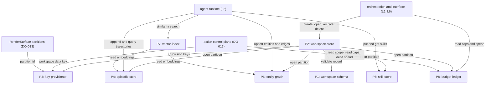
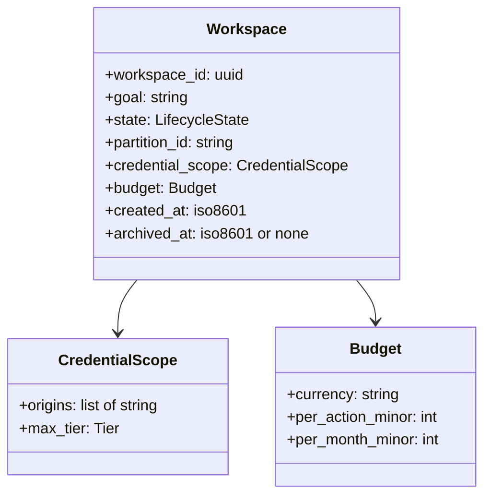
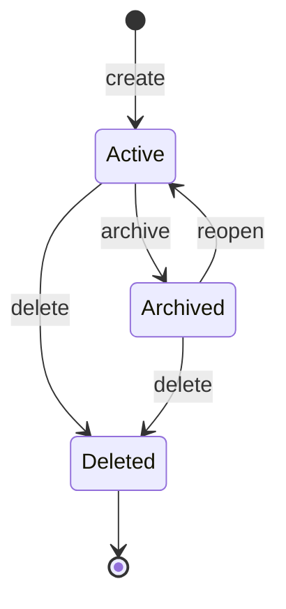
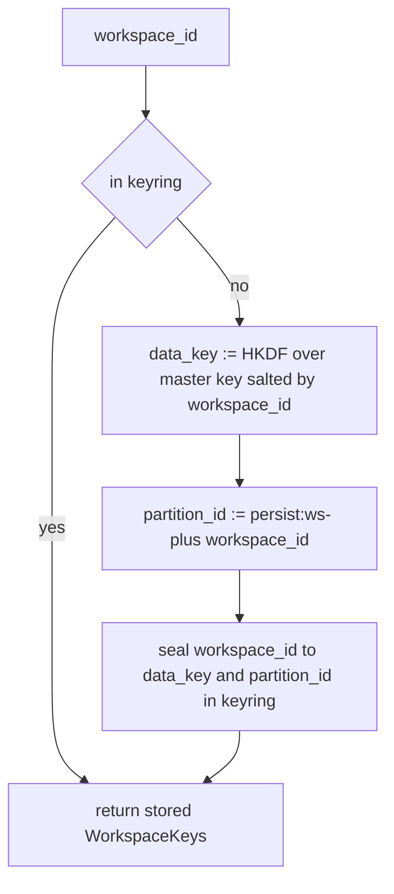
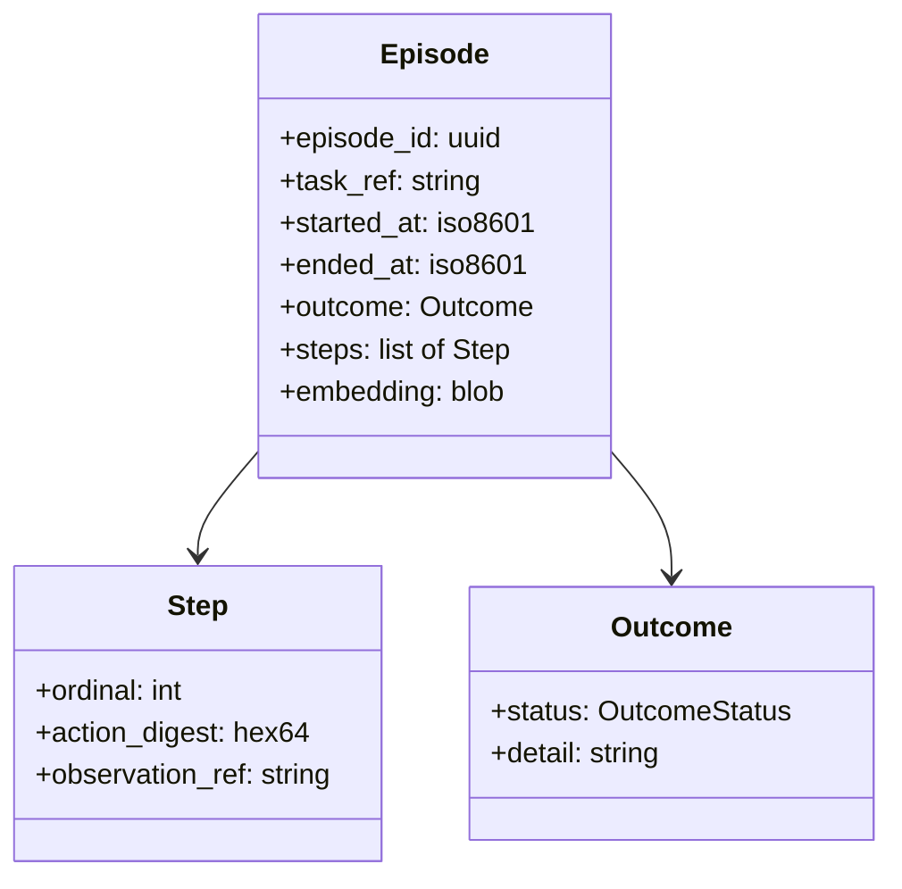
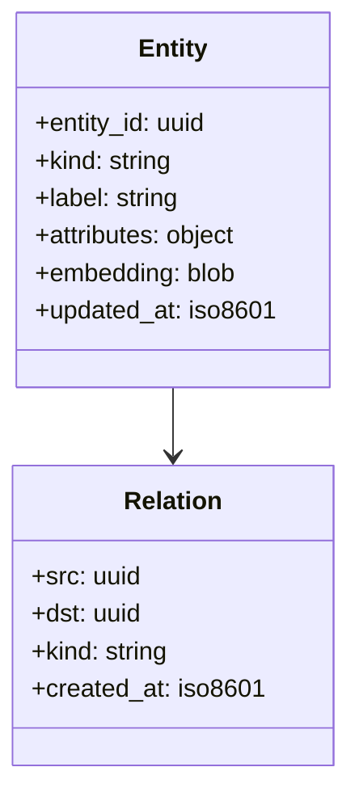
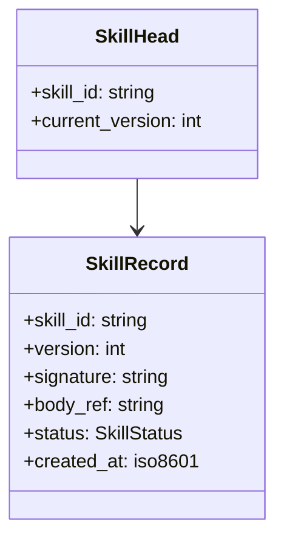
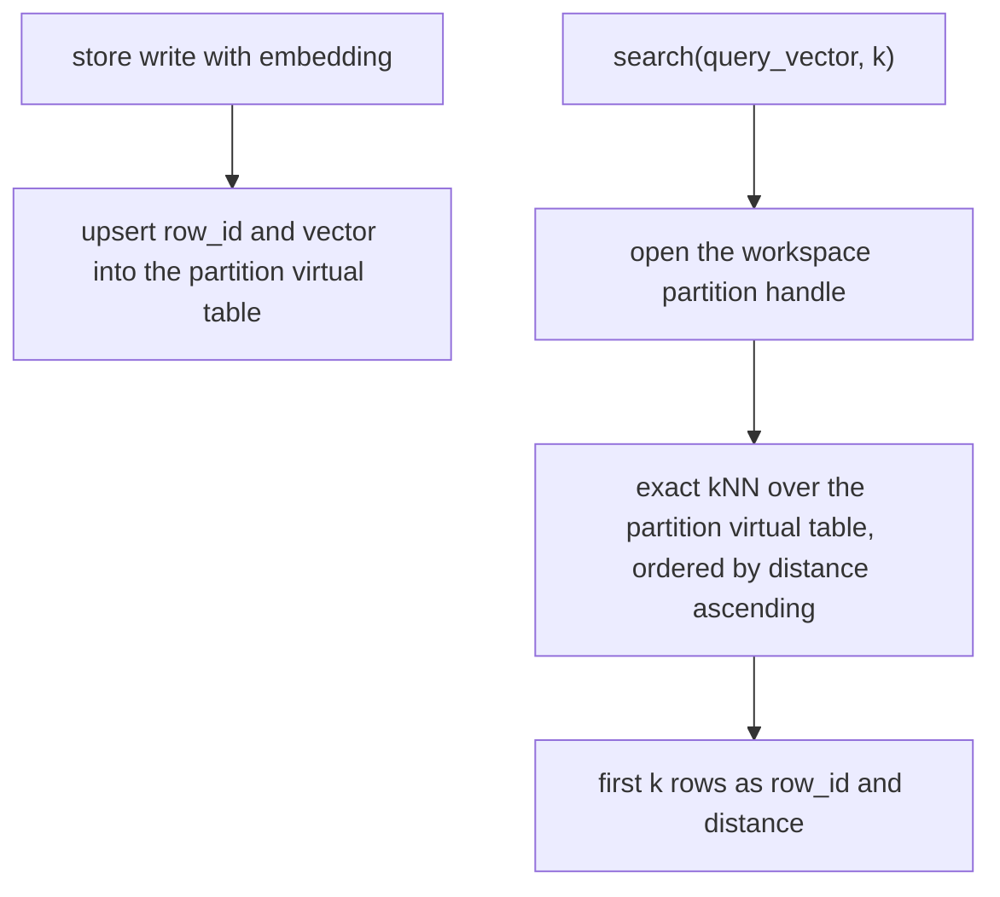
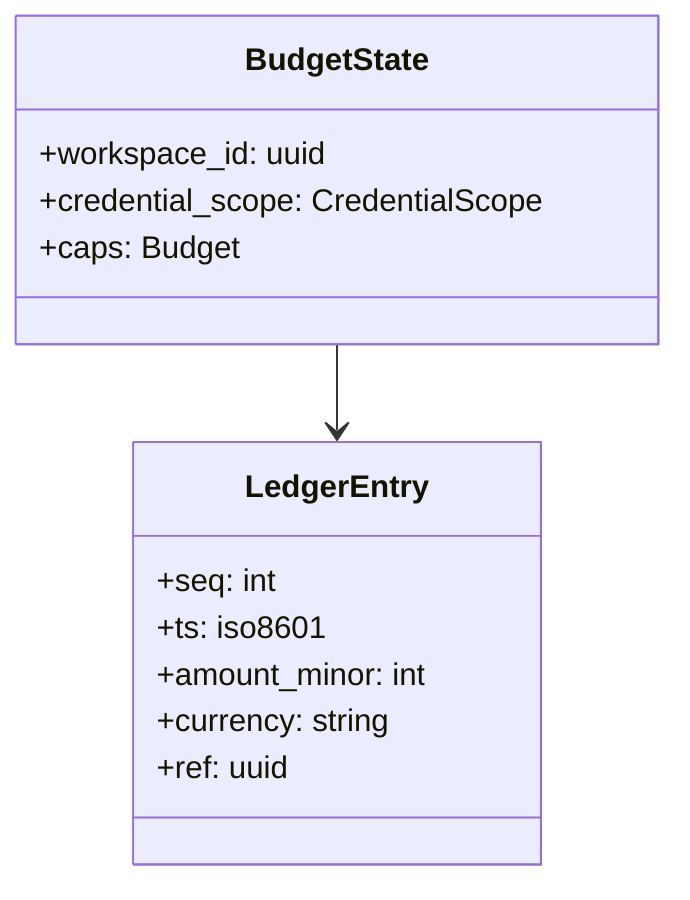

# DO-019 — Workspace and Memory Store

The L3 persistence layer for Browser OS: it persists workspaces and their episodic, entity, and skill memory locally and encrypted, one partition per workspace, so that a compromised or crashed task never reaches another workspace's data and nothing leaves the machine.

## ASSEMBLY DRAWING



Orchestration and the interface create, open, archive, and delete workspaces through the workspace-store, the single lifecycle entry point; the store validates each record against the workspace-schema, asks the key-provisioner for the workspace's data key and partition id, and opens the four encrypted partition stores under that key. The agent runtime reads and writes the episodic, entity, and skill stores directly and queries the vector-index, which reads embeddings held in the episodic and entity stores. The action control plane reads a workspace's credential scope, reads its budget caps, and records spend against the budget-ledger, and takes the same per-workspace data key the store and vault use to encrypt at rest, while the RenderSurface uses the shared partition id to name its session partition, so the isolation boundary is one key and one partition id shared by all three subsystems.

## BILL OF MATERIALS

| Part | Name | Kind | Responsibility | Deps | Ref |
|------|------|------|----------------|------|-----|
| P1 | workspace-schema | module | Defines and validates the Workspace record, its credential scope and budget fields, and its lifecycle states and transitions. | none | local |
| P2 | workspace-store | store | Owns workspace lifecycle: creates, opens, archives, and deletes workspaces and maps each to exactly one encrypted partition. | P1, P3, P4, P5, P6, P8 | local |
| P3 | key-provisioner | module | Derives a deterministic per-workspace data key and partition id from a master keyring and zeroizes them on delete. | none | local |
| P4 | episodic-store | store | Holds trajectories and their outcomes for one workspace, encrypted, with an embedding column per episode. | P3 | local |
| P5 | entity-graph | store | Holds the entities the user tracks and the edges between them for one workspace, encrypted, with an embedding column per entity. | P3 | local |
| P6 | skill-store | store | Holds the workspace's compiled skill library from L2, versioned, encrypted. | P3 | local |
| P7 | vector-index | module | Maintains sqlite-vec virtual tables over episodic and entity embeddings and answers exact nearest-neighbor queries scoped to one partition. | P4, P5 | local |
| P8 | budget-ledger | store | Holds a workspace's credential scope, budget caps, and append-only spend entries, and sums the current month. | P1, P3 | local |

## DETAIL DRAWINGS

### P1 — workspace-schema

The Workspace record is the unit of persistence: a goal, a pointer to its agent memory partition, a credential scope, and a budget. Pages and artifacts named in the arch-doc L3 responsibility are held elsewhere and are out of scope for this sheet. The scope and budget are fields, not stores — the vault (DO-012) and the budget manager (DO-020) read them; this sheet never holds the credentials themselves.



Enums, closed: `LifecycleState` = active(0), archived(1), deleted(2). `Tier` = read(0), interact(1), transact(2), the same ordering DO-012 resolves against. Validation rejects an empty goal, a currency outside ISO-4217, a non-positive budget field, a `max_tier` above transact, and any unknown field; rejection is a typed Rejection, never a partial record. The lifecycle transition table is total: every state accepts a fixed set of events and rejects the rest.

```text
transition(state, event):
 1. IF state is active AND event is archive: RETURN archived
 2. IF state is active AND event is delete: RETURN deleted
 3. IF state is archived AND event is reopen: RETURN active
 4. IF state is archived AND event is delete: RETURN deleted
 5. RETURN Rejection(illegal_transition)
```

### P2 — workspace-store

The lifecycle owner. A catalog table records every workspace and its state; the four memory partitions live in a single encrypted SQLite database file named by the partition id. Create provisions the key, opens the partition, and initializes the store tables in one durable step; delete zeroizes the key so the ciphertext on disk is unrecoverable.



Active and archived workspaces persist across process restart; the store reloads the catalog and reopens partitions on demand. Each workspace maps to exactly one partition id, and no partition id is shared between two workspaces — this one-to-one mapping is the isolation invariant DO-012 and DO-013 depend on.

```text
create(goal, scope, budget):
 1. record := Workspace(new uuid, goal, state active, scope, budget, created_at now)
 2. IF P1.validate(record) rejects: RETURN Rejection
 3. keys := P3.provision(record.workspace_id)
 4. record.partition_id := keys.partition_id
 5. open encrypted partition keys.partition_id under keys.data_key
 6. initialize episodic, entity, skill, and budget tables in the partition
 7. append record to the catalog and flush durable
 8. RETURN record
```

### P3 — key-provisioner

One master keyring file, owner-only permissions, holds the master key and the per-workspace derivation salts. A workspace data key is derived, never stored in plaintext beyond the sealed keyring, and is deterministic in the workspace id so the same workspace always opens under the same key. The partition id is the shared name DO-013 uses for its Electron session partition and this sheet uses for the encrypted database file.



```text
provision(workspace_id):
 1. IF keyring holds workspace_id: RETURN stored WorkspaceKeys
 2. data_key := HKDF(master_key, salt: workspace_id, info: ws-data)
 3. partition_id := concat(persist:ws-, workspace_id)
 4. seal (workspace_id to data_key, partition_id) into the owner-only keyring
 5. RETURN WorkspaceKeys(data_key, partition_id)
```

Zeroize overwrites the workspace's keyring entry and drops the derived key; without the key the AEAD-encrypted partition file is indistinguishable from random, so delete needs no secure erase of the data file itself. The master key never leaves the process and never enters any store partition.

### P4 — episodic-store

Trajectories and their outcomes, one row per episode, inside the workspace partition. Each row carries an embedding blob the vector-index reads; the store computes no embeddings itself — the agent runtime supplies the vector.



`OutcomeStatus` = succeeded(0), failed(1), abandoned(2). Steps are stored in ascending ordinal and read back in the same order; a query returns whole episodes filtered by task_ref, outcome, or time window. Every write is encrypted at rest under the partition key and is visible only through a handle opened for that workspace.

### P5 — entity-graph

The things the user tracks — products compared, flights watched, leads researched — as typed nodes and directed edges, inside the workspace partition. Each entity carries an embedding blob for similarity recall.



Upsert is idempotent on entity_id: a second write with the same id replaces attributes and refreshes the embedding and updated_at, never creating a duplicate. A neighbors query returns entities one edge from a given node, filtered by relation kind. Nodes and edges are encrypted at rest under the partition key.

### P6 — skill-store

The workspace's compiled skill library, the durable form of L2 output. This sheet persists and versions skills; the compiler and verifier are DO-018 and do not appear here.



`SkillStatus` = promoted(0), demoted(1). Put appends a new immutable version and advances the skill head; get returns the current promoted version by default, or a named version. Demotion flips a version's status without deleting it, so a demoted skill's history survives for audit. Records are encrypted at rest under the partition key.

### P7 — vector-index

Exact nearest-neighbor search over the episodic and entity embeddings of one partition. The index maintains a sqlite-vec virtual table alongside each store's table inside the same encrypted database, so a search never crosses a partition boundary. Search is brute-force exact over the partition, not approximate: the result is the true k nearest by distance.



```text
search(workspace_id, store, query_vector, k):
 1. handle := open partition for workspace_id
 2. rows := exact kNN over handle.store embeddings ordered by distance ascending
 3. RETURN first k of rows as (row_id, distance)
```

Dimension is fixed per store at initialization; a query vector of another dimension is rejected, never truncated or padded. The index reads embeddings the stores hold and returns row ids only — the caller resolves rows through the owning store, so the index never widens a store's read surface.

### P8 — budget-ledger

A workspace's credential scope, its budget caps, and its append-only spend entries, inside the workspace partition. The action control plane (DO-012) reads the scope and caps and records each debit at dispatch; the budget manager (DO-020) reads caps and the month sum. This sheet owns the durable ledger; the vault and the budget manager are its clients across the boundary.



Entries are append-only and monotonic in seq; a debit never mutates a prior entry, and a reversal is a further entry, never an edit. The month sum walks entries whose timestamp falls in the current UTC calendar month against the injected clock, so the sum is exact to the minor unit and independent of read order.

```text
month_spent(workspace_id):
 1. now := injected clock
 2. sum := 0
 3. LOOP over ledger entries where entry.ts within the UTC month of now:
      sum := sum + entry.amount_minor
 4. RETURN sum
```

## CONTRACTS & TOLERANCES

P1 — workspace-schema:

| Operation | Input domain | Nominal behavior | Tolerance | Inspection op | Failure mode outside tolerance |
|-----------|--------------|------------------|-----------|---------------|--------------------------------|
| validate(record) | any candidate Workspace value | Accepts a well-formed record or returns a typed Rejection; rejects empty goal, non-ISO-4217 currency, non-positive budget field, tier above transact, unknown field. | Acceptance and rejection deterministic; exact | Op 10 | A malformed record yields Rejection and no partial workspace is created downstream. |
| transition(state, event) | a LifecycleState and a lifecycle event | Returns the next state per the total transition table or Rejection for an illegal pair. | Transition table total and exact; every state-event pair resolves | Op 10, Op 30 | An illegal transition returns Rejection and the workspace state is unchanged. |

P2 — workspace-store:

| Operation | Input domain | Nominal behavior | Tolerance | Inspection op | Failure mode outside tolerance |
|-----------|--------------|------------------|-----------|---------------|--------------------------------|
| create(goal, scope, budget) | a valid goal, credential scope, and budget | Provisions the key, opens the encrypted partition, initializes store tables, and appends the catalog record in one durable step. | Create atomic and durable before return; each workspace maps to exactly one partition id; exact | Op 30 | A failed step leaves no catalog record and no orphan partition; the caller sees Rejection. |
| open, archive, reopen, delete | an existing workspace_id | Applies the lifecycle transition and, for delete, zeroizes the workspace key. | Lifecycle transitions exact per P1 table; delete zeroizes the key so the partition is unrecoverable; exact | Op 30, Op 90 | An unknown workspace_id returns Rejection; a deleted workspace never reopens. |
| get, list | none, or an existing workspace_id | Returns active and archived workspaces reloaded from the catalog after restart. | Active and archived records durable across process restart; partition mapping one-to-one; exact | Op 30, Op 90 | A record lost across restart fails inspection; a shared partition id fails the isolation battery. |

P3 — key-provisioner:

| Operation | Input domain | Nominal behavior | Tolerance | Inspection op | Failure mode outside tolerance |
|-----------|--------------|------------------|-----------|---------------|--------------------------------|
| provision(workspace_id) | any workspace_id | Derives or returns the workspace data key and partition id and seals them in the owner-only keyring. | Same workspace_id yields the same data key and partition id; distinct workspaces yield distinct keys; exact | Op 20 | A key collision across workspaces fails inspection; the keyring file must carry owner-only permissions. |
| key_for(workspace_id) | a provisioned workspace_id | Returns the sealed data key for opening the partition. | Master key never enters a partition or a return path above L3; exact | Op 20, Op 90 | A key readable outside its workspace collapses isolation and fails the battery. |
| zeroize(workspace_id) | a deleted workspace_id | Overwrites the keyring entry and drops the derived key. | After zeroize the partition ciphertext is unrecoverable; exact | Op 90 | A surviving key after delete leaves recoverable data and fails the deletion vector. |

P4 — episodic-store:

| Operation | Input domain | Nominal behavior | Tolerance | Inspection op | Failure mode outside tolerance |
|-----------|--------------|------------------|-----------|---------------|--------------------------------|
| append_trajectory(workspace_id, episode) | an Episode with ordered steps and an embedding | Writes the episode and its steps into the workspace partition, encrypted. | Steps read back in ascending ordinal; write durable before return; ciphertext at rest carries no plaintext field; exact | Op 40, Op 90 | Reordered steps or plaintext on disk fails inspection; a write to a closed partition is rejected. |
| query(workspace_id, filter) | a workspace_id and a filter over task_ref, outcome, or time | Returns whole episodes matching the filter, from that workspace only. | Results scoped to the workspace partition; no episode from another workspace ever returned; exact | Op 40, Op 90 | A cross-workspace row in results fails the isolation battery. |

P5 — entity-graph:

| Operation | Input domain | Nominal behavior | Tolerance | Inspection op | Failure mode outside tolerance |
|-----------|--------------|------------------|-----------|---------------|--------------------------------|
| upsert_entity(workspace_id, entity) | an Entity with an id, kind, and embedding | Inserts or replaces the entity by id and refreshes its embedding and updated_at. | Upsert idempotent on entity_id; no duplicate node per id; encrypted at rest; exact | Op 50, Op 90 | A second write creating a duplicate node fails inspection; plaintext at rest fails the battery. |
| link, neighbors | an existing src and dst, or a node and a relation kind | Adds a directed edge, or returns entities one edge from a node filtered by kind, from that workspace only. | Neighbor set exact for the relation kind; results scoped to the partition; exact | Op 50, Op 90 | A cross-workspace neighbor fails the isolation battery; a dangling edge endpoint is rejected. |

P6 — skill-store:

| Operation | Input domain | Nominal behavior | Tolerance | Inspection op | Failure mode outside tolerance |
|-----------|--------------|------------------|-----------|---------------|--------------------------------|
| put_skill(workspace_id, skill) | a SkillRecord with a skill_id and body_ref | Appends an immutable new version and advances the skill head. | Versions monotonic per skill_id; prior versions immutable; encrypted at rest; exact | Op 60, Op 90 | An overwritten prior version fails inspection; plaintext at rest fails the battery. |
| get_skill, list_skills | a skill_id, optional version, or a workspace_id | Returns the current promoted version by default or a named version, from that workspace only. | Head resolves to the highest promoted version exactly; results scoped to the partition; exact | Op 60, Op 90 | A demoted head served as current fails inspection; a cross-workspace skill fails the battery. |

P7 — vector-index:

| Operation | Input domain | Nominal behavior | Tolerance | Inspection op | Failure mode outside tolerance |
|-----------|--------------|------------------|-----------|---------------|--------------------------------|
| index(workspace_id, store, row_id, vector) | a row_id and a fixed-dimension vector | Upserts the vector into the store's partition virtual table. | Dimension fixed per store; a wrong-dimension vector rejected, never padded or truncated; exact | Op 70 | A dimension-mismatched vector is rejected; a silently reshaped vector fails inspection. |
| search(workspace_id, store, query_vector, k) | a query vector of the store dimension and a positive k | Returns the true k nearest rows by distance from that partition only. | Exact nearest neighbors, ordered by distance ascending; results scoped to the partition; exact | Op 70, Op 90 | An approximate or cross-partition result fails inspection; a wrong-dimension query is rejected. |
| search latency | partitions up to 100000 embedded rows | Returns within the latency budget on the reference corpus. | p99 at or below 50 ms on the Op 110 corpus | Op 110 | Over-budget search stalls agent recall; the op rejects the build until within budget. |

P8 — budget-ledger:

| Operation | Input domain | Nominal behavior | Tolerance | Inspection op | Failure mode outside tolerance |
|-----------|--------------|------------------|-----------|---------------|--------------------------------|
| caps(workspace_id), credential_scope(workspace_id) | an existing workspace_id | Returns the workspace's budget caps and credential scope. | Values equal the last accepted workspace record exactly | Op 80 | A stale or wrong scope would misauthorize the vault; inspection compares against the stored record. |
| debit(workspace_id, amount_minor, currency, ref) | a positive amount in the workspace currency | Appends a LedgerEntry and returns it; never mutates a prior entry. | Ledger append-only and monotonic in seq; debit durable before return; exact | Op 80, Op 90 | A mutated prior entry or a lost debit breaks the spend record; inspection rejects both. |
| month_spent(workspace_id) | an existing workspace_id and injected clock | Sums entries in the current UTC calendar month. | Sum exact to the minor unit and independent of read order | Op 80 | Arithmetic drift or order-dependence lets a cap be overspent; the op sums a known ledger. |

Boundary contracts (external actors; this sheet owns these obligations, DO-012, DO-013, DO-020, DO-021, and L2 hold the far side):

| Operation | Input domain | Nominal behavior | Tolerance | Inspection op | Failure mode outside tolerance |
|-----------|--------------|------------------|-----------|---------------|--------------------------------|
| provisioning to DO-012 and DO-013 | an open workspace | Supplies exactly one data key and one partition id per workspace to the vault, the audit log, and the RenderSurface session partition. | Key and partition id scoped to exactly one workspace_id; shared by all three consumers; exact | Op 20, Op 90 | A shared or cross-workspace key collapses the isolation DO-012 and DO-013 rely on; the battery falsifies it. |
| budget read by DO-012 and DO-020 | an open workspace | The vault reads scope and caps and debits at dispatch; the budget manager reads caps and the month sum. | Scope, caps, and month sum served exactly to the reader; ledger append-only | Op 80, Op 90 | A wrong cap or a mutable ledger lets spend exceed the budget; inspection reconciles reads against the record. |
| lifecycle to DO-020 and DO-021 | create, open, archive, delete requests | Orchestration and the interface drive workspace lifecycle through the store; no caller reaches a partition except through an opened workspace. | Every partition access goes through an open workspace handle; exact | Op 30, Op 90 | A partition reached without an open handle bypasses isolation and fails the battery. |
| local-first storage | all workspaces and stores | All workspace and memory data lives under the local data directory; no copy leaves the machine. | Network egress from the store equals zero; exact | Op 100 | Any byte of store data crossing the network breaks the local-first guarantee; the op monitors egress. |

## PROCESS PLAN

| Op | Task | Tooling | Inspection |
|----|------|---------|------------|
| 10 | Implement P1 workspace-schema: Workspace record, scope and budget fields, validation, lifecycle transition table. | language stdlib, unit test runner | Golden records validate; empty-goal, bad-currency, non-positive-budget, and above-transact records reject; every state-event pair resolves to a next state or Rejection. |
| 20 | Implement P3 key-provisioner: master keyring, per-workspace HKDF derivation, partition id, zeroize. | language stdlib, AEAD and HKDF primitives, unit test runner | Same workspace_id yields the same data key and partition id; two workspaces yield distinct keys; the keyring file has owner-only permissions; the master key appears in no return above L3. |
| 30 | Implement P2 workspace-store over P1 and P3: catalog, create, open, archive, reopen, delete, restart reload. | language stdlib, unit test runner | Create is atomic and durable; the full lifecycle runs; active and archived workspaces reload after a process restart; each workspace maps to exactly one partition id. |
| 40 | Implement P4 episodic-store inside the encrypted partition: episodes, ordered steps, outcomes, embedding column, filtered query. | language stdlib, SQLite with AEAD page encryption, unit test runner | Round-trip preserves step ordinal order; the on-disk file carries no plaintext field; a query returns only the opened workspace's episodes. |
| 50 | Implement P5 entity-graph inside the partition: entities, edges, idempotent upsert, neighbors query. | language stdlib, SQLite, unit test runner | Upsert on an existing id creates no duplicate; neighbors returns the exact one-edge set per relation kind; nodes and edges are ciphertext at rest and scoped to the workspace. |
| 60 | Implement P6 skill-store inside the partition: versioned skill records, head advance, demotion. | language stdlib, SQLite, unit test runner | Put advances the head and leaves prior versions immutable; get returns the highest promoted version; a demoted head is not served as current; records are ciphertext at rest. |
| 70 | Implement P7 vector-index over P4 and P5 embeddings: sqlite-vec virtual tables, exact kNN, dimension check. | language stdlib, sqlite-vec extension, fixture corpus, unit test runner | kNN returns the true nearest by distance on the fixture corpus; a wrong-dimension vector is rejected; results never include a row from another partition. |
| 80 | Implement P8 budget-ledger inside the partition: scope and caps read, append-only debit, month sum. | language stdlib, SQLite, unit test runner | caps and scope equal the stored record; debit is append-only and monotonic; the month sum is exact to the minor unit and independent of read order. |
| 90 | Isolation, encryption, and deletion battery across all partitions with an adversarial cross-workspace harness. | fault-injection harness, on-disk inspector, unit test runner | No store returns a row from another workspace across episodic, entity, skill, and budget reads; delete zeroizes the key and renders the partition unreadable; no partition file carries plaintext; no partition is reachable without an open handle. |
| 100 | Local-first inspection with a network monitor around a full workspace session. | egress monitor, unit test runner | A create-open-write-read-archive session emits zero store-originated network egress; every data file resides under the local data directory. |
| 110 | Latency and throughput measurement over reference corpora. | benchmark harness with high-resolution clock measurement | p99 measured at or below budget: vector search 50 ms on 100000-row partitions. |

## REVISION HISTORY

| Rev | Date | Author | Change summary |
|-----|------|--------|----------------|
| A | 2026-07-18 | Claude Fable 5 | Initial draft. |
