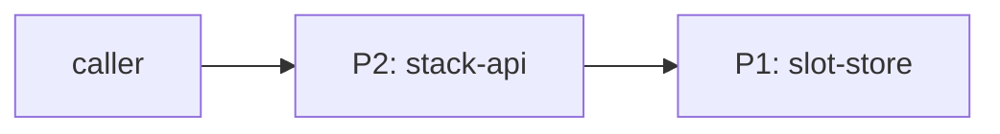
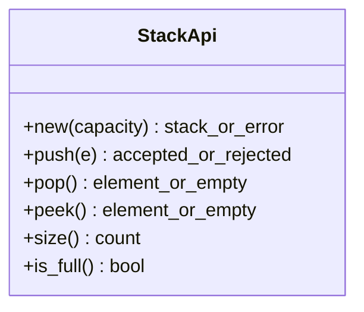

# DO-005 — Bounded LIFO Stack

A fixed-capacity last-in-first-out stack of opaque elements for single-thread
use, specified in drawing-office v2: every operation pins its return shape, and
every tolerance declares a kind whose inspection can observe a violation.

## ASSEMBLY DRAWING

The caller drives push, pop, peek, size, is_full, and construction through
stack-api, which owns all access to slot-store and enforces capacity and LIFO
order.

## BILL OF MATERIALS

| Part | Name | Kind | Responsibility | Deps |
|------|------|------|----------------|------|
| P1 | slot-store | store | Holds elements in insertion order for last-in-first-out removal. | none |
| P2 | stack-api | module | Enforces fixed capacity, LIFO discipline, and constant-time access over P1. | P1 |

## DETAIL DRAWINGS

### P1 — slot-store

Commodity part — no drawing needed: any ordered in-memory sequence with
amortized constant-time append and remove-last suffices.

### P2 — stack-api

Capacity is a fixed positive integer set at construction; construction with a
non-positive capacity is rejected. push rejects at capacity rather than evicting
or growing. Element type is a build-time parameter (opaque to this drawing);
nulls are a valid element. All return shapes are fixed below so two builds share
one interface.

## CONTRACTS & TOLERANCES

Return shapes are pinned (no pipe characters in cells: read "A or B" as a sum
type). Every tolerance names a kind; non-behavioral kinds cite an op whose
tooling can observe the violation.

| Operation | Input domain | Return shape | Tolerance | Kind | Inspection op | Failure mode outside tolerance |
|-----------|--------------|--------------|-----------|------|---------------|--------------------------------|
| new(capacity) | any integer | the string "error" when capacity is not a positive integer, otherwise a stack handle | Construction with capacity below 1 is rejected and builds no stack. | behavioral | Op 10 | new(0) and new(-1) return "error"; no stack is created. |
| push(e) | any element including null | the string "accepted" or the string "rejected" | LIFO order exact; capacity never exceeded; accepted exactly when size is below capacity. | behavioral | Op 20 | At capacity returns "rejected", stack unchanged; no eviction, no growth. |
| push(e), pop() | any sequence of calls | as above for push; the top element or the string "empty" for pop | Push and pop each perform a bounded number of element operations independent of current size (constant time). | complexity | Op 30 | An implementation whose per-call element-operation count grows with size fails the measurement and is rejected. |
| pop() | stack non-empty for a value; any state otherwise | the most recently pushed element, or the string "empty" when the stack is empty | LIFO order exact: returns the last element accepted by push and not yet popped. | behavioral | Op 20 | On empty returns the string "empty"; never raises, never blocks. |
| peek() | any state | the top element, or the string "empty" when the stack is empty | Read-only exact: the stack's size and contents are unchanged by peek. | behavioral | Op 20 | On empty returns the string "empty"; never raises. |
| size() | none | a non-negative integer | Equals the number of elements accepted by push and not yet popped. | behavioral | Op 10 | Not applicable — total function. |
| is_full() | none | the boolean true or false | Returns true exactly when size equals capacity. | behavioral | Op 10 | Not applicable — total function. |

## PROCESS PLAN

| Op | Task | Tooling | Inspection |
|----|------|---------|------------|
| 10 | Implement P1 slot-store, and P2 construction, size, is_full. | language stdlib, unit test runner | new(0) and new(-1) return "error"; push three then size is 3; is_full is true only at capacity. |
| 20 | Implement P2 push, pop, peek with capacity and LIFO. | language stdlib, unit test runner | Push a, b, c then pop yields c, b, a; push at capacity returns "rejected" and leaves the stack unchanged; pop and peek on empty return "empty" and never raise. |
| 30 | Measure per-call cost of push and pop across sizes. | element-operation counting measurement harness | The counted element operations per push and per pop are constant across stacks of size 10, 1000, and 100000 (no growth with size). |

## REVISION HISTORY

| Rev | Date | Author | Change summary |
|-----|------|--------|----------------|
| A | 2026-07-07 | Claude | Initial release (v1 format). |
| B | 2026-07-07 | Febin William | Ported to v2: pinned every return shape (closing the accepted/rejected and empty-value ambiguities), added construction domain, and tagged the constant-time tolerance as kind=complexity with a measurement op (Op 30) so it is observable rather than toothless. |
