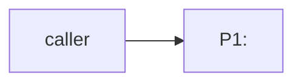
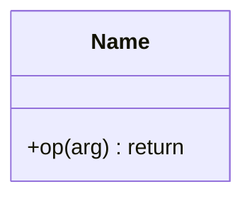

# DO-NNN — <title>

<one-paragraph statement of what this is and its scope.>

## ASSEMBLY DRAWING

<how the parts connect, in prose.>

## BILL OF MATERIALS

| Part | Name | Kind | Responsibility | Deps |
|------|------|------|----------------|------|
| P1 | <name> | module | <one sentence> | none |

## DETAIL DRAWINGS

### P1 — <name>

<terse prose. Or, for a trivial part: "Commodity part — no drawing needed: ...">

## CONTRACTS & TOLERANCES

<Return shapes are pinned. Avoid the pipe character in cells: write "the string
A or the string B", not "A | B". Every tolerance names a kind; a non-behavioral
kind must cite an op whose tooling can observe the violation.>

| Operation | Input domain | Return shape | Tolerance | Kind | Inspection op | Failure mode outside tolerance |
|-----------|--------------|--------------|-----------|------|---------------|--------------------------------|
| op(arg) | <domain> | <exact shape> | <allowed variance> | behavioral | Op 10 | <what happens outside tolerance> |

## PROCESS PLAN

| Op | Task | Tooling | Inspection |
|----|------|---------|------------|
| 10 | <build step> | <tooling; use measurement/fault/concurrency tooling to back the matching kinds> | <how to verify> |

## REVISION HISTORY

| Rev | Date | Author | Change summary |
|-----|------|--------|----------------|
| A | YYYY-MM-DD | <name> | Initial draft. |
