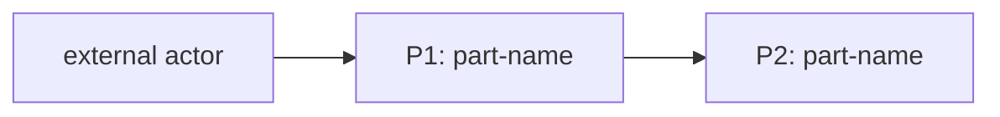
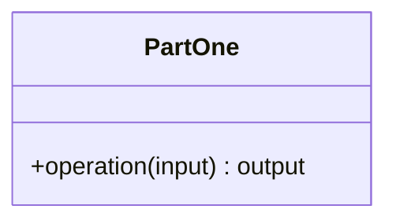

# DO-NNN — <Title>

<One sentence: what the artifact is and the constraint it exists to satisfy.>

## ASSEMBLY DRAWING

<One short paragraph stating the data flow. No internals.>

## BILL OF MATERIALS

| Part | Name | Kind | Responsibility | Deps | Ref |
|------|------|------|----------------|------|-----|
| P1 | <kebab-name> | <module, class, function, store, or assembly> | <one sentence maximum> | none | local |
| P2 | <kebab-name> | <module, class, function, store, or assembly> | <one sentence maximum> | P1 | <local, or DO-NNN of the registered part filling this slot> |

## DETAIL DRAWINGS

### P1 — <kebab-name>

<Terse prose: invariants, key decisions, pseudocode in fenced text blocks
where arithmetic or ordering matters.>

### P2 — <kebab-name>

Commodity part — no drawing needed: <one-line justification>.

<!-- For a part whose Ref is a DO-NNN, use an external-part note instead:
External part — see DO-NNN: <one line on the interface consumed>. -->

## CONTRACTS & TOLERANCES

| Operation | Input domain | Nominal behavior | Tolerance | Inspection op | Failure mode outside tolerance |
|-----------|--------------|------------------|-----------|---------------|--------------------------------|
| <op(args)> | <accepted inputs, as constraints> | <what it does, 1–2 sentences> | <bound, budget, precision, ordering guarantee, or the word exact — never empty, never a dash> | <Op NN that verifies this tolerance> | <what the caller observes; what the part does> |

## PROCESS PLAN

| Op | Task | Tooling | Inspection |
|----|------|---------|------------|
| 10 | <first thing built> | <generic tooling> | <how to verify it succeeded> |
| 20 | <next thing built> | <generic tooling> | <how to verify it succeeded> |

## REVISION HISTORY

| Rev | Date | Author | Change summary |
|-----|------|--------|----------------|
| A | <YYYY-MM-DD> | <your name> | Initial draft. |
