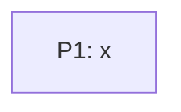

# DO-903 — t

A minimal fixture drawing.

## ASSEMBLY DRAWING

## BILL OF MATERIALS

| Part | Name | Kind | Responsibility | Deps | Ref |
|------|------|------|----------------|------|-----|
| P1 | x | module | x. | none | local |

## DETAIL DRAWINGS

### P1 — x

Commodity part — no drawing needed: trivial.

## CONTRACTS & TOLERANCES

| Operation | Input domain | Nominal behavior | Tolerance | Inspection op | Failure mode outside tolerance |
|-----------|--------------|------------------|-----------|---------------|--------------------------------|
| f() | any | g. | exact | Op 10 | none observed. |

## PROCESS PLAN

| Op | Task | Tooling | Inspection |
|----|------|---------|------------|
| 10 | build | stdlib | check |

## REVISION HISTORY

| Rev | Date | Author | Change summary |
|-----|------|--------|----------------|
| A | 2026-07-18 | a | Initial draft. |

## APPENDIX

extra.
